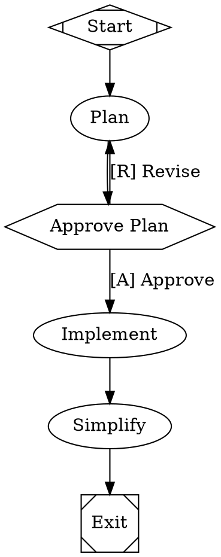

<div align="left" id="top">
<a href="https://arc.dev"></a>
</div>

## The software factory for small teams of expert engineers

Arc replaces the prompt-wait-review loop with version-controlled workflow graphs that orchestrate AI agents, shell commands, and human decisions into repeatable, long-horizon coding processes.

Define workflows in Graphviz DOT, route tasks to the right model with CSS-like stylesheets, and let the engine handle orchestration, parallelism, checkpointing, and verification -- all from a single Rust binary.

[](LICENSE.md)
[](https://arc.dev)

---

## Table of Contents

- [Key Features](#key-features)
- [Quick Start](#quick-start)
- [Example Workflow](#example-workflow)
- [Supported Models](#supported-models)
- [System Requirements](#system-requirements)
- [Help or Feedback](#help-or-feedback)
- [Contributing](#contributing)
- [License](#license)

---

## Key Features

### What Arc Does

|     | Feature                    | Description                                                                                |
| --- | -------------------------- | ------------------------------------------------------------------------------------------ |
| :robot: | Multi-model orchestration   | Route tasks to the right model per node -- cheap for boilerplate, frontier for hard reasoning |
| :diamond_shape_with_a_dot_inside: | Declarative workflows       | Define pipelines in Graphviz DOT -- diffable, reviewable, composable                        |
| :raised_hand: | Human-in-the-loop          | Approval gates, interviews, and real-time steering let you intervene at the right moments   |
| :arrows_counterclockwise: | Checkpoint and resume       | Git-native checkpointing after every stage -- inspect, revert, or fork from any point        |
| :shield: | Adaptive verification      | Combine LLM-as-judge, test suites, and human review into quality gates                      |
| :bar_chart: | Full observability          | Every tool call, agent turn, and decision point captured in a unified event stream           |

### How Arc Does It

|     | Feature                 | Description                                                                              |
| --- | ----------------------- | ---------------------------------------------------------------------------------------- |
| :art: | Model stylesheets        | CSS-like selectors (`*`, `.class`, `#id`) assign models, providers, and reasoning effort |
| :deciduous_tree: | Git-native checkpoints   | Every stage commits to a branch -- resume interrupted runs exactly where they left off    |
| :package: | Sandbox isolation        | Run agent tools in local, Docker, Daytona cloud VMs, or exe.dev ephemeral VMs            |
| :electric_plug: | MCP integration          | Extend agents with any Model Context Protocol server (Playwright, databases, APIs)       |
| :repeat: | Loops and fan-out        | Implement-test-fix cycles, parallel code reviews, and ensemble multi-provider patterns   |
| :crab: | Written in Rust          | Single compiled binary with minimal dependencies -- no Python runtime, no npm install     |
| :gear: | CLI and API modes        | `arc run` for local dev, `arc serve` for production with a React web UI                  |

Read the full [documentation](https://arc.dev) for details.

---

## Quick Start

> [!WARNING]
> Arc is in private research preview. Contact [bryan@qlty.sh](mailto:bryan@qlty.sh) if you're interested in trying it.

### Install

Download the latest release for your platform:

```bash
# macOS (Apple Silicon)
curl -fsSL https://github.com/brynary/arc/releases/latest/download/arc-aarch64-apple-darwin.tar.gz | tar xz
sudo mv arc /usr/local/bin/

# Linux (x86_64)
curl -fsSL https://github.com/brynary/arc/releases/latest/download/arc-x86_64-unknown-linux-gnu.tar.gz | tar xz
sudo mv arc /usr/local/bin/
```

Or download directly from [GitHub Releases](https://github.com/brynary/arc/releases).

<details>
<summary>Build from source</summary>

Requires [Rust](https://rustup.rs/) (latest stable):

```bash
git clone https://github.com/brynary/arc.git
cd arc
cargo build --release
# Binary is at ./target/release/arc
```

</details>

### Run the setup wizard

```bash
arc install
```

### Initialize your project

```bash
cd my-repo/
arc init
```

### Run your first workflow

```bash
arc run hello
```

---

## Example Workflow

A plan-approve-implement workflow where a human reviews the plan before the agent writes code:



### Node types at a glance

| Shape            | Type        | What it does                                     |
| ---------------- | ----------- | ------------------------------------------------ |
| `Mdiamond`       | Start       | Workflow entry point                             |
| `Msquare`        | Exit        | Workflow terminal                                |
| `box` (default)  | Agent       | Multi-turn LLM with tool access                 |
| `tab`            | Prompt      | Single LLM call, no tools                        |
| `parallelogram`  | Command     | Runs a shell script                              |
| `hexagon`        | Human gate  | Pauses for human input                           |
| `diamond`        | Conditional | Routes based on conditions                       |
| `component`      | Parallel    | Fans out to concurrent branches                  |
| `tripleoctagon`  | Merge       | Collects parallel branch results                 |

### Multi-model routing with stylesheets

```dot
graph [
    model_stylesheet="
        *        { llm_model: claude-haiku-4-5; reasoning_effort: low; }
        .coding  { llm_model: claude-sonnet-4-5; reasoning_effort: high; }
        #review  { llm_model: gemini-3.1-pro-preview; llm_provider: gemini; }
    "
]
```

Selectors follow CSS specificity: `*` (0) < `shape` (1) < `.class` (2) < `#id` (3).

---

## Supported Models

Arc supports models from Anthropic, OpenAI, Gemini, Kimi, Zai, MiniMax, and Inception. Route tasks to the right model per node and configure provider fallback chains per-run.

Run `arc model list` locally or see the [Models documentation](https://arc.dev/core-concepts/models) for the full catalog.

---

## System Requirements

- **macOS** (Apple Silicon) or **Linux** (x86_64)
- **At least one LLM provider API key** (Anthropic, OpenAI, or Gemini)
- **Git** (for checkpoint and resume)
- **Rust** (only if building from source)

---

## Help or Feedback

- Read the [documentation](https://arc.dev)
- [Bug reports](https://github.com/brynary/arc/issues) via GitHub Issues
- [Feature requests](https://github.com/brynary/arc/issues) via GitHub Issues
- Email [bryan@qlty.sh](mailto:bryan@qlty.sh) for access or questions

---

## Contributing

See [CLAUDE.md](CLAUDE.md) for build commands, architecture overview, and development conventions.

---

## License

Arc is licensed under the [MIT License](LICENSE.md).
