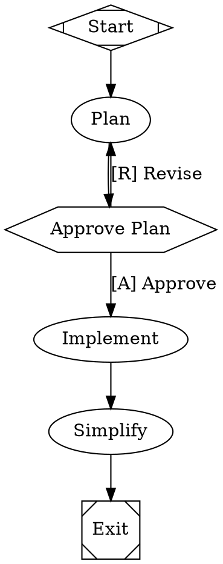

<div align="left" id="top">
<a href="https://fabro.dev"></a>
</div>

## The open source software factory for expert engineers

AI coding agents are powerful but unpredictable. You either babysit every step or review a 50-file diff you don't trust. Fabro gives you a middle path: define the process as a graph, let agents execute it, and intervene only where it matters. [Why Fabro?](https://fabro.dev/getting-started/why-arc)

[](LICENSE.md)
[](https://fabro.dev)

```bash
curl -fsSL https://fabro.sh/install.sh | bash
```


---

## Use Cases

- **Extend disengagement time** — Stop babysitting an agent REPL. Define a workflow with verification gates and walk away — Fabrokeeps the process on track without you.
- **Leverage ensemble intelligence** — Seamlessly combine models from different vendors. Use one model to implement, another to cross-critique, and a third to summarize — all in a single workflow.
- **Share best practices across your team** — Collaborate on version-controlled workflows that encode your software processes as code. Review, iterate, and reuse them like any other source file.
- **Reduce token bills** — Route cheap tasks to fast, inexpensive models and reserve frontier models for the steps that need them. CSS-like stylesheets make this a one-line change.
- **Improve agent security** — Run agents in cloud sandboxes with full network and filesystem isolation. Keep untrusted code off your laptop and out of your production environment.
- **Run agents 24/7** — Arc's API server queues and executes runs continuously. Close your laptop — workflows keep running and results are waiting when you return.
- **Scale infinitely** — Move execution off your laptop and into cloud sandboxes. Run as many concurrent workflows as your infrastructure allows.
- **Guarantee code quality** — Layer deterministic verifications — test suites, linters, type checkers, LLM-as-judge — into your workflow graph. Failures trigger fix loops automatically.
- **Achieve compounding engineering** — Automatic retrospectives after every run feed a continuous improvement loop. Your workflows get better over time, not just your code.
- **Specify in natural language** — Define requirements as natural-language specs and let Arc generate — and regenerate — implementations that conform to them.

---

## Key Features

|     | Feature                        | Description                                                                                           |
| --- | ------------------------------ | ----------------------------------------------------------------------------------------------------- |
| 🔀  | Deterministic workflow graphs  | Define pipelines in Graphviz DOT with branching, loops, parallelism, and human gates. Diffable, reviewable, version-controlled |
| 🙋  | Human-in-the-loop              | Approval gates pause for human decisions. Steer running agents mid-turn. Interview steps collect structured input |
| 🎨  | Multi-model routing            | CSS-like stylesheets route each node to the right model and provider, with automatic fallback chains  |
| ☁️  | Cloud sandboxes                | Run agents in isolated Daytona cloud VMs with snapshot-based setup, network controls, and automatic cleanup |
| 🔌  | SSH access and preview links   | Shell into running sandboxes with `fabro ssh` and expose ports with `fabro preview` for live debugging    |
| 🌲  | Git checkpointing              | Every stage commits code changes and execution metadata to Git branches. Resume, revert, or trace any change |
| 📊  | Automatic retros               | Each run generates a retrospective with cost, duration, files touched, and an LLM-written narrative   |
| ⚡  | Comprehensive API              | REST API with SSE event streaming and a React web UI. Run workflows programmatically or as a service  |
| 🦀  | Single binary, no runtime      | One compiled Rust executable with zero dependencies. No Python, no Node, no Docker required           |
| ⚖️  | Open source (MIT)              | Full source code, no vendor lock-in. Self-host, fork, or extend to fit your workflow                  |

---

## Example Workflow

A plan-approve-implement workflow where a human reviews the plan before the agent writes code:



Agents run as multi-turn LLM sessions with tool access. Human gates (`hexagon`) pause for approval. The stylesheet routes planning to a cheap model and coding to a frontier model. See the [DOT language reference](https://fabro.dev/reference/dot-language) for the full syntax.

---

## 📖 Documentation

Fabro ships with [comprehensive documentation](https://fabro.dev) covering every feature in depth:

- [**Getting Started**](https://fabro.dev/getting-started/introduction) -- Installation, first workflow, and why Fabro exists
- [**Defining Workflows**](https://fabro.dev/workflows/stages-and-nodes) -- Node types, transitions, variables, stylesheets, and human gates
- [**Executing Workflows**](https://fabro.dev/execution/run-configuration) -- Run configuration, sandboxes, checkpoints, retros, and failure handling
- [**Tutorials**](https://fabro.dev/tutorials/hello-world) -- Step-by-step guides from hello world to parallel multi-model ensembles
- [**API Reference**](https://fabro.dev/api-reference/overview) -- Full OpenAPI spec with authentication, SSE events, and client SDKs

---

## Quick Start

### Install

```bash
curl -fsSL https://fabro.sh/install.sh | bash

# Initialize your project
cd my-repo/
fabro init

# Run your first workflow
fabro run hello
```

---

## Help or Feedback

- [Bug reports](https://github.com/fabro-sh/fabro/issues) via GitHub Issues
- [Feature requests](https://github.com/fabro-sh/fabro/issues) via GitHub Issues
- Email [bryan@qlty.sh](mailto:bryan@qlty.sh) for questions
- See [CONTRIBUTING.md](CONTRIBUTING.md) for build instructions and development workflow

---

## License

Fabro is licensed under the [MIT License](LICENSE.md).
