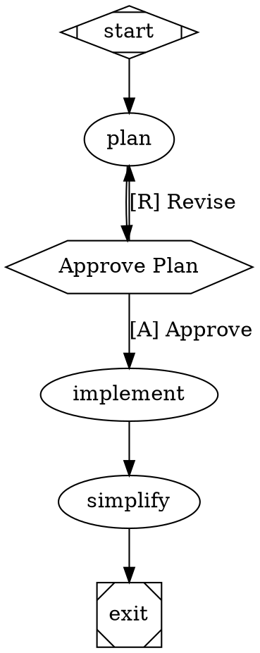

Today, we're introducing Fabro, an open-source platform for orchestrating AI coding agents with workflow graphs. We built Fabro to help expert engineers define their process once, verify it at every step, and walk away while agents do the work.

## The problem with AI coding today

AI coding agents are powerful, but they're also chaotic. The current generation of tools gives you a chat window and a single loop: prompt, act, repeat. That works for small tasks, but it breaks down the moment you need structure.

- **No process definition.** You can't specify that a plan should be approved before implementation starts, that tests must pass before the PR is opened, or that a second model should cross-review the first.
- **Single-model dependence.** You're locked into one provider for every step, even when a faster, cheaper model would suffice for triage or formatting.
- **No verification.** The agent decides when it's "done." There's no deterministic gate confirming that the code compiles, tests pass, and linting is clean.
- **No reproducibility.** Sessions are ephemeral. You can't checkpoint mid-run, resume after a failure, or replay a workflow with a different model.

The result is that engineers babysit their agents instead of using them. You spend more time supervising than you save.

## Workflow graphs: your engineering process as code

Fabro takes a fundamentally different approach. Instead of prompting an agent and watching it work, you define your engineering process as a Graphviz graph — diffable, reviewable, and version-controlled just like the code it produces.



Each node is a stage with a specific role. Edges define the flow. Node shapes determine behavior — `box` for agents with tool access, `hexagon` for human decision gates, `diamond` for conditionals, `parallelogram` for shell commands. The graph supports loops, not just DAGs, so you can build implement-test-fix cycles that repeat until verification passes.

**The process is deterministic, even though the AI execution within each stage is not.** You control the structure. The models do the work.

## Multi-model by design

Not every stage needs a frontier model. Fabro's model stylesheets use CSS-like selectors to route each node to the right model and provider:

```
*        { model: claude-haiku-4-5; reasoning_effort: low; }
.coding  { model: claude-sonnet-4-5; reasoning_effort: high; }
#review  { model: gemini-3.1-pro-preview; }
```

Selectors follow CSS specificity rules — universal (`*`), shape, class (`.coding`), and ID (`#review`) — so you can set sensible defaults and override where it matters. Route cheap tasks to fast models, reserve frontier models for implementation and review, and combine providers for ensemble intelligence. Swap a model with a one-line change instead of rearchitecting your workflow.

## Verification gates and human checkpoints

AI agents are confident — even when they're wrong. Fabro addresses this with two layers of control.

**Deterministic verification.** Goal gates confirm that the code compiles, tests pass, and linting is clean before the workflow advances. These aren't LLM judgments — they're shell commands with pass/fail exit codes.

**Human-in-the-loop gates.** Hexagon nodes pause the workflow for human approval, rejection, or freeform input. Keyboard accelerators (`[A]` Approve, `[R]` Revise) make decisions fast. When you trust the process, `--auto-approve` skips gates entirely.

The combination lets deterministic checks catch what linters and tests can catch, human gates handle judgment calls, and agents do everything in between.

## Checkpoint, resume, and walk away

Every stage is checkpointed to Git. If a run fails at stage 7 of 12, you don't start over — you fix the issue and resume from the checkpoint. Runs execute in isolated Git worktrees, so your working directory stays untouched while agents work in parallel.

Fabro supports six sandbox environments — local, Docker, SSH, Daytona cloud VMs, and more — so you can develop on your laptop and move to isolated cloud sandboxes for production workflows.

## Get started

Fabro is open source and ships as a single Rust binary with zero runtime dependencies.

```bash
# Install
curl -fsSL https://fabro.sh/install.sh | bash

# Run a workflow
fabro run implement
```

Check the [roadmap](/roadmap) to see what we're building — including automatic retrospectives, a REST API server, and analytics — and join us on [Discord](/discord) to shape what comes next.
