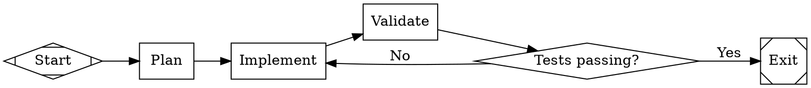

# attractor

A DOT-based pipeline runner for multi-stage AI workflows. Define workflows as Graphviz `digraph` files and execute them with pluggable handlers, conditional routing, human-in-the-loop gates, parallel branching, retry policies, and checkpoint-based recovery.

## Key Concepts

- **Graph** -- A directed graph parsed from DOT syntax containing nodes, edges, and attributes. The graph carries a `goal` describing the pipeline's purpose.
- **Node** -- A workflow step. Graphviz shapes map to handler types (e.g., `Mdiamond` = start, `Msquare` = exit, `box` = codergen/LLM, `diamond` = conditional, `hexagon` = human gate, `component` = parallel).
- **Edge** -- A connection between nodes with optional `condition`, `label`, `weight`, and `fidelity` attributes that control routing.
- **Handler** -- An async trait implementation that executes a node and returns an `Outcome`. Built-in handlers include `StartHandler`, `ExitHandler`, `CodergenHandler`, `ConditionalHandler`, `WaitHumanHandler`, `ParallelHandler`, `FanInHandler`, `ScriptHandler`, and `ManagerLoopHandler`.
- **Outcome** -- The result of executing a handler, carrying a `StageStatus` (Success, Fail, PartialSuccess, Retry, Skipped), optional routing hints (`preferred_label`, `suggested_next_ids`), and context updates.
- **Context** -- A thread-safe key-value store shared across pipeline stages, supporting snapshots and isolated cloning for parallel branches.
- **Interviewer** -- A trait for human-in-the-loop interactions. Implementations include `AutoApproveInterviewer`, `QueueInterviewer`, `CallbackInterviewer`, `ConsoleInterviewer`, and `RecordingInterviewer`.
- **Checkpoint** -- A serializable snapshot of execution state (completed nodes, context values, logs) for crash recovery and resume.

## Pipeline Definition

Pipelines are defined using Graphviz DOT syntax:



## Usage

### Parsing and Validating a Pipeline

```rust
use attractor::pipeline::prepare_pipeline;

let dot_source = r#"digraph Simple {
    graph [goal="Run tests"]
    start [shape=Mdiamond]
    exit  [shape=Msquare]
    work  [shape=box, prompt="Run the test suite"]
    start -> work -> exit
}"#;

let graph = prepare_pipeline(dot_source)
    .expect("pipeline should parse and validate");
assert_eq!(graph.name, "Simple");
assert_eq!(graph.goal(), "Run tests");
```

`prepare_pipeline` parses the DOT source, applies built-in transforms (variable expansion, stylesheet application, preamble injection), and validates the graph against 14 built-in lint rules.

### Running a Pipeline

```rust
use attractor::engine::{PipelineEngine, RunConfig};
use attractor::event::EventEmitter;
use attractor::handler::HandlerRegistry;
use attractor::handler::start::StartHandler;
use attractor::handler::exit::ExitHandler;
use attractor::handler::codergen::CodergenHandler;
use attractor::pipeline::prepare_pipeline;

let graph = prepare_pipeline(dot_source).unwrap();

let mut registry = HandlerRegistry::new(Box::new(CodergenHandler::new(None)));
registry.register("start", Box::new(StartHandler));
registry.register("exit", Box::new(ExitHandler));
registry.register("codergen", Box::new(CodergenHandler::new(None)));

let engine = PipelineEngine::new(registry, EventEmitter::new());
let config = RunConfig {
    logs_root: "/tmp/pipeline-run".into(),
};

// engine.run(&graph, &config).await
```

### Custom Handlers

Implement the `Handler` trait to add custom node behavior:

```rust
use attractor::handler::Handler;
use attractor::context::Context;
use attractor::graph::{Graph, Node};
use attractor::outcome::Outcome;
use attractor::error::AttractorError;
use async_trait::async_trait;
use std::path::Path;

struct MyHandler;

#[async_trait]
impl Handler for MyHandler {
    async fn execute(
        &self,
        node: &Node,
        context: &Context,
        graph: &Graph,
        logs_root: &Path,
    ) -> Result<Outcome, AttractorError> {
        // Custom logic here
        Ok(Outcome::success())
    }
}
```

### Model Stylesheets

CSS-like stylesheets control LLM model assignment with specificity-based cascading:

```dot
digraph Styled {
    graph [
        goal="Build feature",
        model_stylesheet="
            * { llm_model: claude-sonnet-4-5; llm_provider: anthropic; }
            .code { llm_model: claude-opus-4-6; }
            #critical_review { llm_model: gpt-5.2; llm_provider: openai; }
        "
    ]
    // ...
}
```

Selectors by specificity: `*` (universal, 0) < `shape` (1) < `.class` (2) < `#id` (3). Explicit node attributes are never overridden.

### Condition Expressions

Edge conditions use a simple expression syntax for routing:

```
outcome=success
outcome!=fail
outcome=success && context.tests_passed=true
my_flag
```

Clauses support `=`, `!=`, and bare key truthiness checks, joined with `&&`.

### Human-in-the-Loop Gates

Nodes with `shape=hexagon` or `type="wait.human"` pause execution for human input. Outgoing edge labels become selectable options, with accelerator key parsing for patterns like `[A] Approve` and `F) Fix`.

### Parallel Execution

Nodes with `shape=component` fan out to branches concurrently. Configurable join policies: `wait_all` (default), `first_success`, `k_of_n(N)`, `quorum(0.5)`. Error policies: `continue`, `fail_fast`, `ignore`.

### Checkpoints and Resume

The engine saves a checkpoint after each node. Resume from a checkpoint with `engine.run_from_checkpoint(&graph, &config, &checkpoint)`.

## Architecture

```
parser (DOT -> AST -> Graph)
  -> transform (variable expansion, stylesheet, preamble)
    -> validation (14 lint rules)
      -> engine (execution loop with retry, edge selection, goal gates)
        -> handler (pluggable node executors)
          -> interviewer (human-in-the-loop I/O)
```
