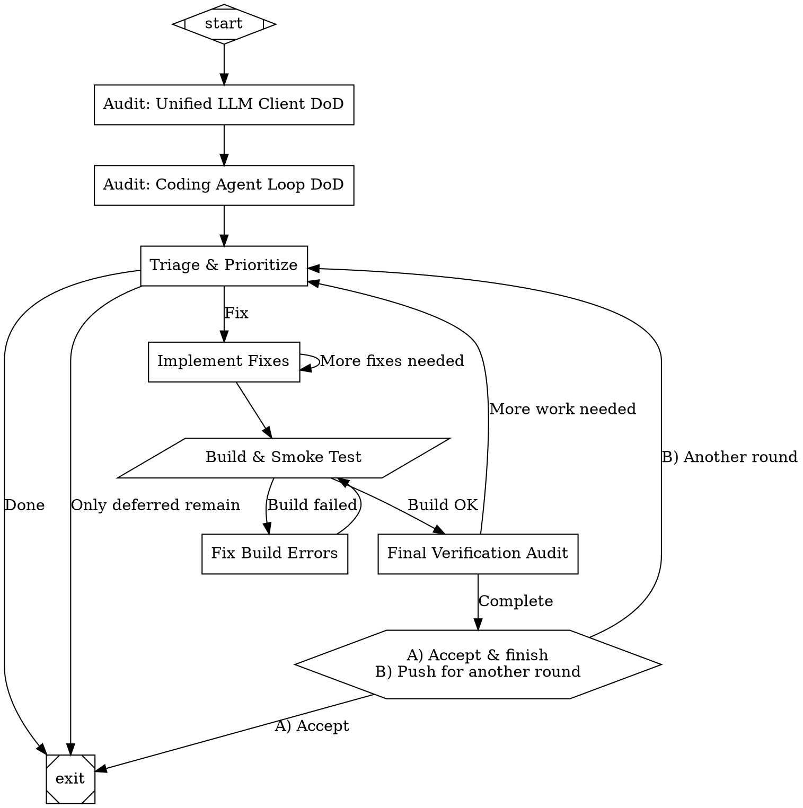

The Definition of Done (DoD) pattern reads one or more specification documents with explicit checklists, audits the current implementation against every checkbox, triages failures, implements fixes, and verifies the result. It's a structured way to close the gap between "spec says X" and "code does X."

This pattern is useful when you have detailed specs with acceptance criteria (Definition of Done sections) and want an agent to systematically verify and fix compliance — rather than hoping it remembered every requirement.

## When to use this

- You have specification documents with explicit checklists or acceptance criteria
- The implementation exists but may have gaps or incomplete features
- You want structured, auditable verification rather than ad-hoc testing
- The codebase is large enough that a single-pass "fix everything" approach would miss things

## Single-model variant

<Frame>
  
</Frame>

The simpler variant uses one model throughout, with sequential audits across multiple specs:



### How it works

**Sequential audits** — each spec gets its own audit node so the agent can focus on one spec at a time. The prompts ask for structured JSON output with pass/fail per checkbox, making the results machine-parseable for the triage phase.

**Three-category triage** — failures are classified as IMPLEMENTABLE (can fix now), STRUCTURAL (needs architecture work), or DEFERRED (needs external resources). This prevents the agent from wasting cycles on items it can't address in a code-only pass.

**Batched fixes** — the `fix_batch` node tackles up to 5 failures per iteration. The self-loop (`fix_batch -> fix_batch` with `loop_restart=true`) allows it to keep going when more fixes remain, while `goal_gate=true` ensures the workflow only succeeds if fixes were actually applied.

**Build gate** — after each fix batch, a script node runs `cargo build` and `cargo test`. If the build breaks, a dedicated `build_fix` node diagnoses and repairs compilation errors before retrying.

**Re-audit after fixes** — the `final_audit` node re-checks only the previously-failing items, catching regressions without re-auditing the entire spec. If items remain, the workflow loops back to triage for another round.

**Human gate** — before declaring victory, a human reviews the results and can push for another round if the automated audit missed something.

## Multi-model variant

<Frame>
  
</Frame>

The multi-model variant applies the same audit-triage-fix-verify structure but uses independent assessments from two models (Claude Opus and GPT-5.2) at each phase, with cross-critique and consensus merging. This catches blind spots that a single model might miss.

```dot title="spec-dod-multimodel.fabro"
digraph SpecDoDMultiModel {
    graph [
        goal="Satisfy every Definition of Done checkbox across both specs (unified-llm-spec.md, coding-agent-loop-spec.md). The implementation is in Rust under crates/. Do NOT modify the spec files. Only modify implementation code. Uses multi-model consensus: Opus 4.6 and GPT-5.2 compete on audits and planning, GPT-5.2-codex and Opus 4.6 alternate on implementation.",
        default_max_retry="3",
        retry_target="triage_merge",
        default_fidelity="full",
        model_stylesheet="
            * { model: claude-opus-4-6;}
            .opus   { model: claude-opus-4-6;reasoning_effort: high; }
            .gpt    { model: gpt-5.2;        reasoning_effort: high; }
            .codex  { model: gpt-5.2-codex;  reasoning_effort: high; }
            .merge  { model: claude-opus-4-6; reasoning_effort: high; }
        "
    ]

    start [shape=Mdiamond]
    exit  [shape=Msquare]

    /*========================================================================
     * PHASE 1 — Dual Independent Audits (interleaved, fidelity-isolated)
     *
     * Each spec is audited by both models before moving to the next.
     * Audit nodes use fidelity="truncate" so they only see the graph goal
     * and NOT each other's responses — prevents anchoring bias.
     * Full responses are still stored as response.<node_id> for later use.
     *======================================================================*/

    /* ---- LLM spec: both models ---- */

    audit_llm_opus [
        label="Opus: Audit LLM DoD",
        shape=box,
        class="opus",
        fidelity="truncate",
        prompt="Read docs/specs/unified-llm-spec.md Section 8 (Definition of Done) in full. Then read every source file under crates/llm/src/.

For EACH checkbox in sections 8.1 through 8.10, evaluate whether the current Rust implementation satisfies it. Be strict — a checkbox is only checked if the feature is fully implemented and would work correctly at runtime.

Respond with ONLY a JSON object (no prose) -- don't write it out as a file:
{
  \"spec\": \"unified-llm\",
  \"model\": \"opus\",
  \"sections\": {
    \"8.1\": { \"title\": \"Core Infrastructure\", \"items\": [ {\"text\": \"...\", \"pass\": true/false, \"reason\": \"...\"} ] },
    ...
  },
  \"total\": N,
  \"passed\": M,
  \"failed\": K,
  \"failed_items\": [ {\"section\": \"8.2\", \"text\": \"...\", \"reason\": \"...\"} ]
}

Be thorough. Check every single checkbox."
    ]

    audit_llm_gpt [
        label="GPT-5.2: Audit LLM DoD",
        shape=box,
        class="gpt",
        fidelity="truncate",
        prompt="Read docs/specs/unified-llm-spec.md Section 8 (Definition of Done) in full. Then read every source file under crates/llm/src/.

For EACH checkbox in sections 8.1 through 8.10, evaluate whether the current Rust implementation satisfies it. Be strict — a checkbox is only checked if the feature is fully implemented and would work correctly at runtime.

Respond with ONLY a JSON object (no prose) -- don't write it out as a file:
{
  \"spec\": \"unified-llm\",
  \"model\": \"gpt-5.2\",
  \"sections\": {
    \"8.1\": { \"title\": \"Core Infrastructure\", \"items\": [ {\"text\": \"...\", \"pass\": true/false, \"reason\": \"...\"} ] },
    ...
  },
  \"total\": N,
  \"passed\": M,
  \"failed\": K,
  \"failed_items\": [ {\"section\": \"8.2\", \"text\": \"...\", \"reason\": \"...\"} ]
}

Be thorough. Check every single checkbox."
    ]

    /* ---- Agent spec: both models ---- */

    audit_agent_opus [
        label="Opus: Audit Agent DoD",
        shape=box,
        class="opus",
        fidelity="truncate",
        prompt="Read docs/specs/coding-agent-loop-spec.md Section 9 (Definition of Done) in full. Then read every source file under crates/agent/.

For EACH checkbox in sections 9.1 through 9.13, evaluate whether the current Rust implementation satisfies it. Be strict.

Respond with ONLY a JSON object (no prose) -- don't write it out as a file:
{
  \"spec\": \"coding-agent-loop\",
  \"model\": \"opus\",
  \"sections\": { ... },
  \"total\": N,
  \"passed\": M,
  \"failed\": K,
  \"failed_items\": [ {\"section\": \"9.1\", \"text\": \"...\", \"reason\": \"...\"} ]
}

Be thorough. Check every single checkbox."
    ]

    audit_agent_gpt [
        label="GPT-5.2: Audit Agent DoD",
        shape=box,
        class="gpt",
        fidelity="truncate",
        prompt="Read docs/specs/coding-agent-loop-spec.md Section 9 (Definition of Done) in full. Then read every source file under crates/agent/.

For EACH checkbox in sections 9.1 through 9.13, evaluate whether the current Rust implementation satisfies it. Be strict.

Respond with ONLY a JSON object (no prose) -- don't write it out as a file:
{
  \"spec\": \"coding-agent-loop\",
  \"model\": \"gpt-5.2\",
  \"sections\": { ... },
  \"total\": N,
  \"passed\": M,
  \"failed\": K,
  \"failed_items\": [ {\"section\": \"9.1\", \"text\": \"...\", \"reason\": \"...\"} ]
}

Be thorough. Check every single checkbox."
    ]

    /*========================================================================
     * PHASE 2 — Cross-Critique (fidelity=full to see all response.* keys)
     *
     * Each model reviews the other's audit. Like megaplan's Compete phase:
     * independent work first, then adversarial review.
     *======================================================================*/

    critique_by_gpt [
        label="GPT-5.2: Critique Opus Audits",
        shape=box,
        class="gpt",
        fidelity="full",
        prompt="You have all four audit reports available in context. The full outputs are in these context keys:

OPUS AUDITS:
- response.audit_llm_opus — Opus's audit of unified-llm-spec.md Section 8
- response.audit_agent_opus — Opus's audit of coding-agent-loop-spec.md Section 9

GPT AUDITS (your own):
- response.audit_llm_gpt — your audit of unified-llm-spec.md Section 8
- response.audit_agent_gpt — your audit of coding-agent-loop-spec.md Section 9

Compare them item by item. For every DoD checkbox where the two models DISAGREE (one says pass, the other says fail), re-read the relevant spec section and source file to determine who is correct.

Also identify items that one model flagged but the other missed entirely.

Respond with JSON (not by writing out a file):
{
  \"agreements\": { \"both_pass\": N, \"both_fail\": N },
  \"disagreements\": [
    {
      \"spec\": \"...\", \"section\": \"...\", \"text\": \"...\",
      \"opus_says\": \"pass|fail\", \"gpt_says\": \"pass|fail\",
      \"verdict\": \"pass|fail\",
      \"reasoning\": \"...\"
    }
  ],
  \"missed_by_opus\": [ {\"spec\": \"...\", \"section\": \"...\", \"text\": \"...\", \"reason\": \"...\"} ],
  \"missed_by_gpt\": [ {\"spec\": \"...\", \"section\": \"...\", \"text\": \"...\", \"reason\": \"...\"} ]
}

Be rigorous. When in doubt, fail the checkbox — strictness prevents false confidence."
    ]

    critique_by_opus [
        label="Opus: Critique GPT-5.2 Audits",
        shape=box,
        class="opus",
        fidelity="full",
        prompt="You have all four audit reports available in context. The full outputs are in these context keys:

GPT AUDITS:
- response.audit_llm_gpt — GPT-5.2's audit of unified-llm-spec.md Section 8
- response.audit_agent_gpt — GPT-5.2's audit of coding-agent-loop-spec.md Section 9

OPUS AUDITS (your own):
- response.audit_llm_opus — your audit of unified-llm-spec.md Section 8
- response.audit_agent_opus — your audit of coding-agent-loop-spec.md Section 9

Compare them item by item. For every DoD checkbox where the two models DISAGREE (one says pass, the other says fail), re-read the relevant spec section and source file to determine who is correct.

Also identify items that one model flagged but the other missed entirely.

Respond with JSON (not by writing out a file):
{
  \"agreements\": { \"both_pass\": N, \"both_fail\": N },
  \"disagreements\": [
    {
      \"spec\": \"...\", \"section\": \"...\", \"text\": \"...\",
      \"opus_says\": \"pass|fail\", \"gpt_says\": \"pass|fail\",
      \"verdict\": \"pass|fail\",
      \"reasoning\": \"...\"
    }
  ],
  \"missed_by_opus\": [ {\"spec\": \"...\", \"section\": \"...\", \"text\": \"...\", \"reason\": \"...\"} ],
  \"missed_by_gpt\": [ {\"spec\": \"...\", \"section\": \"...\", \"text\": \"...\", \"reason\": \"...\"} ]
}

Be rigorous. When in doubt, fail the checkbox — strictness prevents false confidence."
    ]

    /*========================================================================
     * PHASE 3 — Audit Consensus
     *
     * Merge all findings into a single agreed-upon truth.
     * Like megaplan's Merge phase: best ideas from both, disagreements resolved.
     *======================================================================*/

    audit_consensus [
        label="Merge: Audit Consensus",
        shape=box,
        class="merge",
        fidelity="full",
        prompt="You have all prior audit and critique outputs in context. The key inputs are:

FOUR AUDIT REPORTS (context keys response.audit_llm_opus, response.audit_agent_opus, response.audit_llm_gpt, response.audit_agent_gpt)

TWO CROSS-CRITIQUES (context keys response.critique_by_gpt, response.critique_by_opus)

Produce a single definitive audit result. Resolution rules:
1. If BOTH models agree a checkbox passes → pass
2. If BOTH models agree a checkbox fails → fail
3. If they DISAGREE, use the cross-critique verdicts. If the critiques also disagree, re-read the spec and code yourself and make the call. When in doubt, fail it.
4. Include any items that were missed by one model but caught by the other.

Respond with JSON (not by writing out a file):
{
  \"spec_results\": {
    \"unified-llm\": { \"total\": N, \"passed\": M, \"failed\": K, \"failed_items\": [...] },
    \"coding-agent-loop\": { ... }
  },
  \"consensus_total\": N,
  \"consensus_passed\": M,
  \"consensus_failed\": K,
  \"disagreements_resolved\": N,
  \"all_failed_items\": [ {\"spec\": \"...\", \"section\": \"...\", \"text\": \"...\", \"reason\": \"...\", \"agreed_by\": \"both|opus_only|gpt_only|resolved\"} ]
}"
    ]

    /*========================================================================
     * PHASE 4 — Dual Triage
     *
     * Both models independently prioritize the failures, then merge.
     * Different models weight different risks differently — consensus is stronger.
     *======================================================================*/

    triage_opus [
        label="Opus: Triage & Prioritize",
        shape=box,
        class="opus",
        fidelity="full",
        prompt="The consensus audit results are in context key response.audit_consensus. Parse the all_failed_items list from that JSON and triage every failing DoD checkbox.

Group failures into:
1. IMPLEMENTABLE — can be fixed by writing/modifying Rust code (functions, handlers, logic)
2. STRUCTURAL — requires new files, new modules, or significant architecture changes
3. DEFERRED — requires external resources (real API keys, network access, interactive testing) that cannot be done in a code-only pass

For each IMPLEMENTABLE item, identify the exact file(s) to modify and briefly describe the fix. Rank them by impact (most important first).

Respond with JSON (not by writing out a file):
{
  \"model\": \"opus\",
  \"total_failing\": N,
  \"implementable\": [ {\"rank\": 1, \"spec\": \"...\", \"section\": \"...\", \"text\": \"...\", \"files\": [\"...\"], \"fix\": \"...\", \"impact\": \"high|medium|low\"} ],
  \"structural\": [ ... ],
  \"deferred\": [ ... ]
}"
    ]

    triage_gpt [
        label="GPT-5.2: Triage & Prioritize",
        shape=box,
        class="gpt",
        fidelity="full",
        prompt="The consensus audit results are in context key response.audit_consensus. Parse the all_failed_items list from that JSON and triage every failing DoD checkbox.

Group failures into:
1. IMPLEMENTABLE — can be fixed by writing/modifying Rust code (functions, handlers, logic)
2. STRUCTURAL — requires new files, new modules, or significant architecture changes
3. DEFERRED — requires external resources (real API keys, network access, interactive testing) that cannot be done in a code-only pass

For each IMPLEMENTABLE item, identify the exact file(s) to modify and briefly describe the fix. Rank them by impact (most important first).

Respond with JSON (not by writing out a file):
{
  \"model\": \"gpt-5.2\",
  \"total_failing\": N,
  \"implementable\": [ {\"rank\": 1, \"spec\": \"...\", \"section\": \"...\", \"text\": \"...\", \"files\": [\"...\"], \"fix\": \"...\", \"impact\": \"high|medium|low\"} ],
  \"structural\": [ ... ],
  \"deferred\": [ ... ]
}"
    ]

    triage_merge [
        label="Merge: Triage Consensus",
        shape=box,
        class="merge",
        fidelity="full",
        prompt="You have two triage reports in context: response.triage_opus and response.triage_gpt. Merge them into a single prioritized work plan.

Resolution rules:
1. If both models classify an item the same way (IMPLEMENTABLE/STRUCTURAL/DEFERRED) → keep that classification
2. If they disagree on classification → take the MORE ACTIONABLE classification (prefer IMPLEMENTABLE over STRUCTURAL over DEFERRED)
3. For ranking, average the ranks and re-sort. If one model identified files/fixes the other didn't, include all suggestions.
4. Deduplicate items that both models identified.

Respond with JSON (not by writing out a file):
{
  \"total_failing\": N,
  \"implementable\": [ {\"spec\": \"...\", \"section\": \"...\", \"text\": \"...\", \"files\": [\"...\"], \"fix\": \"...\", \"opus_rank\": N, \"gpt_rank\": N} ],
  \"structural\": [ ... ],
  \"deferred\": [ ... ],
  \"classification_disagreements\": N,
  \"verdict\": \"all_clear\" | \"has_fixes\" | \"only_deferred\"
}

If total_failing == 0 or verdict == \"only_deferred\", set preferred_next_label to \"Done\".
Otherwise set preferred_next_label to \"Fix\"."
    ]

    /*========================================================================
     * PHASE 5 — Multi-Model Implementation
     *
     * Codex implements, Opus reviews and corrects, Codex validates.
     * Like megaplan's draft→critique→merge but for code.
     *======================================================================*/

    fix_codex [
        label="Codex: Implement Fixes",
        shape=box,
        class="codex",
        goal_gate=true,
        fidelity="full",
        prompt="The merged triage report is in context key response.triage_merge. It contains a prioritized list of IMPLEMENTABLE DoD failures.

Pick the top 5 most impactful items (or all if fewer than 5) and implement the fixes in Rust.

Begin by making sure the build is green with `cargo test`

For each fix:
1. Read the relevant source file(s)
2. Make the minimal change needed to satisfy the DoD checkbox
3. Write the modified file(s) -- update tests as needed
4. Verify the fix and the tests pass (`cargo test`)

Constraints:
- Do NOT modify any files under docs/specs/ (those are the specs)
- Do NOT add external dependencies beyond what's already used
- Keep changes minimal and focused — one checkbox per fix
- Maintain the existing code style

Respond with JSON (not by writing out a file):
{
  \"model\": \"codex\",
  \"fixes_applied\": [ {\"spec\": \"...\", \"section\": \"...\", \"text\": \"...\", \"files_changed\": [\"...\"], \"description\": \"...\"} ],
  \"count\": N,
  \"remaining_implementable\": M
}"
    ]

    review_fix_opus [
        label="Opus: Review & Fix",
        shape=box,
        class="opus",
        goal_gate=true,
        fidelity="full",
        prompt="Codex just implemented a batch of fixes. Its report is in context key response.fix_codex.

PART A — Review Codex's work:
1. Read every file that Codex modified (check the files_changed lists in response.fix_codex)
2. For each fix, verify it actually satisfies the DoD checkbox it claims to address
3. Check for: correctness, edge cases, style consistency, missing error handling
4. If a fix is wrong or incomplete, rewrite it correctly

PART B — Implement additional fixes:
5. From the remaining IMPLEMENTABLE items (see response.triage_merge for the full list), pick up to 5 more and implement them
6. Follow the same constraints as Codex (Rust, no new deps, minimal changes)

Respond with JSON (not by writing out a file):
{
  \"model\": \"opus\",
  \"codex_fixes_reviewed\": N,
  \"codex_fixes_correct\": N,
  \"codex_fixes_corrected\": [ {\"spec\": \"...\", \"section\": \"...\", \"issue\": \"...\", \"correction\": \"...\"} ],
  \"additional_fixes\": [ {\"spec\": \"...\", \"section\": \"...\", \"text\": \"...\", \"files_changed\": [\"...\"], \"description\": \"...\"} ],
  \"total_fixes_this_round\": N,
  \"remaining_implementable\": M
}"
    ]

    review_codex [
        label="Codex: Validate All Changes",
        shape=box,
        class="codex",
        fidelity="full",
        prompt="Opus reviewed your fixes and implemented additional ones. Its report is in context key response.review_fix_opus. Your original report is in response.fix_codex.

Validate the full set of changes from this round:
1. Read every file modified in this round (check files_changed in both response.fix_codex and response.review_fix_opus)
2. Check each change for correctness: does it satisfy its DoD checkbox?
3. Check for regressions: did any fix break something else?
4. Check for consistency: do all the changes work together?

Respond with JSON (not by writing out a file):
{
  \"model\": \"codex\",
  \"total_changes_reviewed\": N,
  \"all_correct\": true/false,
  \"issues_found\": [ {\"file\": \"...\", \"issue\": \"...\", \"severity\": \"critical|minor\"} ],
  \"remaining_implementable\": M
}

If issues_found contains any critical items, set preferred_next_label to \"more_fixes_needed\".
If remaining_implementable > 0 and no critical issues, set preferred_next_label to \"more_fixes_needed\".
Otherwise set preferred_next_label to \"ready_for_build\"."
    ]

    /*========================================================================
     * PHASE 6 — Build Verification
     *======================================================================*/

    build_check [
        label="Build & Smoke Test",
        shape=parallelogram,
        script="cargo build 2>&1 && echo '---BUILD OK---' && cargo test 2>&1 && echo '---ALL TESTS PASSED---'",
        timeout="120s"
    ]

    build_fix [
        label="Opus: Fix Build Errors",
        shape=box,
        class="opus",
        fidelity="full",
        prompt="The build or smoke tests failed. The build output is in context key command.output. Diagnose the compilation errors or test failures and fix them.

Read the relevant source files, identify the issue, and write corrected versions. Common issues:
- Missing includes
- Type mismatches
- Undeclared functions

Output the fixes applied and ensure the code will compile cleanly with: cargo build"
    ]

    /*========================================================================
     * PHASE 7 — Dual Final Audit (interleaved, fidelity-isolated)
     *
     * Both models independently verify the fixes worked.
     * If either model finds a remaining failure, it counts.
     *======================================================================*/

    final_audit_opus [
        label="Opus: Final Verification",
        shape=box,
        class="opus",
        fidelity="full",
        prompt="This is a verification pass. The items that were previously failing are listed in context key response.triage_merge (the implementable list). The fixes applied are in response.fix_codex and response.review_fix_opus.

Re-read both spec DoD sections:
- docs/specs/unified-llm-spec.md Section 8
- docs/specs/coding-agent-loop-spec.md Section 9

And re-read the implementation files that were changed in this iteration.

Check ONLY the items that were previously failing. Have they been fixed?

Respond with JSON (not by writing out a file):
{
  \"model\": \"opus\",
  \"verified_fixed\": [ {\"spec\": \"...\", \"section\": \"...\", \"text\": \"...\"} ],
  \"still_failing\": [ {\"spec\": \"...\", \"section\": \"...\", \"text\": \"...\", \"reason\": \"...\"} ],
  \"newly_broken\": [ ... ],
  \"remaining_total\": N
}"
    ]

    final_audit_gpt [
        label="GPT-5.2: Final Verification",
        shape=box,
        class="gpt",
        fidelity="full",
        prompt="This is a verification pass. The items that were previously failing are listed in context key response.triage_merge (the implementable list). The fixes applied are in response.fix_codex and response.review_fix_opus.

Re-read both spec DoD sections:
- docs/specs/unified-llm-spec.md Section 8
- docs/specs/coding-agent-loop-spec.md Section 9

And re-read the implementation files that were changed in this iteration.

Check ONLY the items that were previously failing. Have they been fixed?

Respond with JSON (not by writing out a file):
{
  \"model\": \"gpt-5.2\",
  \"verified_fixed\": [ {\"spec\": \"...\", \"section\": \"...\", \"text\": \"...\"} ],
  \"still_failing\": [ {\"spec\": \"...\", \"section\": \"...\", \"text\": \"...\", \"reason\": \"...\"} ],
  \"newly_broken\": [ ... ],
  \"remaining_total\": N
}"
    ]

    final_consensus [
        label="Merge: Final Consensus",
        shape=box,
        class="merge",
        fidelity="full",
        prompt="You have final audit results from both models in context: response.final_audit_opus and response.final_audit_gpt. Merge them into a definitive status.

Rules:
1. An item is only \"verified_fixed\" if BOTH models agree it's fixed
2. If EITHER model says an item is still failing, it counts as still failing
3. Union all newly_broken items from both models

Respond with JSON (not by writing out a file):
{
  \"verified_fixed\": [ {\"spec\": \"...\", \"section\": \"...\", \"text\": \"...\", \"agreed_by\": \"both|opus_only|gpt_only\"} ],
  \"still_failing\": [ {\"spec\": \"...\", \"section\": \"...\", \"text\": \"...\", \"flagged_by\": \"both|opus_only|gpt_only\", \"reason\": \"...\"} ],
  \"newly_broken\": [ ... ],
  \"remaining_total\": N
}

If remaining_total == 0 (ignoring DEFERRED items), set preferred_next_label to \"Complete\".
Otherwise set preferred_next_label to \"more_work_needed\"."
    ]

    /*========================================================================
     * PHASE 8 — Human Gate
     *======================================================================*/

    review_gate [
        label="A) Accept & finish\nB) Push for another round",
        shape=hexagon
    ]

    /*========================================================================
     * EDGES — Serial interleaved chain
     *
     * The engine is single-path, so we interleave model audits per-spec.
     * fidelity="truncate" on audit nodes prevents cross-model anchoring.
     *======================================================================*/

    /* Phase 1: Interleaved audits (Opus then GPT for each spec) */
    start -> audit_llm_opus
    audit_llm_opus -> audit_llm_gpt
    audit_llm_gpt -> audit_agent_opus
    audit_agent_opus -> audit_agent_gpt

    /* Phase 2: Cross-critique (now sequential — GPT critiques Opus, then Opus critiques GPT) */
    audit_agent_gpt -> critique_by_gpt
    critique_by_gpt -> critique_by_opus

    /* Phase 3: Consensus */
    critique_by_opus -> audit_consensus

    /* Phase 4: Dual triage (sequential — Opus then GPT then merge) */
    audit_consensus -> triage_opus
    triage_opus -> triage_gpt
    triage_gpt -> triage_merge

    /* Triage decision */
    triage_merge -> exit        [label="Done", condition="preferred_label=Done"]
    triage_merge -> fix_codex   [label="Fix", condition="preferred_label=Fix", weight=10]
    triage_merge -> exit        [label="Only deferred remain"]

    /* Phase 5: Multi-model implementation (sequential alternation) */
    fix_codex -> review_fix_opus
    review_fix_opus -> review_codex

    /* Implementation loop */
    review_codex -> fix_codex   [label="More fixes needed", condition="preferred_label=more_fixes_needed", loop_restart=true]
    review_codex -> build_check [label="Ready for build", condition="preferred_label=ready_for_build"]
    review_codex -> fix_codex   [label="Fallback"]

    /* Phase 6: Build */
    build_check -> final_audit_opus [label="Build OK", condition="outcome=success"]
    build_check -> build_fix        [label="Build failed"]
    build_fix -> build_check

    /* Phase 7: Dual final audit (sequential — Opus then GPT then consensus) */
    final_audit_opus -> final_audit_gpt
    final_audit_gpt -> final_consensus

    /* Final decision */
    final_consensus -> review_gate  [label="Complete", condition="preferred_label=Complete"]
    final_consensus -> triage_merge [label="More work needed"]

    /* Phase 8: Human gate */
    review_gate -> exit             [label="A) Accept"]
    review_gate -> triage_merge     [label="B) Another round"]
}
```

### What the multi-model variant adds

**Independent audits with `fidelity="truncate"`** — each model audits the same spec without seeing the other's answers. This prevents anchoring bias: if Opus marks a checkbox as passing, GPT doesn't blindly agree. The `fidelity="truncate"` attribute strips prior responses from the context while still storing them for later phases.

**Cross-critique** — after all audits complete, each model reviews the other's work. Disagreements are resolved by re-reading the spec and code. This adversarial step catches both false positives (a model said "pass" when the feature is incomplete) and false negatives (a model said "fail" when the code is actually correct).

**Consensus merging** — a dedicated merge node combines the four audit reports and two critiques into a single truth. The merge rules are conservative: when in doubt, fail the checkbox.

**Dual triage** — both models independently classify and prioritize failures. The merge takes the more actionable classification (IMPLEMENTABLE > STRUCTURAL > DEFERRED) and averages ranks. Different models weight risks differently, so consensus produces a stronger work plan.

**Alternating implementation** — Codex implements, Opus reviews and corrects, Codex validates. This draft-critique-validate cycle catches implementation errors before they reach the build gate.

**Conservative final verification** — both models independently verify fixes. An item is only "verified fixed" if both agree. If either model says it's still failing, it counts as failing. This prevents premature declaration of victory.

## Key patterns across both variants

### Structured JSON responses

Every audit and triage node requests JSON output with a defined schema. This makes responses machine-parseable: downstream nodes can reference specific fields (`response.triage_merge`) rather than parsing free-form text.

### The audit-triage-fix loop

Both variants share the same core loop:

```
audit → triage → fix → build → verify → (loop or exit)
```

The single-model variant runs this loop with one model. The multi-model variant runs it with consensus at each decision point. The loop structure is identical — only the number of participants changes.

### `goal_gate` on fix nodes

Fix nodes have `goal_gate=true`, meaning the workflow only succeeds if the agent actually applied fixes. If triage finds nothing implementable and routes directly to exit, the workflow succeeds. But if it routes to fix and the fix node produces no changes, the workflow fails.

### Human gate as a safety valve

Both variants end with a human gate. Even after automated verification, a human can review the results and push for another round. This is especially useful when the automated audit might miss subtleties that a human reviewer would catch.

## Further reading

<Columns cols={2}>
  <Card title="Multi-Model Workflows" icon="users" href="/tutorials/multi-model">
    Assigning different models to different workflow nodes.
  </Card>
  <Card title="Ensemble Review" icon="scale-balanced" href="/tutorials/ensemble">
    Independent assessments merged into consensus decisions.
  </Card>
  <Card title="Model Stylesheets" icon="palette" href="/workflows/stylesheets">
    CSS-like rules for assigning models to workflow nodes.
  </Card>
  <Card title="Human-in-the-Loop" icon="hand" href="/workflows/human-in-the-loop">
    Human approval gates and review checkpoints.
  </Card>
</Columns>
