The NLSpec Conformance pattern gives an agent a detailed specification document, has it build an implementation, and then loops on automated conformance tests until the implementation achieves full conformance. This is the same pattern used by benchmarks like [AttractorBench](https://github.com/strongdm/attractorbench) to measure how well agents follow complex specs.

## When to use this

- You have a detailed specification (API contract, RFC, design doc) and want an agent to implement it
- You have automated tests that can verify conformance
- The implementation is too large to get right in one pass and benefits from iterative repair

## The workflow

```dot title="n-l-spec-conformance.dot"
digraph NLSpecConformance {
    graph [
        goal="Implement a conformant system from a natural language specification",
        model_stylesheet="
            *      { model: claude-haiku-4-5;}
            .impl  { model: claude-sonnet-4-5; reasoning_effort: high; }
        "
    ]
    rankdir=LR

    start [shape=Mdiamond, label="Start"]
    exit  [shape=Msquare, label="Exit"]

    // Phase 1: Read spec and plan
    plan [label="Plan", class="impl", prompt="@prompts/plan.md"]

    // Phase 2: Build the initial implementation
    subgraph cluster_impl {
        label = "Implement & Conform"
        node [thread_id="impl", fidelity="full"]

        implement [label="Implement", class="impl", prompt="@prompts/implement.md"]
        fix       [label="Fix Failures", class="impl", prompt="@prompts/fix.md", max_visits=5]
    }

    // Phase 3: Quick conformance loop
    test_quick [label="Quick Conformance", shape=parallelogram, script="make conformance-quick 2>&1 || true"]
    gate_quick [shape=diamond, label="Quick suite passing?"]

    // Phase 4: Full conformance
    test_full [label="Full Conformance", shape=parallelogram, script="make conformance-full 2>&1 || true", goal_gate=true, retry_target="fix"]
    gate_full [shape=diamond, label="All tests passing?"]

    // Wiring
    start -> plan -> implement -> test_quick -> gate_quick

    gate_quick -> test_full  [label="Pass", condition="outcome=success"]
    gate_quick -> fix        [label="Fix"]

    fix -> test_quick

    test_full -> gate_full

    gate_full -> exit [label="Pass", condition="outcome=success"]
    gate_full -> fix  [label="Fix"]
}
```

<Frame>
  
</Frame>



```bash
fabro run workflows/nlspec-conformance.dot
```

## How it works

### Spec reading and planning

The `plan` node reads the specification and produces an implementation plan. Because the spec may be long (thousands of lines), the prompt tells the agent to read it from a file rather than trying to include it inline:

```markdown
<!-- prompts/plan.md -->
Read the specification at `docs/spec.md` in full.

Produce a step-by-step implementation plan in `plan.md` that covers:
1. The key abstractions and data types to define
2. The public API surface (functions, CLI commands, endpoints)
3. The conformance contract (what `make conformance-quick` and `make conformance-full` will test)
4. Implementation order — start with the smallest slice that passes at least one conformance test
```

### Implementation with a shared thread

The `implement` and `fix` nodes share a `thread_id="impl"`, so they accumulate context across loop iterations. When the agent returns to `fix` after a failed conformance run, it sees the full history of what it built and what broke. Combined with `fidelity="full"`, the agent retains the detail it needs to make targeted repairs.

### The conformance loop

The core of this pattern is the test-fix loop:

```
implement → test_quick → gate_quick → [Fix] → fix → test_quick → gate_quick → [Pass] → test_full → ...
```

The **quick conformance** suite runs a subset of tests that execute fast (seconds, not minutes). The agent iterates against this subset first, fixing one failure class at a time. Only after the quick suite passes does it run the **full conformance** suite.

This two-tier approach mirrors how developers work: run the fast tests while iterating, then run the complete suite before calling it done.

### Fix node prompt

The `fix` prompt reads conformance output and targets specific failures:

```markdown
<!-- prompts/fix.md -->
The conformance tests found failures. Read the test output from the
previous command node and fix the issues.

Strategy:
1. Read the failing test names and error messages
2. Identify the root cause — is it a missing feature, wrong format, or integration bug?
3. Fix one failure class at a time (e.g. all JSON schema errors, then all routing errors)
4. After fixing, the workflow will re-run conformance automatically

Do not rewrite working code. Make targeted fixes to the specific failures.
```

### Max visits as a safety valve

`max_visits=5` on the `fix` node prevents infinite loops. If the agent can't pass in 5 iterations, the workflow moves on with the best result so far. Tune this based on spec complexity: a 30-line spec might need 2 iterations, a 2,000-line spec might need 10.

### Goal gate on full conformance

The `test_full` node has `goal_gate=true`. If the full conformance suite never passes, the workflow is marked as failed even if execution reaches the exit node. This makes the workflow's success criteria explicit: partial conformance is not a passing result.

## Model assignment

The `model_stylesheet` assigns a cheaper model as the default and routes implementation work to a more capable model:

```dot
graph [model_stylesheet="
    *      { model: claude-haiku-4-5;}
    .impl  { model: claude-sonnet-4-5; reasoning_effort: high; }
"]
```

The `.impl` class targets both the `implement` and `fix` nodes (both have `class="impl"`). Planning and implementation get the stronger model with high reasoning effort; any lightweight nodes you add later (summaries, notifications) default to the faster model.

## Adding a human approval gate

For high-stakes specs, add a human gate after planning:

```dot
approve [shape=hexagon, label="Approve Plan"]

plan -> approve
approve -> implement [label="[A] Approve"]
approve -> plan      [label="[R] Revise"]
```

The agent writes its plan to `plan.md`, the human reviews it, and either approves (proceeding to implementation) or sends it back for revision.

## Adapting for your project

To use this pattern:

1. **Write your spec** as a Markdown file in the repo (e.g. `docs/spec.md`)
2. **Write conformance tests** that exercise the spec's requirements via a CLI or test runner. Split them into quick (core paths) and full (everything) suites.
3. **Wire the Makefile** so `make conformance-quick` and `make conformance-full` run the suites and output results
4. **Customize the prompts** to reference your spec file, your project's language and conventions, and your conformance contract

The pattern works for any spec that has automated verification: API contracts with integration tests, protocol implementations with compliance suites, or library specs with unit tests.

## What you've learned

- The **conformance loop** (implement, test, fix, repeat) is the core pattern for spec-driven development
- **Two-tier conformance** (quick then full) keeps iteration fast
- **Shared threads** (`thread_id`) give the fix node context from prior iterations
- **`max_visits`** prevents infinite loops when the agent can't pass
- **`goal_gate`** makes conformance a hard requirement for workflow success
