The REPL Handoff pattern bridges interactive planning in a coding assistant (like Claude Code) with autonomous execution in Fabro. You collaborate with an AI in your terminal to produce a plan, then hand it off to a workflow that implements the plan, runs it through multi-model simplification, and verifies the result — all on cloud resources.

This pattern is useful when a task is well-understood enough to plan interactively but large enough that you don't want to babysit the implementation. The human stays in the loop for the creative part (planning) and delegates the mechanical part (coding, testing, reviewing) to an automated pipeline.

## When to use this

- You've scoped a feature or fix and can describe the steps in a plan
- The implementation involves writing code, running tests, and iterating on lint/build failures
- You want multi-model review (not just the model that wrote the code) before calling it done
- You'd rather not wait at your terminal while the agent codes — let it run in the background on cloud resources

## The workflow

```dot title="implement.fabro"
digraph ImplementAndSimplify {
    graph [
        goal="Implement and simplify",
        model_stylesheet="
            * { backend: api; model: claude-opus-4-6;}
        "
    ]
    rankdir=LR

    start [shape=Mdiamond, label="Start"]
    exit  [shape=Msquare, label="Exit"]

    toolchain         [label="Toolchain", shape=parallelogram, script="command -v cargo >/dev/null || { curl --proto '=https' --tlsv1.2 -sSf https://sh.rustup.rs | sh -s -- -y && sudo ln -sf $HOME/.cargo/bin/* /usr/local/bin/; }; cargo --version 2>&1", max_retries=0]
    preflight_compile [label="Preflight Compile", shape=parallelogram, script="cargo check -q --workspace 2>&1", max_retries=0]
    preflight_lint    [label="Preflight Lint", shape=parallelogram, script="cargo clippy -q --workspace -- -D warnings 2>&1", max_retries=0]
    fix_lints         [label="Fix Lints", prompt="The preflight lint step failed. Read the build output from context and fix all clippy lint warnings.", max_visits=3]
    implement         [label="Implement", prompt="Read the plan file referenced in the goal and implement every step. Make all the code changes described in the plan. Use red/green TDD."]
    simplify_opus     [label="Simplify (Opus)", prompt="@prompts/simplify.md"]
    simplify_gemini   [label="Simplify (Gemini)", prompt="@prompts/simplify.md", model="gemini-3.1-pro-preview-customtools"]
    simplify_gpt      [label="Simplify (GPT-54)", prompt="@prompts/simplify.md", model="gpt-54"]
    verify            [label="Verify", shape=parallelogram, script="cargo clippy -q --workspace -- -D warnings 2>&1 && cargo nextest run --cargo-quiet --workspace --status-level fail 2>&1", goal_gate=true, retry_target="fixup"]
    fixup             [label="Fixup", prompt="The verify step failed. Read the build output from context and fix all clippy lint warnings and test failures.", max_visits=3]
    fmt               [label="Format", shape=parallelogram, script="cargo fmt --all 2>&1", goal_gate=true, max_retries=0]

    start -> toolchain
    toolchain -> preflight_compile [condition="outcome=success"]
    toolchain -> exit
    preflight_compile -> preflight_lint [condition="outcome=success"]
    preflight_compile -> exit
    preflight_lint -> implement [condition="outcome=success"]
    preflight_lint -> fix_lints
    fix_lints -> preflight_lint
    implement -> simplify_opus -> simplify_gemini -> simplify_gpt -> verify
    verify -> fmt   [condition="outcome=success"]
    verify -> fixup
    fixup -> verify
    fmt -> exit
}
```

<Frame>
  
</Frame>



## How the handoff works

The key insight is that **planning happens interactively** and **implementation happens autonomously**. The workflow's `implement` node reads a plan file that you created in your REPL session — it doesn't generate its own plan.

### Step 1: Plan in Claude Code

Use Claude Code's plan mode to collaborate on an implementation plan. Go back and forth until you're happy with the steps, file changes, and test strategy:

```
> /plan Add retry logic to the webhook delivery system

Planning...
1. Add RetryPolicy struct to lib/crates/fabro-webhooks/src/policy.rs
2. Implement exponential backoff with jitter
3. Add max_retries field to WebhookConfig
4. Write tests for retry timing, max attempts, and jitter bounds
5. Update webhook delivery loop to use RetryPolicy

Shall I proceed with this plan?
```

### Step 2: Hand off to Fabro

Once the plan is ready, run the `/fabro-implement` slash command. This reads your Claude Code plan file and launches a Fabro workflow run:

```
> /fabro-implement
```

The command runs:

```sh
fabro run --detach --goal-file <plan-file-path> implement
```

The `--detach` flag returns immediately so you get your terminal back. Fabro executes the workflow on cloud resources in the background.

### The Claude Code command

To set up the `/fabro-implement` slash command, create this file:

```markdown title="~/.claude/commands/fabro-implement.md"
Get the path to the current Claude Code plan file.

Run this command from the root of this repository:

\`\`\`sh
fabro run --detach --goal-file CLAUDE_CODE_PLAN_FILE_PATH implement
\`\`\`

Respond with the plan file path and the output from the `fabro run` command, for example:

\`\`\`
Plan file: ~/.claude/plans/FILENAME.md
Fabro Run: OUTPUT_FROM_FABRO_RUN
\`\`\`
```

Claude Code resolves `CLAUDE_CODE_PLAN_FILE_PATH` to the actual plan file, passes it as the `--goal-file` to Fabro, and the workflow's `implement` node reads that file to know what to build.

## How it works

### Preflight checks

Before touching any code, the workflow validates the environment:

1. **Toolchain** — ensures Rust is installed (installs via `rustup` if not). Exits immediately if this fails.
2. **Preflight Compile** — `cargo check --workspace` confirms the codebase compiles. Exits if it doesn't — no point implementing against a broken baseline.
3. **Preflight Lint** — `cargo clippy --workspace -D warnings` checks for lint warnings. If lints fail, the `fix_lints` agent fixes them (up to 3 attempts) before proceeding.

This guarantees the `implement` node starts from a clean, compiling, lint-free codebase.

### Implementation

The `implement` node is the core agent stage. Its prompt is simple:

```
Read the plan file referenced in the goal and implement every step.
Make all the code changes described in the plan. Use red/green TDD.
```

The agent reads your plan file (passed via `--goal-file`), then writes code, creates tests, and iterates until all plan steps are complete. The "red/green TDD" instruction means: write a failing test first, then make it pass.

### Multi-model simplification

After implementation, the code passes through three independent simplification stages:

```
implement → Simplify (Opus) → Simplify (Gemini) → Simplify (GPT-54) → verify
```

Each model runs the same `@prompts/simplify.md` prompt but brings different strengths. Running the same review prompt across Claude, Gemini, and GPT catches different classes of issues — verbose code one model wrote that another would simplify, edge cases one model spots that others miss, naming improvements that vary by model preference.

The models override the graph-level default via per-node `model` attributes:

```dot
simplify_opus     [prompt="@prompts/simplify.md"]
simplify_gemini   [prompt="@prompts/simplify.md", model="gemini-3.1-pro-preview-customtools"]
simplify_gpt      [prompt="@prompts/simplify.md", model="gpt-54"]
```

### Verification and fixup

The `verify` node runs clippy and the full test suite:

```sh
cargo clippy -q --workspace -- -D warnings 2>&1 && \
  cargo nextest run --cargo-quiet --workspace --status-level fail 2>&1
```

This node has two important attributes:

- **`goal_gate=true`** — the workflow cannot succeed unless verification passes
- **`retry_target="fixup"`** — if verification fails at the exit node, route back to the `fixup` agent instead of failing immediately

The `fixup` agent reads the build output and fixes lint warnings and test failures. It loops back to `verify`, with `max_visits=3` as a circuit breaker.

### Format

A final `cargo fmt --all` ensures consistent formatting. This is also a goal gate — unformatted code means the workflow fails.

## Adapting for other languages

This workflow is Rust-specific, but the pattern generalizes. Replace the shell commands for your language:

| Stage | Rust | TypeScript | Python |
|-------|------|-----------|--------|
| Toolchain | `rustup` | `bun --version` | `python3 --version` |
| Compile | `cargo check` | `bun run typecheck` | `mypy .` |
| Lint | `cargo clippy` | `bun run lint` | `ruff check .` |
| Test | `cargo nextest run` | `bun test` | `pytest` |
| Format | `cargo fmt` | `bun run format` | `ruff format .` |

The agent stages (implement, simplify, fixup) work with any language — they use the Fabro agent's standard tools (Read, Write, Edit, Bash) and follow the plan file regardless of language.

## Further reading

<Columns cols={2}>
  <Card title="Multi-Model Workflows" icon="users" href="/tutorials/multi-model">
    Assigning different models to different workflow nodes.
  </Card>
  <Card title="Failures & Retries" icon="triangle-exclamation" href="/execution/failures">
    Goal gates, retry targets, max visits, and circuit breakers.
  </Card>
  <Card title="Run Configuration" icon="gear" href="/execution/run-configuration">
    TOML configs, goal files, and detached runs.
  </Card>
  <Card title="Environments" icon="cloud" href="/execution/environments">
    Running workflows on cloud resources with sandboxed execution.
  </Card>
</Columns>
