A semantic port workflow tracks commits in an upstream repository, analyzes each one for relevance, and either ports the change to a different codebase or acknowledges it as not applicable — then loops back for the next commit. It's an autonomous maintenance loop, not a one-shot build task.

This pattern is useful when you maintain a downstream implementation (e.g., a Go SDK) that tracks an upstream reference (e.g., a Python SDK). Instead of manually reviewing every upstream commit, the workflow processes the backlog commit-by-commit, making intelligent port-or-skip decisions.

## The workflow

```dot title="semantic-port.dot"
digraph SemanticPort {
    graph [
        goal="Port semantic changes from upstream Python repository to our Go implementation",
        rankdir=LR,
        default_max_retry=3,
        model_stylesheet="
            *        { llm_model: claude-sonnet-4-5; llm_provider: anthropic; }
            .hard    { llm_model: claude-opus-4-6;   llm_provider: anthropic; }
            .analyze { llm_model: gemini-3.1-pro-preview; llm_provider: gemini; }
        "
    ]

    start [shape=Mdiamond, label="Start"]
    exit  [shape=Msquare, label="Exit"]

    // Phase 1: Find the next unprocessed commit
    fetch [
        label="Fetch & Identify",
        prompt="Find the next unprocessed upstream commit.\n\n\
            1. Run `python3 ledger/manage.py earliest` to get the oldest commit with status=new\n\
            2. If found, write the commit details to .arc/current_commit.md and respond with:\n\
               {\"preferred_next_label\": \"process\"}\n\
            3. If no new commits exist:\n\
               a. Fetch latest from upstream: cd upstream/ && git fetch && git pull\n\
               b. Find commits newer than the latest in ledger.tsv\n\
               c. Add them with `python3 ledger/manage.py add <sha> <timestamp>`\n\
               d. Try `earliest` again\n\
               e. If still none, respond with: {\"preferred_next_label\": \"done\"}\n\n\
            Respond with exactly one of: process or done."
    ]

    // Phase 2: Analyze the commit and decide port vs. skip
    analyze [
        label="Analyze & Decide",
        class="analyze",
        prompt="Read .arc/current_commit.md for the commit to process.\n\
            Examine it with `git show <sha>` in the upstream/ directory.\n\n\
            Analyze the semantic changes — what functionality changed, not just syntax.\n\
            Decide if this change is relevant to our Go implementation or if it is\n\
            Python-specific, docs-only, or not applicable.\n\n\
            Write .arc/analysis.md with sections:\n\
            - Commit summary\n\
            - Semantic analysis\n\
            - Decision: PORT or ACKNOWLEDGE (with reasoning)\n\
            - Port plan (if porting): concrete tasks with file:line references\n\n\
            If decision is ACKNOWLEDGE:\n\
            1. Update ledger: `python3 ledger/manage.py update <sha> acknowledged`\n\
            2. Commit: `git add ledger/ && git commit -m \"semport: acknowledge <sha> - <reason>\"`\n\
            3. Respond with: {\"preferred_next_label\": \"skip\"}\n\n\
            If decision is PORT:\n\
            Respond with: {\"preferred_next_label\": \"port\"}"
    ]

    // Phase 3: Refine the plan
    plan [
        label="Finalize Plan",
        prompt="Read .arc/analysis.md. Perform a final editorial pass.\n\
            Write .arc/plan.md ensuring each task has:\n\
            - Concrete file:line references in our Go code\n\
            - Clear acceptance criteria\n\
            - Directly executable instructions\n\n\
            Remove vague language. The plan must be actionable."
    ]

    // Phase 4: Implement the port
    implement [
        label="Implement Port",
        class="hard",
        prompt="Follow the plan in .arc/plan.md.\n\
            Port the semantic changes to the Go codebase.\n\
            Focus on semantic equivalence, not literal translation.\n\
            Use Go idioms and respect existing architecture.\n\
            Log all changes to .arc/implementation_log.md."
    ]

    // Phase 5: Validate
    validate [
        label="Validate",
        shape=parallelogram,
        script="cd go-sdk && go build ./... && go test ./... -v 2>&1 || true"
    ]

    gate [shape=diamond, label="Tests pass?"]

    // Phase 6: Fix failures
    fix [
        label="Analyze & Fix",
        class="hard",
        max_visits=3,
        prompt="Tests or build failed. Read the test output from the prior stage.\n\
            Read .arc/plan.md and .arc/implementation_log.md.\n\
            Diagnose the root cause, fix the issue, and log the fix."
    ]

    // Phase 7: Update ledger and commit
    finalize [
        label="Finalize",
        prompt="All tests pass. Finalize this port:\n\
            1. Update ledger: `python3 ledger/manage.py update <sha> implemented`\n\
            2. Commit all changes:\n\
               `git add -A && git commit -m \"semport: implement <sha> - <description>\"`\n\
            3. Write a brief summary to .arc/implementation_summary.md"
    ]

    // Wiring
    start -> fetch

    fetch -> analyze [label="Process", condition="preferred_label=process"]
    fetch -> exit    [label="Done"]

    analyze -> plan  [label="Port", condition="preferred_label=port"]
    analyze -> fetch [label="Skip"]

    plan -> implement -> validate -> gate

    gate -> finalize [label="Pass", condition="outcome=success"]
    gate -> fix      [label="Fail"]

    fix -> validate

    finalize -> fetch
}
```

<Frame>
  
</Frame>



## Key patterns

### The commit-processing loop

The core of this workflow is a loop: `fetch → analyze → (port or skip) → fetch`. Each iteration processes exactly one upstream commit, then loops back for the next. The loop terminates when `fetch` finds no more unprocessed commits and routes to `exit`.

```
fetch → analyze → [Skip] → fetch → analyze → [Port] → plan → implement →
validate → gate → [Pass] → finalize → fetch → ... → [Done] → exit
```

This is fundamentally different from a build workflow that runs once and exits. The semantic port workflow is designed to process an entire backlog autonomously, handling dozens of commits in a single run.

### Ledger-driven state

The workflow tracks disposition in an external ledger file (`ledger.tsv`) with three states:

| Status | Meaning |
|---|---|
| `new` | Unprocessed — the workflow hasn't looked at this commit yet |
| `acknowledged` | Reviewed and determined to be irrelevant (docs-only, Python-specific, etc.) |
| `implemented` | Semantic changes ported to the Go codebase |

The ledger is the source of truth for what's been processed. Because it's a plain file committed to Git, it survives across runs — you can stop and resume the workflow and it picks up where it left off.

### Semantic analysis, not literal translation

The `analyze` node is the decision point. It examines each upstream commit for *what changed functionally*, not just what code was modified. A commit that refactors Python type hints has no semantic impact on a Go port. A commit that changes retry behavior in the HTTP client does.

This distinction is critical — routing a different model (Gemini) to the analysis node via the `.analyze` class brings a fresh perspective to the port/skip decision:

```
.analyze { llm_model: gemini-3.1-pro-preview; llm_provider: gemini; }
```

### The fix loop

When ported code fails tests, the workflow enters a bounded fix loop:

```dot
gate -> fix  [label="Fail"]
fix -> validate
```

The `fix` node has `max_visits=3`, preventing infinite retry cycles. If the fix can't be resolved in 3 attempts, the run terminates rather than looping forever.

### Skip vs. port branching

The `analyze` node uses [routing directives](/workflows/transitions#agent-transitions) to choose between two paths:

```dot
analyze -> plan  [label="Port", condition="preferred_label=port"]
analyze -> fetch [label="Skip", condition="preferred_label=skip"]
```

When the agent decides a commit is irrelevant, it updates the ledger, commits the acknowledgment, and loops back to `fetch` immediately — no planning or implementation needed. This keeps the workflow efficient: trivial commits (typo fixes, CI config changes, docs updates) are processed in seconds.

## Multi-model routing

The stylesheet assigns three tiers of models:

```
*        { llm_model: claude-sonnet-4-5; }    // Default: plan, finalize
.hard    { llm_model: claude-opus-4-6; }      // Implementation, fixing
.analyze { llm_model: gemini-3.1-pro-preview; } // Analysis: fresh eyes
```

- **Sonnet** handles routine tasks: fetching commits, finalizing plans, updating the ledger
- **Opus** handles the hard work: implementing ports and diagnosing test failures
- **Gemini Pro** handles analysis: a different provider brings independent judgment to the port/skip decision, reducing the risk of a single model's blind spots

## Run configuration

Pair the workflow with a run config TOML for repeatable execution:

```toml
version = 1
goal = "Port semantic changes from upstream openai-agents-python to our Go SDK"
graph = "semport.dot"

[llm]
model = "claude-sonnet-4-5"
provider = "anthropic"

[llm.fallbacks]
anthropic = ["openai"]
gemini = ["anthropic"]

[setup]
commands = [
    "git clone https://github.com/openai/openai-agents-python upstream || (cd upstream && git pull)",
    "pip install -r ledger/requirements.txt"
]

[vars]
upstream_repo = "openai/openai-agents-python"
downstream_lang = "go"
```

Launch with:

```bash
arc run start semport.toml
```

## Adapting this pattern

The semantic port pattern generalizes beyond language porting:

- **Spec tracking** — monitor an upstream specification (OpenAPI, protobuf) and propagate changes to client libraries
- **Dependency updates** — process a queue of dependency version bumps, testing and committing each one
- **Issue triage** — pull issues from a tracker, classify them, and route to the appropriate workflow
- **Log analysis** — process a backlog of alerts or log entries, investigating each one

The core structure is always the same: fetch the next item, analyze it, decide on an action, execute, record the disposition, loop.

## Further reading

<Columns cols={2}>
  <Card title="Transitions" icon="route" href="/workflows/transitions">
    Edge conditions, routing directives, and how agents control flow.
  </Card>
  <Card title="Model Stylesheets" icon="palette" href="/workflows/stylesheets">
    CSS-like rules for assigning models to workflow nodes.
  </Card>
  <Card title="Failures" icon="triangle-exclamation" href="/execution/failures">
    Retry policies, loop detection, and max_visits.
  </Card>
  <Card title="Run Configuration" icon="gear" href="/execution/run-configuration">
    TOML configs for repeatable, parameterized runs.
  </Card>
</Columns>
