A build-from-scratch workflow takes a high-level goal, expands it into a spec, then implements the application in phases — each phase followed by an independent verification node and a conditional gate that either advances or retries. A final review with `goal_gate=true` ensures the result meets the spec before the workflow can succeed.

This pattern is useful when you want an agent to build something non-trivial from zero — a CLI tool, a game, a library — where the implementation naturally decomposes into layers that build on each other.

## The workflow

```dot title="build-solitaire.dot"
digraph BuildSolitaire {
    graph [
        goal="Build a terminal-based solitaire (Klondike) game in Python",
        rankdir=LR,
        default_max_retry=3,
        retry_target="impl_setup",
        fallback_retry_target="impl_logic",
        model_stylesheet="
            *       { model: claude-sonnet;}
            .hard   { model: claude-opus;  }
            .verify { model: claude-haiku; }
        "
    ]

    start [shape=Mdiamond, label="Start"]
    exit  [shape=Msquare, label="Exit"]

    // Phase 0: Expand the goal into a detailed spec
    expand_spec [
        label="Expand Spec",
        prompt="Expand the goal into a detailed spec covering:\n\
            - Game rules and data structures (Card, Deck, Pile types)\n\
            - Terminal rendering approach (curses library)\n\
            - Input handling and move validation\n\
            - Win/loss detection\n\
            - UI layout\n\
            - Test strategy\n\n\
            Write the spec to spec.md."
    ]

    // Phase 1: Project setup
    impl_setup [
        label="Setup Project",
        prompt="Read spec.md. Create the Python project structure:\n\
            pyproject.toml, src/ directory, tests/ directory, main.py stub.\n\
            Run: python3 -m py_compile src/*.py"
    ]

    verify_setup [label="Verify Setup", class="verify",
        prompt="Verify project setup: check pyproject.toml exists,\n\
            source directories exist, and files compile without errors.\n\
            Run: python3 -m py_compile src/*.py"
    ]

    check_setup [shape=diamond, label="Setup OK?"]

    // Phase 2: Core data structures
    impl_data [
        label="Data Structures",
        prompt="Read spec.md. Implement Card, Deck, and Pile types\n\
            with unit tests. Run: python3 -m pytest tests/ -v"
    ]

    verify_data [label="Verify Data", class="verify",
        prompt="Verify data structures: build, run tests, check that\n\
            Card, Deck, and Pile types are defined and basic operations work.\n\
            Run: python3 -m pytest tests/ -v"
    ]

    check_data [shape=diamond, label="Data OK?"]

    // Phase 3: Game logic (hardest phase)
    impl_logic [
        label="Game Logic",
        class="hard",
        max_retries=2,
        prompt="Read spec.md and the data structure files.\n\
            Implement Klondike rules: initial deal, move validation,\n\
            auto-complete detection, win condition, undo.\n\
            Write tests for legal/illegal moves, win detection, edge cases.\n\
            Run: python3 -m pytest tests/ -v"
    ]

    verify_logic [label="Verify Logic", class="verify",
        prompt="Verify game logic: run all tests, check move validation,\n\
            win detection, and undo.\n\
            Run: python3 -m pytest tests/ -v"
    ]

    check_logic [shape=diamond, label="Logic OK?"]

    // Phase 4: Terminal UI
    impl_ui [
        label="Terminal UI",
        class="hard",
        max_retries=2,
        prompt="Read spec.md and game logic files.\n\
            Implement terminal UI with curses: card rendering (ASCII art),\n\
            board layout, keyboard input, move selection, help text.\n\
            Run: python3 -m pytest tests/ && python3 -m py_compile src/*.py"
    ]

    verify_ui [label="Verify UI", class="verify",
        prompt="Verify terminal UI: build, run tests, check that\n\
            renderer and input handler exist, game can be instantiated.\n\
            Run: python3 -m pytest tests/"
    ]

    check_ui [shape=diamond, label="UI OK?"]

    // Phase 5: Integration
    impl_integration [
        label="Integrate",
        prompt="Wire up main.py to start the game loop.\n\
            Connect UI input to game logic. Add game over screen,\n\
            help menu, and README with build/run instructions.\n\
            Run: python3 -m pytest tests/"
    ]

    verify_integration [label="Verify Integration", class="verify",
        prompt="Verify integration: build, run all tests, check README\n\
            exists, verify the game starts without errors.\n\
            Run: python3 -m pytest tests/"
    ]

    check_integration [shape=diamond, label="Integration OK?"]

    // Phase 6: Final review (goal gate)
    review [
        label="Final Review",
        class="hard",
        goal_gate=true,
        prompt="Read spec.md in full. Review the complete implementation:\n\
            - All Klondike rules correctly implemented\n\
            - Terminal UI works and is intuitive\n\
            - Tests comprehensive and passing\n\
            - README clear and accurate\n\n\
            Run the full test suite. Write a review to review.md.\n\
            Run: python3 -m pytest tests/ -v"
    ]

    check_review [shape=diamond, label="Review OK?"]

    // Wiring: linear phases with verify-gate loops
    start -> expand_spec -> impl_setup -> verify_setup -> check_setup

    check_setup -> impl_data  [condition="outcome=success"]
    check_setup -> impl_setup [condition="outcome=fail", label="Retry"]
    check_setup -> impl_setup

    impl_data -> verify_data -> check_data

    check_data -> impl_logic [condition="outcome=success"]
    check_data -> impl_data  [condition="outcome=fail", label="Retry"]
    check_data -> impl_data

    impl_logic -> verify_logic -> check_logic

    check_logic -> impl_ui    [condition="outcome=success"]
    check_logic -> impl_logic [condition="outcome=fail", label="Retry"]
    check_logic -> impl_logic

    impl_ui -> verify_ui -> check_ui

    check_ui -> impl_integration [condition="outcome=success"]
    check_ui -> impl_ui          [condition="outcome=fail", label="Retry"]
    check_ui -> impl_ui

    impl_integration -> verify_integration -> check_integration

    check_integration -> review           [condition="outcome=success"]
    check_integration -> impl_integration [condition="outcome=fail", label="Retry"]
    check_integration -> impl_integration

    review -> check_review

    check_review -> exit    [condition="outcome=success"]
    check_review -> impl_ui [condition="outcome=fail", label="Fix"]
    check_review -> impl_ui
}
```

<Frame>
  
</Frame>



## Key patterns

### Phased implementation with verification gates

The workflow decomposes the build into six phases, each building on the previous one:

```
Spec → Setup → Data Structures → Game Logic → Terminal UI → Integration → Review
```

Each phase follows the same three-node pattern: **implement**, **verify**, **gate**. The implement node builds the code, a separate verify node checks it independently, and a conditional gate routes to the next phase on success or back to retry on failure.

This separation matters. The verify node runs with a different prompt and (via the `.verify` class) a cheaper model. It acts as an independent check — not just "did the implementation node think it succeeded?" but "does an independent evaluation confirm the phase is complete?"

### Graph-level retry targets

The graph sets two levels of retry targets:

```dot
graph [
    retry_target="impl_setup",
    fallback_retry_target="impl_logic"
]
```

If a node fails and has no local retry target, Fabro jumps back to `impl_setup` to re-attempt from project setup. If that target itself can't recover, Fabro falls back further to `impl_logic`. This creates a cascading recovery strategy without cluttering every node with retry configuration.

### Three-tier model routing

The stylesheet assigns models by role:

```
*       { model: claude-sonnet-4-5; }    // Default: spec, setup, integration
.hard   { model: claude-opus-4-6; }      // Hard work: game logic, UI, review
.verify { model: claude-haiku-4-5; }     // Verification: fast, cheap checks
```

- **Sonnet** handles routine phases: expanding the spec, setting up the project, wiring integration
- **Opus** handles the hard phases: implementing game logic and terminal UI where correctness and complexity demand the strongest model
- **Haiku** handles all verification gates: these are straightforward "run the tests, check the output" tasks that don't need a frontier model

This keeps costs down. Verification runs after every phase — using Haiku instead of Opus for those checks saves significant tokens across a full run.

### Goal gate on final review

The `review` node has `goal_gate=true`:

```dot
review [label="Final Review", class="hard", goal_gate=true, ...]
```

This means the workflow **cannot succeed** unless the review passes. Even if execution reaches the exit node through some edge routing path, Fabro checks all goal gates and fails the run if any are unsatisfied. The review is the quality bar — it reads the original spec and verifies the implementation against it.

If the review fails, execution routes back to `impl_ui` rather than to the beginning. The assumption is that by the time you reach review, the foundation (data structures, game logic) is solid and only the UI or integration needs fixing.

### Progressive layering

Each phase reads the spec and builds on the artifacts from prior phases. The data structures phase defines Card, Deck, and Pile types. The game logic phase reads those types and implements rules on top of them. The UI phase reads the game logic and renders it. Each layer has its own tests, so failures are caught at the right level of abstraction.

This is more reliable than a single "implement everything" node because:
- Earlier phases are validated before later phases begin
- Failures are localized — a broken data structure is caught before game logic tries to use it
- Retries target the right phase, not the entire build

## Run configuration

Pair the workflow with a run config for repeatable execution:

```toml title="run.toml"
version = 1
goal = "Build a terminal-based solitaire (Klondike) game in Python"
graph = "build-solitaire.dot"

[llm]
model = "claude-sonnet-4-5"
provider = "anthropic"

[llm.fallbacks]
anthropic = ["openai", "gemini"]

[setup]
commands = ["python3 -m venv .venv && . .venv/bin/activate && pip install pytest curses"]

[sandbox]
provider = "daytona"

[sandbox.daytona.snapshot]
name = "python-dev"
cpu = 4
memory = 8
disk = 20
dockerfile = "FROM python:3.12-slim\nRUN apt-get update && apt-get install -y git libncurses-dev"
```

```bash
fabro run build-solitaire.toml
```

## Adapting this pattern

The phased build pattern generalizes to any project that decomposes into layers:

- **CLI tool** — argument parsing → core logic → output formatting → integration tests
- **REST API** — data models → route handlers → middleware → end-to-end tests
- **Library** — type definitions → core algorithms → public API → documentation
- **Compiler** — lexer → parser → type checker → code generator → test suite

The structure is always the same: decompose into phases that build on each other, verify each one independently, gate advancement on verification, and enforce overall quality with a goal gate on the final review.

## Further reading

<Columns cols={2}>
  <Card title="Failures" icon="triangle-exclamation" href="/execution/failures">
    Retry policies, goal gates, retry targets, and circuit breakers.
  </Card>
  <Card title="Model Stylesheets" icon="palette" href="/workflows/stylesheets">
    CSS-like rules for assigning models to workflow nodes.
  </Card>
  <Card title="Nodes & Stages" icon="circle-nodes" href="/workflows/stages-and-nodes">
    All node types, shapes, and their attributes.
  </Card>
  <Card title="Run Configuration" icon="gear" href="/execution/run-configuration">
    TOML configs for repeatable, parameterized runs.
  </Card>
</Columns>
