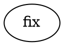

Failures are inevitable when orchestrating LLM-powered workflows — models hit rate limits, agents produce bad output, commands fail, and providers go down. Fabro handles this with multiple layers of defense: automatic retries with backoff, provider failover, failure classification for intelligent routing, circuit breakers to prevent infinite loops, and goal gates to catch quality problems before a run completes.

## Failure classification

When a node fails, Fabro classifies the failure into one of six categories. These classes drive retry decisions, circuit breaker logic, and edge routing.

| Class | Description | Examples |
|---|---|---|
| `transient_infra` | Temporary infrastructure problem — likely to resolve on retry | Rate limits, timeouts, network errors, 5xx responses |
| `deterministic` | Permanent failure — retrying won't help | Authentication errors, bad configuration, invalid requests |
| `budget_exhausted` | Resource limit reached | Context length exceeded, token/turn limits, quota exhausted |
| `compilation_loop` | Reserved for loop detection | — |
| `canceled` | User or system cancellation | Cancel signal, abort |
| `structural` | Reserved for scope enforcement | Write scope violations |

Classification happens automatically. Fabro inspects SDK error types, HTTP status codes, and error message patterns to assign the right class. The `failure_class` is written to [context](/execution/context) after each stage, so you can route on it in edge conditions:

```dot
implement -> fix       [condition="failure_class=transient_infra"]
implement -> escalate  [condition="failure_class=deterministic"]
```

## Retry layers

Fabro retries failures at two levels: **LLM retries** handle transient API errors inside a single model call, and **node retries** re-execute the entire node handler when the first level isn't enough. These layers are independent — a node retry re-runs the full handler, which gets its own fresh set of LLM retries.

### LLM retries

Every LLM call (within an agent session or a one-shot prompt node) has a built-in retry loop for transient API errors. This is invisible to the workflow — it happens inside the model call itself.

| Setting | Default |
|---|---|
| Max retries | 3 |
| Initial delay | 1 second |
| Backoff multiplier | 2x |
| Max delay | 60 seconds |
| Jitter | 0.5x–1.5x random factor |

Only transient errors are retried: rate limits, server errors (5xx), timeouts, network failures, and stream interruptions. Permanent errors like authentication failures or invalid requests fail immediately.

If the provider returns a `Retry-After` header, Fabro respects it — unless the delay exceeds 60 seconds, in which case the call fails rather than blocking the run.

### Node retries

When a node handler fails (after LLM retries are exhausted), the engine can retry the entire node. This is controlled by **retry policies**.

#### Retry policies

Set a retry policy on a node with the `retry_policy` attribute:

```dot
implement [retry_policy="standard"]
```

| Policy | Max attempts | Initial delay | Backoff | Typical delays |
|---|---|---|---|---|
| `none` | 1 | — | — | No retries |
| `standard` | 5 | 200ms | 2x exponential | 200ms, 400ms, 800ms, 1.6s |
| `aggressive` | 5 | 500ms | 2x exponential | 500ms, 1s, 2s, 4s |
| `linear` | 3 | 500ms | 1x (constant) | 500ms, 500ms |
| `patient` | 3 | 2s | 3x exponential | 2s, 6s |

All policies apply random jitter (0.5x–1.5x) and cap individual delays at 60 seconds.

#### Setting retries without a policy

You can also set just the retry count using `max_retries`:

```dot
implement [max_retries="5"]
```

This uses the default backoff (5s initial, 2x exponential) with the specified number of retries.

#### Resolution order

The engine resolves retry configuration in this order:

1. Node attribute `retry_policy` — named preset
2. Node attribute `max_retries` — count only, default backoff
3. Graph attribute `default_max_retry` — applies to all nodes without explicit config (default: **3**)

#### What gets retried

Not all errors trigger a node retry. The handler's `should_retry` check must return true — generally, only errors classified as transient are retried. Deterministic errors (auth failures, bad config) fail immediately without consuming retry attempts.

When a handler returns a `Retry` status instead of `Fail`, retries always proceed (if attempts remain). If retries are exhausted and the node has `allow_partial=true`, the outcome is promoted to `PartialSuccess` instead of failing.

## Model fallbacks

When a model provider fails with a transient error or quota exhaustion, Fabro can automatically switch to a different provider. Configure fallback chains in your [run configuration](/execution/run-configuration):

```toml title="run.toml"
[llm]
model = "claude-opus-4-6"
provider = "anthropic"

[llm.fallbacks]
anthropic = ["gemini", "openai"]
gemini = ["anthropic", "openai"]
```

When Anthropic is unavailable, Fabro tries Gemini first, then OpenAI. For each fallback provider, Fabro selects the closest model by matching required capabilities (tool use, vision, reasoning) and minimizing cost difference.

### What triggers failover

Failover is a superset of LLM retry eligibility:

| Error type | LLM retry | Provider failover |
|---|---|---|
| Rate limit | Yes | Yes |
| Server error (5xx) | Yes | Yes |
| Timeout / network | Yes | Yes |
| Quota exceeded | No | Yes |
| Authentication (401) | No | No |
| Invalid request (400) | No | No |
| Context length (413) | No | No |
| Content filter | No | No |

Quota errors are the key distinction — they aren't retried against the same provider (the quota won't reset) but *are* eligible for failover to a provider with its own quota.

## Loop detection

Fabro has two independent mechanisms for detecting stuck loops: **node visit limits** that catch workflow-level cycles, and **tool call pattern detection** that catches agent-level repetition.

### Node visit limits

The `max_node_visits` graph attribute sets the maximum number of times any single node can execute before the run is terminated:

```dot title="example.fabro"
digraph Example {
    graph [max_node_visits="20"]
    // ...
}
```

| Context | Default |
|---|---|
| Normal runs | Disabled (unlimited) |
| Dry runs (`--dry-run`) | 10 |
| Explicit `max_node_visits` | The configured value |

When a node hits the limit, the run fails immediately:

```
node "verify" visited 20 times (graph limit 20); run is stuck in a cycle
```

#### Per-node overrides

You can set `max_visits` on individual nodes to override the graph-level limit for that node:



The per-node `max_visits` takes precedence over `max_node_visits` (and the dry-run default of 10). This is useful when specific nodes — like a fix-and-verify loop — should have a tighter limit than the rest of the workflow:

```
node "fix" visited 3 times (node limit 3); run is stuck in a cycle
```

### Tool call loop detection

Inside an agent session, Fabro monitors the last 10 assistant turns for repeating tool call patterns. It detects patterns of length 1 (same call repeated), 2 (A-B-A-B), or 3 (A-B-C-A-B-C). Every complete group in the window must match for detection to trigger.

When a loop is detected, Fabro injects a steering message into the conversation:

> WARNING: Loop detected. You appear to be repeating the same tool calls. Please try a different approach or ask for clarification.

This gives the agent a chance to break out of the loop without failing the node.

## Failure signatures and circuit breakers

Failure signatures are a deduplication mechanism that prevents the same failure from recurring indefinitely across loop iterations. They are particularly important for workflows with retry loops (implement → verify → fix → verify → ...).

### How signatures work

After each failed node, Fabro constructs a **failure signature** — a normalized fingerprint combining the node ID, failure class, and error message:

```
implement|deterministic|handler panicked: index out of bounds
```

The error message is normalized by lowercasing, replacing hex strings with `<hex>`, replacing digits with `<n>`, and truncating to 240 characters. This groups failures with the same root cause even when details like line numbers or timestamps vary.

### Circuit breaker

Fabro tracks signature counts across the run. When the same signature repeats **3 times** (configurable via `loop_restart_signature_limit`), the run is terminated:

```
deterministic failure cycle detected: signature ... repeated 3 times (limit 3)
```

Only `deterministic` and `structural` failures are tracked — transient failures are excluded because they may genuinely resolve on retry.

<Note>
Failure signature counts are never reset on success. This is intentional — it prevents cycles like "implement succeeds → verify fails → fix → implement succeeds → verify fails" from running indefinitely.
</Note>

### Loop restart edges

Edges marked with `loop_restart=true` trigger a special restart of the workflow from the target node. These have an additional guard: only `transient_infra` failures may cross a `loop_restart` edge. If the failure class is anything else, the run is terminated:

```
loop_restart blocked: failure_class=deterministic (requires transient_infra)
```

Loop restart edges also have their own separate circuit breaker (`restart_failure_signatures`) that enforces the same signature limit.

## Goal gates

Goal gates are quality checkpoints that are enforced when the workflow reaches an exit node. A node marked with `goal_gate=true` must have completed with `success` or `partial_success` — otherwise the run cannot finish.

```dot
verify [shape=box, goal_gate="true"]
```

When a goal gate is unsatisfied at the exit node, Fabro looks for a **retry target** — a node to jump back to for another attempt:

1. Failed node's `retry_target` attribute
2. Failed node's `fallback_retry_target` attribute
3. Graph-level `retry_target` attribute
4. Graph-level `fallback_retry_target` attribute

```dot title="example.fabro"
digraph Example {
    graph [retry_target="plan"]
    verify [shape=box, goal_gate="true", retry_target="implement"]
    // If verify fails, jump to implement
    // If no node-level target existed, would jump to plan
}
```



If no retry target is found at any level, the run fails:

```
goal gate unsatisfied for node verify and no retry target
```

## Stall watchdog

Fabro runs a background watchdog that monitors event activity. If no events are emitted for longer than the **stall timeout**, the run is canceled. This catches cases where a handler hangs indefinitely without producing errors.

| Setting | Default |
|---|---|
| `stall_timeout` | 1800 seconds (30 minutes) |
| Set to `0` | Disables the watchdog |

```dot title="example.fabro"
digraph Example {
    graph [stall_timeout="300"]  // 5 minutes
}
```

## When failures become fatal

A node failure does **not** automatically terminate the run. Fabro follows this escalation path:

1. **LLM retries** — transient API errors are retried inside the model call (up to 3 retries)
2. **Provider failover** — if configured, switch to a fallback provider
3. **Node retries** — re-execute the entire handler (per the retry policy)
4. **Edge routing** — if the node ultimately fails, look for an outgoing edge that matches (e.g., `condition="outcome=fail"`)
5. **Retry target** — if no matching edge exists, check `retry_target` / `fallback_retry_target` on the node and graph
6. **Run failure** — if none of the above produces a path forward, the run terminates

The run also terminates immediately for:

- **Node visit limit exceeded** — a node has been visited too many times
- **Circuit breaker tripped** — the same failure signature has repeated too many times
- **Loop restart blocked** — a non-transient failure tried to cross a `loop_restart` edge
- **Goal gate failure with no retry target** — a required gate was unsatisfied at the exit node
- **Stall timeout** — no events for too long
- **Cancellation** — user or system cancel signal
