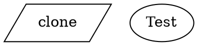

A run config is a TOML file that bundles a workflow graph with all the settings needed to execute it — the goal, model, sandbox, setup commands, variables, and hooks. Instead of passing a dozen CLI flags, you check a `.toml` file into version control and launch with a single command:

```bash
fabro run run.toml
```

## Minimal example

A run config requires two fields:

```toml title="run.toml"
version = 1
graph = "workflow.fabro"
goal = "Implement the login feature"
```

| Field | Required | Description |
|---|---|---|
| `version` | Yes | Config format version. Must be `1`. |
| `graph` | Yes | Path to the Graphviz workflow file, resolved relative to the TOML file's directory. |
| `goal` | No | What the workflow should accomplish. Passed to agents and used in retrospectives. Can also be provided via `--goal` CLI flag or Graphviz graph `goal` attribute. |

Goal precedence: CLI `--goal` > TOML `goal` > Graphviz graph attribute.

## Full example

```toml title="run.toml"
version = 1
goal = "Run the CI pipeline for $repo_name"
graph = "fabro/workflows/ci.fabro"
directory = "/tmp/workdir"

[llm]
model = "claude-sonnet-4-5"

[llm.fallbacks]
anthropic = ["gemini", "openai"]
gemini = ["anthropic", "openai"]

[setup]
commands = ["git clone $repo_url repo", "cd repo && npm install"]
timeout_ms = 120000

[sandbox]
provider = "daytona"
preserve = false

[sandbox.daytona]
auto_stop_interval = 60

[sandbox.daytona.labels]
project = "fabro"
env = "ci"

[sandbox.daytona.snapshot]
name = "node-20"
cpu = 4
memory = 8
disk = 20
dockerfile = "FROM node:20-slim\nRUN apt-get update && apt-get install -y git"

[sandbox.env]
API_KEY = "${env.MY_API_KEY}"
NODE_ENV = "production"

[checkpoint]
exclude_globs = ["**/node_modules/**", "**/.cache/**"]

[vars]
repo_name = "fabro"
repo_url = "https://github.com/fabro-sh/fabro"

[assets]
include = ["test-results/**", "playwright-report/**"]

[mcp_servers.playwright]
type = "sandbox"
command = ["npx", "@playwright/mcp@latest", "--port", "3100", "--headless"]
port = 3100

[pull_request]
enabled = true
draft = false

[[hooks]]
event = "stage_start"
command = "./scripts/pre-check.sh"
blocking = true
sandbox = false

[[hooks]]
event = "run_complete"
command = "echo done"
```

## Sections

### `[llm]`

Override the default model and provider for all nodes that don't have an explicit model assigned via a [stylesheet](/workflows/stylesheets).

```toml title="run.toml"
[llm]
model = "claude-sonnet-4-5"
```

| Field | Description |
|---|---|
| `model` | Model ID or alias (e.g. `claude-sonnet-4-5`, `opus`, `gemini-pro`). See [Models](/core-concepts/models). |
| `provider` | Provider name (optional — auto-inferred from the model catalog). Only needed for models not in the catalog or to force a specific provider. |

#### `[llm.fallbacks]`

Map each provider to an ordered list of fallback providers. When the primary provider is unavailable, Fabro tries the fallbacks in order:

```toml title="run.toml"
[llm.fallbacks]
anthropic = ["gemini", "openai"]
gemini = ["anthropic", "openai"]
```

### `[setup]`

Shell commands to run before the workflow starts. Use this to clone repositories, install dependencies, or prepare the environment.

```toml title="run.toml"
[setup]
commands = ["pip install -r requirements.txt", "npm install"]
timeout_ms = 60000
```

| Field | Description |
|---|---|
| `commands` | List of shell commands, executed sequentially via `sh -c`. |
| `timeout_ms` | Per-command timeout in milliseconds. Default: `300000` (5 minutes). |

Each command must exit with status 0. If any command fails or times out, the run aborts before the workflow starts.

### `[sandbox]`

Configure how agent tools (bash, file edits) are executed.

```toml title="run.toml"
[sandbox]
provider = "docker"
preserve = true
```

| Field | Description |
|---|---|
| `provider` | Sandbox mode: `local` (default), `docker`, `daytona`, `ssh`, or `exe`. |
| `preserve` | When `true`, keep the sandbox alive after the run finishes. Useful for debugging. |
| `devcontainer` | When `true`, use the repo's `devcontainer.json` to configure the sandbox. See [Devcontainers](/execution/devcontainers). |

#### `[sandbox.daytona]`

Additional settings when using the Daytona cloud sandbox:

```toml title="run.toml"
[sandbox.daytona]
auto_stop_interval = 60

[sandbox.daytona.labels]
project = "fabro"
env = "staging"

[sandbox.daytona.snapshot]
name = "my-snapshot"
cpu = 4
memory = 8
disk = 20
dockerfile = "FROM rust:1.85-slim-bookworm\nRUN apt-get update"
# Or reference an external Dockerfile:
# dockerfile = { path = "./Dockerfile" }
```

| Field | Description |
|---|---|
| `auto_stop_interval` | Minutes of inactivity before the sandbox auto-stops. |
| `labels` | Key-value labels attached to the sandbox for filtering and identification. |
| `snapshot.name` | Snapshot name to create or use for the sandbox. |
| `snapshot.cpu` | CPU cores for the snapshot. |
| `snapshot.memory` | Memory in GB for the snapshot. |
| `snapshot.disk` | Disk in GB for the snapshot. |
| `snapshot.dockerfile` | Dockerfile content (inline string) or path (`{ path = "..." }`) for building the snapshot image. Paths are resolved relative to the TOML file's directory. |
| `network` | Network access mode: `"allow_all"` (default), `"block"`, or `{ allow_list = ["..."] }`. See [Sandboxing](/administration/sandboxing#network-access-control). |

#### `[sandbox.local]`

Additional settings when using the local sandbox:

```toml title="run.toml"
[sandbox.local]
worktree_mode = "always"
```

| Field | Description |
|---|---|
| `worktree_mode` | When to create a git worktree for the run: `always`, `clean` (default — only when the working tree is clean), `dirty` (also when dirty), or `never`. |

#### `[sandbox.ssh]`

Additional settings when using the SSH sandbox:

```toml title="run.toml"
[sandbox]
provider = "ssh"

[sandbox.ssh]
destination = "user@myserver"
working_directory = "/home/user/workspace"
```

| Field | Required | Description |
|---|---|---|
| `destination` | Yes | SSH destination — `user@host`, a hostname, or an SSH alias from `~/.ssh/config`. |
| `working_directory` | Yes | Absolute path to the working directory on the remote host. |
| `config_file` | No | Path to a custom SSH config file (e.g. for non-default keys or jump hosts). |
| `preview_url_base` | No | Base URL for port previews (e.g. `"http://myserver"`). When set, preview URLs are `{preview_url_base}:{port}` instead of `localhost`. |

See [SSH sandbox](/execution/environments#ssh) for full details.

#### `[sandbox.exe]`

Additional settings when using the [exe.dev](/integrations/exe-dev) cloud sandbox:

```toml title="run.toml"
[sandbox]
provider = "exe"

[sandbox.exe]
image = "my-custom-image:latest"
```

| Field | Description |
|---|---|
| `image` | Custom container image for the exe.dev VM. Optional — uses the exe.dev default when omitted. |

#### `[sandbox.env]`

Pass environment variables into sandbox command and agent execution. Values can be literal strings or host environment passthrough using `${env.VARNAME}` syntax:

```toml title="run.toml"
[sandbox.env]
API_KEY = "${env.MY_API_KEY}"
NODE_ENV = "production"
```

| Syntax | Description |
|---|---|
| `"literal"` | Static value passed as-is |
| `"${env.VARNAME}"` | Resolved from the host environment at load time. Missing vars produce a hard error. |

Host env references must be whole-value only — partial interpolation like `"prefix-${env.X}"` is not supported. Sandbox env vars from `server.toml` defaults and the run config are merged, with the run config winning on key collisions.

### `[checkpoint]`

Configure how git checkpoint commits behave.

```toml title="run.toml"
[checkpoint]
exclude_globs = ["**/node_modules/**", "**/.cache/**", "**/dist/**"]
```

| Field | Description |
|---|---|
| `exclude_globs` | Glob patterns for files to exclude from checkpoint commits. Uses git pathspec `:(glob,exclude)` syntax. |

Exclude globs from `server.toml` defaults and the run config are merged (union, deduplicated).

### `[vars]`

Define variables that are expanded into the Graphviz source before the graph is parsed. See [Variables](/workflows/variables) for the full reference.

```toml title="run.toml"
[vars]
repo_name = "fabro"
repo_url = "https://github.com/fabro-sh/fabro"
language = "rust"
```

Variables can be used anywhere in the Graphviz file with `$name` syntax:



If a `$variable` in the Graphviz file has no matching entry in `[vars]`, Fabro raises an error immediately. A bare `$` not followed by an identifier (e.g. `costs $5`) is left as-is.

### `[assets]`

Configure automatic collection of test artifacts (Playwright reports, JUnit XML, screenshots, etc.) from the execution environment after each stage.

```toml title="run.toml"
[assets]
include = ["test-results/**", "playwright-report/**", "*.trace.zip"]
```

| Field | Description |
|---|---|
| `include` | Glob patterns for files to collect as assets. Matched against the working directory after each stage completes. |

Asset collection is opt-in — when no `[assets]` section is present, no file scanning occurs. This avoids the overhead of scanning large working directories when assets aren't needed.

### `[mcp_servers]`

Configure [MCP servers](/agents/mcp) available to agent stages during the workflow run. Each server is a named TOML table. All three transport types are supported: `stdio`, `http`, and `sandbox`.

```toml title="run.toml"
[mcp_servers.playwright]
type = "sandbox"
command = ["npx", "@playwright/mcp@latest", "--port", "3100", "--headless", "--browser", "chromium"]
port = 3100
startup_timeout_secs = 60
tool_timeout_secs = 120
```

| Field | Description | Default |
|---|---|---|
| `type` | Transport type: `"stdio"`, `"http"`, or `"sandbox"`. | — |
| `command` | (stdio, sandbox) Array: executable + arguments. | — |
| `port` | (sandbox) Port the server listens on inside the sandbox. | — |
| `url` | (http) The MCP server endpoint URL. | — |
| `env` | (stdio, sandbox) Additional environment variables. | `{}` |
| `headers` | (http) Optional HTTP headers for authentication. | `{}` |
| `startup_timeout_secs` | Max seconds for server startup + MCP handshake. | `10` |
| `tool_timeout_secs` | Max seconds for a single tool call. | `60` |

The `sandbox` transport runs the MCP server inside the workflow's sandbox. This is useful for tools that need access to the sandbox environment, such as browser automation with Playwright. See [MCP](/agents/mcp#sandbox) for details.

### `[pull_request]`

Automatically open a GitHub pull request when the workflow run completes successfully. Requires a [GitHub App](/integrations/github) to be configured.

```toml title="run.toml"
[pull_request]
enabled = true
draft = true
auto_merge = false
merge_strategy = "squash"
```

| Field | Description |
|---|---|
| `enabled` | When `true`, Fabro creates a PR from the agent's working branch after a successful run. Default: `false`. |
| `draft` | When `true`, the PR is created as a draft pull request. Default: `true`. |
| `auto_merge` | When `true`, enables GitHub auto-merge on the created PR. Implies `draft = false` since GitHub doesn't allow auto-merge on draft PRs. The repository must have auto-merge enabled in GitHub settings. Default: `false`. |
| `merge_strategy` | Merge method when `auto_merge` is enabled: `squash` (default), `merge`, or `rebase`. |

### `[github]`

Request a scoped GitHub Installation Access Token and inject it into the sandbox as `GITHUB_TOKEN`. The token is minted from the configured [GitHub App](/integrations/github) with only the permissions you specify.

```toml title="run.toml"
[github]
permissions = { contents = "write", pull_requests = "read" }
```

| Field | Description |
|---|---|
| `permissions` | Map of GitHub API permission names to access levels (`"read"` or `"write"`). Only the listed permissions are requested. |

This requires a GitHub App to be configured. If the app is missing or the repository doesn't have an installation, the run logs a warning and continues without injecting the token.

### `[[hooks]]`

Define hooks that run in response to lifecycle events. Each hook is a TOML array entry:

```toml title="run.toml"
[[hooks]]
name = "pre-check"
event = "stage_start"
command = "./scripts/pre-check.sh"
matcher = "agent_loop"
blocking = true
timeout_ms = 30000
sandbox = false
```

| Field | Description |
|---|---|
| `name` | Optional display name for the hook. |
| `event` | Lifecycle event: `run_start`, `run_complete`, `stage_start`, `stage_complete`. |
| `command` | Shell command to execute (shorthand for `type = "command"`). |
| `matcher` | Regex matched against node ID or handler type. Limits which stages trigger this hook. |
| `blocking` | Whether the hook must complete before execution continues. Defaults vary by event. |
| `timeout_ms` | Hook timeout in milliseconds. Default: `60000` (60s). |
| `sandbox` | Run inside the sandbox (`true`, default) or on the host (`false`). |

See [Hooks](/agents/hooks) for hook types beyond simple commands (HTTP, prompt, agent).

## Top-level fields

In addition to the sections above, two optional top-level fields are available:

| Field | Description |
|---|---|
| `directory` | Working directory for the run. Defaults to the current directory. |

## Graph path resolution

The `graph` path is resolved relative to the TOML file's parent directory, not the current working directory. This means a run config and its workflow can live side by side:

```
project/
  runs/
    ci.toml       # graph = "ci.fabro"
    ci.fabro
```

Absolute paths are used as-is.

## Precedence

Settings can come from multiple sources. Fabro resolves them in this order (first match wins):

| Source | Priority |
|---|---|
| Node-level [stylesheet](/workflows/stylesheets) | Highest |
| Run config TOML | |
| CLI flags (`--model`, `--provider`, `--sandbox`) | |
| Project defaults (`fabro.toml`) | |
| Server defaults (`~/.fabro/server.toml`) | |
| Graphviz graph attributes (`default_model`, `default_provider`) | |
| Built-in defaults | Lowest |

<Note>
For model and provider specifically, the precedence is: CLI flags > TOML config > project defaults > server defaults > Graphviz graph attributes > built-in defaults. Stylesheet rules on individual nodes always take priority over all of these.
</Note>

### Project defaults (`fabro.toml`)

The `fabro.toml` project config can set default values for `[llm]`, `[setup]`, `[sandbox]`, `[vars]`, `[checkpoint]`, `[pull_request]`, `[github]`, `[assets]`, `[[hooks]]`, and `[mcp_servers]`. These defaults apply to all runs in the project unless the run config overrides them:

```toml title="fabro.toml"
version = 1

[llm]
model = "claude-sonnet-4-5"

[sandbox]
provider = "daytona"

[sandbox.daytona.snapshot]
name = "my-project-snapshot"

[github]
permissions = { contents = "write" }
```

Project defaults are merged with run config values using the same rules as server defaults — run config wins on key collisions.

### Server defaults

When running via `fabro serve`, the server config at `~/.fabro/server.toml` can set default values for `[llm]`, `[setup]`, `[sandbox]`, and `[vars]`. These defaults are applied to every run unless the run config overrides them.

For variables, defaults and run config are **merged** — the run config wins on key collisions:

```toml
# ~/.fabro/server.toml
[vars]
default_key = "from_server"
shared = "from_server"

# run.toml
[vars]
shared = "from_run"       # wins
task_key = "from_run"
```

The same merge behavior applies to Daytona labels. All other fields use simple "first non-empty wins" precedence.

## Validation

Fabro validates the run config when it loads:

- **Version check** — Only `version = 1` is accepted. Other versions are rejected immediately.
- **Required fields** — `version` and `graph` are required. `goal` is optional (can be provided via `--goal` or Graphviz graph attribute).
- **Unknown fields** — Extra fields not listed above are rejected (`deny_unknown_fields`).
- **Variable check** — Any `$variable` in the Graphviz file without a matching `[vars]` entry produces an error.

Use `--preflight` to validate a run config without executing it:

```bash
fabro run run.toml --preflight
```
