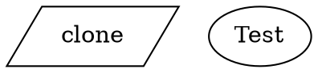

A run config is a TOML file that bundles a workflow graph with all the settings needed to execute it — the goal, model, sandbox, prepare steps, inputs, and hooks. Instead of passing a dozen CLI flags, you check a `.toml` file into version control and launch with a single command:

```bash
fabro run run.toml
```

## Minimal example

A run config needs at minimum a schema version and a goal:

```toml title="run.toml"
_version = 1

[workflow]
graph = "workflow.fabro"

[run]
goal = "Implement the login feature"
```

| Field | Required | Description |
|---|---|---|
| `_version` | No (defaults to `1`) | Schema version. Must be `1` in the first pass. |
| `[workflow].graph` | No | Path to the Graphviz workflow file, relative to the TOML file's directory. Defaults to `workflow.fabro`. |
| `[run].goal` | No | What the workflow should accomplish. Passed to agents and used in retrospectives. Can also be provided via `--goal` CLI flag or Graphviz graph `goal` attribute. |

Goal precedence: CLI `--goal` > `[run].goal` > Graphviz graph attribute.

## Full example

```toml title="run.toml"
_version = 1

[workflow]
graph = "fabro/workflows/ci.fabro"

[run]
goal = "Run the CI pipeline for $repo_name"
working_dir = "/tmp/workdir"

[run.model]
name = "claude-sonnet-4-5"
fallbacks = ["openai", "gemini"]

[[run.prepare.steps]]
script = "git clone $repo_url repo"

[[run.prepare.steps]]
script = "cd repo && npm install"

[run.sandbox]
provider = "daytona"
preserve = false

[run.sandbox.daytona]
auto_stop_interval = 60

[run.sandbox.daytona.labels]
project = "fabro"
env = "ci"

[run.sandbox.daytona.snapshot]
name = "node-20"
cpu = 4
memory = "8GB"
disk = "20GB"
dockerfile = "FROM node:20-slim\nRUN apt-get update && apt-get install -y git"

[run.sandbox.env]
API_KEY = "${env.MY_API_KEY}"
NODE_ENV = "production"

[run.checkpoint]
exclude_globs = ["**/node_modules/**", "**/.cache/**"]

[run.inputs]
repo_name = "fabro"
repo_url = "https://github.com/fabro-sh/fabro"

[run.artifacts]
include = ["test-results/**", "playwright-report/**"]

[run.agent.mcps.playwright]
type = "sandbox"
command = ["npx", "@playwright/mcp@latest", "--port", "3100", "--headless"]
port = 3100

[run.pull_request]
enabled = true
draft = false

[[run.hooks]]
id = "pre-check"
event = "stage_start"
script = "./scripts/pre-check.sh"
blocking = true
sandbox = false

[[run.hooks]]
event = "run_complete"
script = "echo done"
```

## Sections

### `[run.model]`

Override the default model and provider for all nodes that don't have an explicit model assigned via a [stylesheet](/workflows/stylesheets).

```toml title="run.toml"
[run.model]
name = "claude-sonnet-4-5"
```

| Field | Description |
|---|---|
| `name` | Model ID or alias (e.g. `claude-sonnet-4-5`, `opus`, `gemini-pro`). See [Models](/core-concepts/models). |
| `provider` | Provider name (optional — auto-inferred from the model catalog). Only needed for models not in the catalog or to force a specific provider. |
| `fallbacks` | Ordered list of model references to try when the primary is unavailable. Entries can be bare provider tokens (`"openai"`), bare model aliases, or qualified `"provider/model"` references. |

#### Fallbacks with splice

Use the reserved `"..."` marker in `fallbacks` to splice in the inherited list from lower-precedence layers:

```toml title="run.toml"
[run.model]
# Prepend "anthropic" to whatever fallbacks the project config already defines.
fallbacks = ["anthropic", "..."]
```

### `[run.prepare]`

Ordered list of steps to run before the workflow starts. Use this to clone repositories, install dependencies, or prepare the environment.

```toml title="run.toml"
[[run.prepare.steps]]
script = "pip install -r requirements.txt"

[[run.prepare.steps]]
script = "npm install"
```

| Field | Description |
|---|---|
| `script` | Shell-evaluated command (runs through `sh -c`). |
| `command` | Argv-style command, mutually exclusive with `script`. |
| `env` | Additional environment variables for this step. |

Each step must exit with status 0. If any step fails, the run aborts before the workflow starts. Prepare steps replace across layers — the higher-precedence layer wins wholesale.

### `[run.sandbox]`

Configure how agent tools (bash, file edits) are executed.

```toml title="run.toml"
[run.sandbox]
provider = "docker"
preserve = true
```

| Field | Description |
|---|---|
| `provider` | Sandbox mode: `local` (default), `docker`, or `daytona`. |
| `preserve` | When `true`, keep the sandbox alive after the run finishes. Useful for debugging. |
| `devcontainer` | When `true`, use the repo's `devcontainer.json` to configure the sandbox. See [Devcontainers](/execution/devcontainers). |

#### `[run.sandbox.daytona]`

Additional settings when using the Daytona cloud sandbox:

```toml title="run.toml"
[run.sandbox.daytona]
auto_stop_interval = 60

[run.sandbox.daytona.labels]
project = "fabro"
env = "staging"

[run.sandbox.daytona.snapshot]
name = "my-snapshot"
cpu = 4
memory = "8GB"
disk = "20GB"
dockerfile = "FROM rust:1.85-slim-bookworm\nRUN apt-get update"
# Or reference an external Dockerfile:
# dockerfile = { path = "./Dockerfile" }
```

| Field | Description |
|---|---|
| `auto_stop_interval` | Minutes of inactivity before the sandbox auto-stops. |
| `labels` | Key-value labels attached to the sandbox for filtering and identification. Labels merge across layers (sticky merge-by-key). |
| `snapshot.name` | Snapshot name to create or use for the sandbox. |
| `snapshot.cpu` | CPU cores for the snapshot (integer). |
| `snapshot.memory` | Memory size using human-readable units: `"8GB"`, `"16GiB"`, or bare integers that default to GB. |
| `snapshot.disk` | Disk size using the same units as `memory`. |
| `snapshot.dockerfile` | Dockerfile content (inline string) or path (`{ path = "..." }`) for building the snapshot image. Paths are resolved relative to the TOML file's directory. |
| `network` | Network access mode: `"allow_all"` (default), `"block"`, or `{ allow_list = ["..."] }`. See [Sandboxing](/administration/sandboxing#network-access-control). |

#### `[run.sandbox.local]`

Additional settings when using the local sandbox:

```toml title="run.toml"
[run.sandbox.local]
worktree_mode = "always"
```

| Field | Description |
|---|---|
| `worktree_mode` | When to create a git worktree for the run: `always`, `clean` (default — only when the working tree is clean), `dirty` (also when dirty), or `never`. |

#### `[run.sandbox.env]`

Pass environment variables into sandbox command and agent execution. Values can be literal strings or host environment references using `${env.VARNAME}` syntax:

```toml title="run.toml"
[run.sandbox.env]
API_KEY = "${env.MY_API_KEY}"
NODE_ENV = "production"
SERVICE_URL = "https://api.${env.REGION}.example.com"
```

| Syntax | Description |
|---|---|
| `"literal"` | Static value passed as-is |
| `"${env.VARNAME}"` | Whole-value reference resolved from the host environment at consumption time |
| `"prefix-${env.X}-suffix"` | Substring interpolation; multiple tokens per string are supported |

Missing host variables produce a hard error pointing at the specific field and unresolved token. `run.sandbox.env` is a sticky merge-by-key map: entries from all layers combine, with higher-precedence layers overriding individual keys.

### `[run.checkpoint]`

Configure how git checkpoint commits behave.

```toml title="run.toml"
[run.checkpoint]
exclude_globs = ["**/node_modules/**", "**/.cache/**", "**/dist/**"]
```

| Field | Description |
|---|---|
| `exclude_globs` | Glob patterns for files to exclude from checkpoint commits. Uses git pathspec `:(glob,exclude)` syntax. |

`exclude_globs` replaces across layers — the higher-precedence layer wins wholesale.

### `[run.inputs]`

Define inputs that are expanded into the Graphviz source before the graph is parsed. See [Variables](/workflows/variables) for the full reference.

```toml title="run.toml"
[run.inputs]
repo_name = "fabro"
repo_url = "https://github.com/fabro-sh/fabro"
language = "rust"
```

Inputs can be used anywhere in the Graphviz file with `$name` syntax:



If a `$variable` in the Graphviz file has no matching entry in `[run.inputs]`, Fabro raises an error immediately. A bare `$` not followed by an identifier (e.g. `costs $5`) is left as-is.

`[run.inputs]` replaces wholesale across layers. Unlike labels, inputs do not merge by key — the highest-precedence layer that sets `inputs` wins its entire map.

### `[run.artifacts]`

Configure automatic collection of test artifacts (Playwright reports, JUnit XML, screenshots, etc.) from the execution environment after each stage.

```toml title="run.toml"
[run.artifacts]
include = ["test-results/**", "playwright-report/**", "*.trace.zip"]
```

| Field | Description |
|---|---|
| `include` | Glob patterns for files to collect as assets. Matched against the working directory after each stage completes. |

Artifact collection is opt-in — when no `[run.artifacts]` section is present, no file scanning occurs.

### `[run.agent.mcps]`

Configure [MCP servers](/agents/mcp) available to agent stages during the workflow run. Each server is a named TOML table under `[run.agent.mcps]`. All three transport types are supported: `stdio`, `http`, and `sandbox`.

```toml title="run.toml"
[run.agent.mcps.playwright]
type = "sandbox"
command = ["npx", "@playwright/mcp@latest", "--port", "3100", "--headless", "--browser", "chromium"]
port = 3100
startup_timeout = "60s"
tool_timeout = "2m"
```

| Field | Description | Default |
|---|---|---|
| `type` | Transport type: `"stdio"`, `"http"`, or `"sandbox"`. | — |
| `script` | (stdio, sandbox) Shell-evaluated startup command, mutually exclusive with `command`. | — |
| `command` | (stdio, sandbox) Argv array: executable + arguments. | — |
| `port` | (sandbox) Port the server listens on inside the sandbox. | — |
| `url` | (http) The MCP server endpoint URL. | — |
| `env` | (stdio, sandbox) Additional environment variables. | `{}` |
| `headers` | (http) Optional HTTP headers for authentication. | `{}` |
| `startup_timeout` | Max duration for server startup + MCP handshake (e.g. `"10s"`, `"1m"`). | `"10s"` |
| `tool_timeout` | Max duration for a single tool call. | `"60s"` |

The `sandbox` transport runs the MCP server inside the workflow's sandbox. This is useful for tools that need access to the sandbox environment, such as browser automation with Playwright. See [MCP](/agents/mcp#sandbox) for details.

### `[run.pull_request]`

Automatically open a GitHub pull request when the workflow run completes successfully. Requires a [GitHub App](/integrations/github) to be configured.

```toml title="run.toml"
[run.pull_request]
enabled = true
draft = true
auto_merge = false
merge_strategy = "squash"
```

| Field | Description |
|---|---|
| `enabled` | When `true`, Fabro creates a PR from the agent's working branch after a successful run. Default: `false`. |
| `draft` | When `true`, the PR is created as a draft pull request. Default: `true`. |
| `auto_merge` | When `true`, enables GitHub auto-merge on the created PR. Implies `draft = false` since GitHub doesn't allow auto-merge on draft PRs. The repository must have auto-merge enabled in GitHub settings. Default: `false`. |
| `merge_strategy` | Merge method when `auto_merge` is enabled: `squash` (default), `merge`, or `rebase`. |

### `[[run.hooks]]`

Define hooks that run in response to lifecycle events. Each hook is a TOML array entry:

```toml title="run.toml"
[[run.hooks]]
id = "pre-check"
name = "Pre-check script"
event = "stage_start"
script = "./scripts/pre-check.sh"
matcher = "agent_loop"
blocking = true
timeout = "30s"
sandbox = false
```

| Field | Description |
|---|---|
| `id` | Optional merge identity. Hooks with the same `id` replace each other across layers. |
| `name` | Optional display name for the hook. |
| `event` | Lifecycle event: `run_start`, `run_complete`, `stage_start`, `stage_complete`, etc. |
| `script` | Shell-evaluated command (equivalent to the old `type = "command"` shorthand). |
| `command` | Argv-style command (alternative to `script`). |
| `matcher` | Regex matched against node ID or handler type. Limits which stages trigger this hook. |
| `blocking` | Whether the hook must complete before execution continues. Defaults vary by event. |
| `timeout` | Human-readable hook timeout (e.g. `"30s"`, `"1m"`). Default: `"60s"`. |
| `sandbox` | Run inside the sandbox (`true`, default) or on the host (`false`). |

Hook merge semantics: hooks with matching `id` values replace in place. Hooks without an `id` from a higher-precedence layer append after the fully merged inherited hook list.

See [Hooks](/agents/hooks) for hook types beyond scripts (HTTP, prompt, agent).

## Graph path resolution

The `[workflow].graph` path is resolved relative to the TOML file's parent directory, not the current working directory. This means a run config and its workflow can live side by side:

```
project/
  runs/
    ci.toml       # [workflow] graph = "ci.fabro"
    ci.fabro
```

Absolute paths are used as-is.

## Precedence

Settings can come from multiple sources. Fabro resolves them in this order (first match wins):

| Source | Priority |
|---|---|
| Node-level [stylesheet](/workflows/stylesheets) | Highest |
| CLI flags (`--model`, `--provider`, `--sandbox`) | |
| Run config TOML (`workflow.toml` or equivalent) | |
| Project defaults (`fabro.toml`) | |
| Machine defaults (`~/.fabro/settings.toml`) | |
| Graphviz graph attributes (`default_model`, `default_provider`) | |
| Built-in defaults | Lowest |

<Note>
Stylesheet rules on individual nodes always take priority over run config values.
</Note>

### Project defaults (`fabro.toml`)

The `fabro.toml` project config can set default values for any of the `[run.*]` sections described above. These defaults apply to all runs in the project unless the workflow config overrides them:

```toml title="fabro.toml"
_version = 1

[project]
directory = "fabro/"

[run.model]
name = "claude-sonnet-4-5"

[run.sandbox]
provider = "daytona"

[run.sandbox.daytona.snapshot]
name = "my-project-snapshot"
```

Project defaults and workflow config values merge per the normative merge matrix: most fields merge by field (higher-precedence wins per key), `run.inputs` replaces wholesale, `run.sandbox.env` sticky-merges by key, and `run.prepare.steps` replaces whole-list.

### Machine defaults

When running locally, the machine defaults at `~/.fabro/settings.toml` can set run-scoped defaults too. Same merge rules apply.

## Validation

Fabro validates the run config when it loads:

- **`_version` check** — Only `_version = 1` (or missing, which defaults to `1`) is accepted. The legacy top-level `version` key is rejected with a rename hint.
- **Unknown keys** — Any top-level key not in `[project]`, `[workflow]`, `[run]`, `[cli]`, `[server]`, `[features]`, or `_version` is rejected with a targeted rename hint pointing at the v2 replacement path.
- **Variable check** — Any `$variable` in the Graphviz file without a matching `[run.inputs]` entry produces an error.

Use `fabro preflight` to validate a run config without executing it:

```bash
fabro preflight run.toml
```
