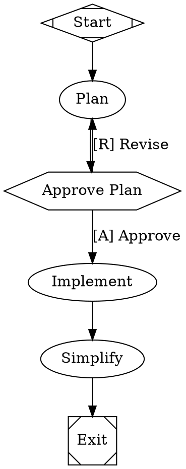

Fabro is the open source software factory for small teams of expert engineers. It replaces the prompt-wait-review loop with version-controlled workflow graphs that orchestrate AI agents, shell commands, and human decisions into repeatable, long-horizon coding processes.

## The problem

AI coding agents have transformed software engineering productivity, but the surrounding toolchain hasn't kept up:

- **Developers work for the agents.** The prompt-wait-review loop idles engineers while agents run, then demands constant babysitting to course-correct.
- **Unpredictable agents force oversight.** Non-deterministic guardrails create an explosion of failure modes. Engineers compensate by watching every step.
- **Verification is overwhelmed.** Agent throughput exceeds human review capacity. CI pipelines designed for pass/fail signals can't keep pace with the volume or nuance of AI-generated code.
- **Token costs are primed to explode.** ROI per token diverges wildly across tasks, models, and harnesses. Every unnecessary frontier token is one that can't be spent where it matters.
- **The continuous improvement loop broke.** Data is lost at every sub-process boundary. Organizations can't train LLMs the way they train people, and memory files make no guarantees.

## How Fabro solves this

Fabro gives you a deterministic harness around non-deterministic AI. You define **workflow graphs** in DOT files that specify exactly what happens, in what order, with which models, and where humans weigh in. Fabro handles orchestration, parallelism, model routing, verification, and observability.

<Columns cols={2}>
  <Card title="Version-controlled workflows" icon="diagram-project">
    Define workflows as code in Graphviz DOT. Nodes are agents, shell commands, or human input gates. Fan out, loop, branch, and resume — all traceable and repeatable.
  </Card>
  <Card title="Multi-model orchestration" icon="microchip">
    Route tasks to the right model using CSS-like stylesheets. Cross-critique with fresh eyes, delegate simple tasks to fast models, and fail over automatically when providers go down.
  </Card>
  <Card title="Human-in-the-loop" icon="hand">
    Steer while the agent runs, not after. Approval gates, interviews, and steering let you intervene at the right moments without waiting for a pull request.
  </Card>
  <Card title="Adaptive verification" icon="shield-check">
    Combine LLM-as-judge, test suites, third-party tools, and human review. Verifications act as an eval suite tailored to your organization, building confidence over time.
  </Card>
  <Card title="Observability" icon="magnifying-glass-chart">
    Every tool call, agent turn, and shell command is captured in a unified event stream. Query run data with SQL via DuckDB and generate automatic retrospectives.
  </Card>
  <Card title="Open source" icon="code-branch">
    Licensed under MIT. Written in Rust with minimal dependencies. Runs on a single node with no databases to set up.
  </Card>
</Columns>

## What a workflow looks like

Workflows are defined in Graphviz DOT, a simple graph description language. Here's a plan-approve-implement workflow and its DOT source:

<Frame>
  
</Frame>

This workflow plans a change, asks a human to approve it, implements the plan, and simplifies the result. If the human rejects the plan, the agent revises it. The entire process is version-controlled, repeatable, and resumable.

## Next steps

<Card
  title="Quick Start"
  icon="rocket"
  href="/getting-started/quick-start"
  horizontal
>
  Install Fabro and run your first workflow in minutes.
</Card>
