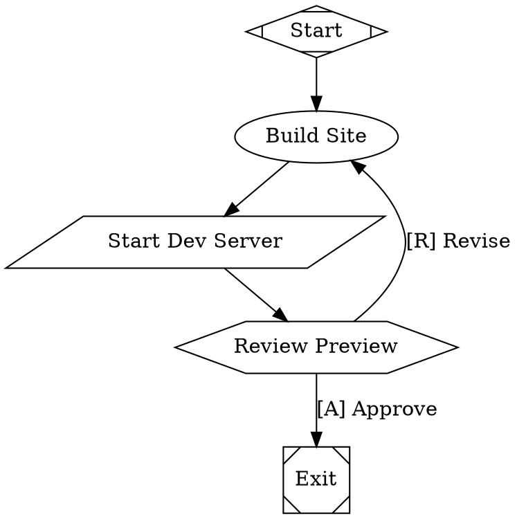

When an agent starts a web server or other network service inside a sandbox, you can generate a time-limited preview URL to access it from your browser — no port forwarding or SSH tunnels required. This lets you visually inspect what the agent is building, test interactive features, and verify UI changes while the workflow is still running.

<Note>
Preview URLs require the **Daytona** sandbox provider. Local, Docker, and exe.dev sandboxes do not support this feature.
</Note>

## How it works

When you request a preview, Arc generates a time-limited, token-authenticated URL that proxies traffic to the specified port on the sandbox. The URL is accessible from any browser without additional credentials — the signed token in the URL handles authentication.

1. An agent starts a service on a port inside the sandbox (e.g. a dev server on port 3000)
2. You request a preview URL for that port — via the web UI button or the API
3. Arc returns a signed URL that you open in your browser
4. The URL expires after the configured TTL (up to 24 hours), after which a new one must be generated

## Using preview from the CLI

Use `arc preview` to generate a preview URL for any run with an active Daytona sandbox:

```bash
arc preview <run-id> 3000              # URL + token + curl example
arc preview <run-id> 3000 --signed     # self-contained signed URL
arc preview <run-id> 3000 --open       # open in browser (implies --signed)
```

See [`arc preview`](/reference/cli#arc-preview) for the full flag reference.

## Using preview from the web UI

When viewing a run with an active sandbox, the run detail page shows a **Preview** button in the toolbar. Clicking it generates a preview URL for port 3000 with a 1-hour TTL and opens it in a new browser tab.

## Using preview from the API

Generate a preview URL by calling `POST /runs/{id}/preview` with the target port and a TTL in seconds. See the [Preview URL API reference](/api-reference/human-in-the-loop/preview-url) for the full request/response schema.

## Common use cases

### Previewing a web application

When a workflow builds and serves a web application, use preview to verify the result without waiting for the run to complete:

<Frame>
  
</Frame>



After the dev server starts, the human gate pauses the workflow. Open a preview URL for port 3000 to inspect the site, then approve or request revisions.

### Debugging a failing test

If an agent is building a frontend and tests are failing, generate a preview URL to visually inspect the application in the same state the test runner sees.

### Reviewing API responses

Start an API server in the sandbox and use the preview URL as the base for `curl` or Postman requests, inspecting the agent's implementation directly.

## Tips

- **Use `--preserve-sandbox`** to keep the sandbox alive after the workflow finishes. This gives you time to generate and use preview URLs for post-run inspection.
- **Pair with human gates** — place a human gate after the agent starts a service so you can preview before approving the next step.
- **Multiple ports** — generate separate preview URLs for different ports (e.g. frontend on 3000, API on 8080) by making multiple API calls.
- **TTL selection** — use shorter TTLs (300–900 seconds) for quick checks and longer TTLs (3600+ seconds) when you need sustained access during a review.
- **Sandbox must be running** — preview URLs only work while the sandbox is active. If the sandbox has been stopped or destroyed, the URL will stop working even if the token hasn't expired.
