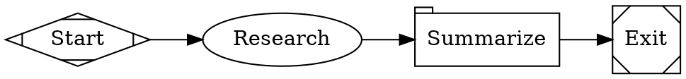

Fabro's [`web_search`](/agents/tools#web_search) tool lets agents search the web during workflow execution. It uses the [Brave Search API](https://brave.com/search/api/) to return titles, URLs, and descriptions for any query. The tool is registered automatically for all provider profiles (Anthropic, OpenAI, Gemini) — no workflow configuration is needed beyond setting the API key.

## Setup

1. Get a Brave Search API key from the [Brave Search API dashboard](https://brave.com/search/api/)

2. Add it to your `.env` file:

```bash
export BRAVE_SEARCH_API_KEY=BSA...
```

3. Verify the key is working:

```bash
fabro doctor --live
```

The doctor output should show **Brave Search** as "connected". If the key is missing, web search is reported as a warning — workflows still run, but `web_search` calls return an error.

## How it works

Agents call the `web_search` tool with a query string. Fabro sends the query to the Brave Web Search API (`/res/v1/web/search`) and returns numbered results with title, URL, and description:

```
1. Rust Lang
   https://rust-lang.org
   A systems language

2. Rust Book
   https://doc.rust-lang.org/book
   The Rust book
```

If `BRAVE_SEARCH_API_KEY` is not set, the tool returns an error explaining that the key is required. The agent can then fall back to other approaches.

See the [`web_search` tool reference](/agents/tools#web_search) for parameters and details.

## Permissions

`web_search` is classified as a `shell` category tool, requiring the `full` [permission level](/agents/permissions) for auto-approval. At lower permission levels:

- **Interactive mode** — the user is prompted to approve each call
- **Non-interactive mode** (`--auto-approve`) — calls are denied

## Example workflow

A workflow that researches a topic before writing about it:

<Frame>
  
</Frame>



## Troubleshooting

**"BRAVE_SEARCH_API_KEY environment variable is not set"** — Add the key to `.env` or your shell environment. Run `fabro doctor --live` to verify.

**"Brave Search API returned status 401"** — The API key is invalid or expired. Generate a new key from the [Brave Search API dashboard](https://brave.com/search/api/).

**"Brave Search API returned status 429"** — Rate limit exceeded. The Brave Search free tier has usage limits. Upgrade your plan or reduce the frequency of `web_search` calls.

## Further reading

<Columns cols={2}>
  <Card title="Tools" icon="wrench" href="/agents/tools#web_search">
    Full `web_search` tool reference — parameters, output format, and error handling.
  </Card>
  <Card title="Permissions" icon="lock" href="/agents/permissions">
    How tool permissions control web search access.
  </Card>
</Columns>
