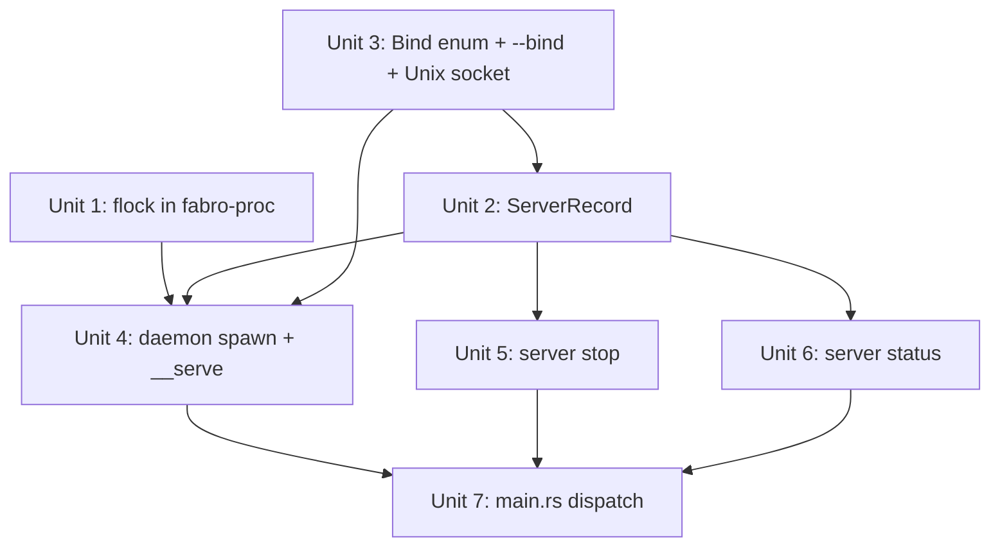

# feat: Add server daemon management with Unix socket support

## Overview

Transform `fabro server` from a foreground-only TCP server into a proper daemon with background/foreground modes, stop/status lifecycle commands, Unix socket binding, and flock-based locking to prevent thundering herd when multiple CLI invocations auto-start the server.

## Problem Frame

The fabro server currently runs only in the foreground on a TCP port. Users must manually manage the process lifecycle. There is no way to check if a server is running, stop it gracefully, or prevent duplicate instances. When the CLI eventually auto-starts the server on demand, concurrent CLI invocations could race to start multiple servers simultaneously.

## Requirements Trace

- R1. `fabro server start` launches as a background daemon by default
- R2. `fabro server start --foreground` retains current blocking behavior
- R3. `fabro server stop` sends SIGTERM, waits, escalates to SIGKILL
- R4. `fabro server status` reports running/stopped with PID, bind address, uptime
- R5. A JSON server record tracks PID and metadata; stale records are auto-cleaned
- R6. `--bind` replaces `--host`/`--port`, supporting both Unix sockets and TCP addresses
- R7. Default bind is `{storage_dir}/fabro.sock` (Unix socket)
- R8. flock-based locking prevents concurrent start attempts (thundering herd)
- R9. Only one server instance can run at a time per storage directory
- R10. TLS is not supported on Unix sockets (only on TCP)

## Scope Boundaries

- No systemd/launchd integration (out of scope)
- No log rotation or `server logs` subcommand beyond basic prev-file rotation (future work)
- Breaking change: `--host` and `--port` are removed, replaced by `--bind`
- Client-side Unix socket connectivity (TypeScript Axios client, CLI-to-server calls) is tracked as a follow-up concern -- this plan covers the server side only

## Context & Research

### Relevant Code and Patterns

- `lib/crates/fabro-cli/src/commands/run/launcher.rs` -- JSON-based launcher records with PID tracking, stale detection via `process_alive()` + `ps` command-line matching, lazy cleanup on read
- `lib/crates/fabro-cli/src/commands/run/start.rs` -- Self-re-exec pattern: spawns `fabro __detached` with `pre_exec_setsid`, stdout/stderr to log file, writes record after spawn, checks `try_wait()` for immediate failure, forwards `--storage-dir` to child
- `lib/crates/fabro-cli/src/commands/run/detached.rs` -- `scopeguard::guard(launcher_path, remove_launcher_record)` for guaranteed cleanup on exit; `title_init()`/`title_set()` for proctitle; receives record path via `--launcher-path` arg
- `lib/crates/fabro-proc/src/` -- `process_alive`, `sigterm`, `sigkill`, `pre_exec_setsid`, `title_init`/`title_set`. All functions are thin libc wrappers -- no retry loops or higher-level logic
- `lib/crates/fabro-server/src/serve.rs` -- Current `serve_command()` with `ServeArgs`, config polling, webhook manager lifecycle. No graceful shutdown wired. TLS path uses manual `loop { listener.accept() }` via `hyper_util`, not `axum::serve`
- `lib/crates/fabro-cli/src/args.rs:650` -- `#[command(name = "__detached", hide = true)]` hidden subcommand pattern with its own args struct
- `lib/crates/fabro-cli/src/args.rs:972-984` -- `ServerNamespace`/`ServerCommand` enum
- `lib/crates/fabro-cli/src/main.rs:108-195` -- Config log level extraction and command dispatch for server

### Institutional Learnings

No `docs/solutions/` directory exists. Patterns are embedded in the launcher record system.

## Key Technical Decisions

- **Hidden subcommand for daemon child, not a flag**: The daemon spawns `fabro server __serve --record-path <path> --bind <addr> ...` as a detached child. `__serve` is a hidden `ServerCommand` variant with its own args struct, matching the `__detached` pattern in `RunCommands`. This keeps `ServeArgs` focused on server runtime concerns and process lifecycle in `fabro-cli`.

- **Process lifecycle stays in fabro-cli**: `fabro-server` has no dependency on `fabro-proc` and should not gain one. A `foreground.rs` in `fabro-cli/src/commands/server/` wraps `serve_command()` with record writes, scopeguard cleanup, and proctitle management -- same boundary as `detached.rs` wrapping workflow operations.

- **Record ownership: parent writes, child cleans up**: In daemon mode, the parent writes `server.json` after spawn (and cleans up on failure). The child receives the record path via `--record-path` and sets up a `scopeguard` to remove it on exit. This matches the launcher record ownership model exactly.

- **Server record, not bare PID file**: A JSON `ServerRecord` (pid, bind: Bind, log_path, started_at) stored at `{storage_dir}/server.json`, following the `LauncherRecord` pattern. The `bind` field uses the `Bind` enum (not a raw string) so consumers get type-safe access without re-parsing. Enables `status` to report rich info and supports PID-command-line validation against PID reuse.

- **flock on a separate lock file**: `{storage_dir}/server.lock` is acquired with `LOCK_EX | LOCK_NB` before any start attempt. Losers of the race block on the lock (with timeout), then discover the server already running. The lock file is separate from `server.json` so the record can be atomically rewritten without interfering with the lock. `flock()` auto-releases on process crash.

- **Keep fabro-proc thin**: Only `try_flock_exclusive(file) -> io::Result<bool>` goes in `fabro-proc` (thin libc wrapper). The timeout/retry loop lives in the caller (`server/start.rs`), consistent with every other function in `fabro-proc` being a single-syscall wrapper.

- **`Bind` enum defined in fabro-server**: A `Bind` enum (`Bind::Unix(PathBuf) | Bind::Tcp(SocketAddr)`) lives in `fabro-server` since it's a server concern ("what am I binding to?"). Used in both `ServeArgs` resolution and `ServerRecord`. Serializes cleanly via serde tagged enum: `{"unix": "/path"}` or `{"tcp": "127.0.0.1:3000"}`. Consumers (stop, status) can match on the variant directly instead of re-parsing a string -- e.g., `stop` knows to clean up the socket file when `bind` is `Bind::Unix`.

- **Bind address parsing**: `parse_bind(s: &str) -> Result<Bind>` in `fabro-server`. If the value contains `/`, it's a Unix socket path. Otherwise it's `host:port` TCP. Default: `{storage_dir}/fabro.sock`. Unix socket paths are validated against the 104-byte limit on macOS (108 on Linux).

- **Graceful shutdown via SIGTERM handler**: Wire `tokio::signal::unix::signal(SignalKind::terminate())` into `axum::serve().with_graceful_shutdown()`. The foreground mode also handles SIGINT (ctrl-c). **Known limitation:** The TLS codepath uses a manual `loop { listener.accept() }` via `hyper_util` and cannot use `with_graceful_shutdown`. Under TLS, `server stop` will rely on SIGTERM causing process exit (default behavior) but may need SIGKILL escalation. This is acceptable for now.

- **Process title includes bind address**: `fabro: server {bind}` to support PID-command-line validation and disambiguate if the single-instance invariant ever relaxes.

- **No TLS on Unix sockets**: When bind is a Unix socket, skip the TLS codepath entirely. TLS only applies to TCP binds.

- **Log rotation on start**: Rename existing `server.log` to `server.log.prev` before starting, so crash diagnostics from the previous run are preserved.

## Open Questions

### Resolved During Planning

- **Where does flock live?** Only `try_flock_exclusive` in `fabro-proc` (thin wrapper). Timeout loop in caller.
- **Default bind address?** `{storage_dir}/fabro.sock` (Unix socket). Resolved storage dir is used so it respects `--storage-dir` and config overrides.
- **How does the parent know the daemon is ready?** Poll-connect to the socket/port with a short timeout (up to 5s). Same approach as pg_ctl.
- **What happens to TLS + Unix socket?** Not supported. If `--bind` is a socket path and TLS is configured, emit a warning and skip TLS.
- **Hidden flag or hidden subcommand?** Hidden subcommand (`__serve`), matching the `__detached` pattern. Not a flag on `ServeArgs`.
- **Where does process lifecycle code live?** In `fabro-cli/src/commands/server/`, not in `fabro-server`. Same boundary as `detached.rs`.
- **Client connectivity with Unix socket default?** Tracked as follow-up -- this plan covers server-side only. The `server.json` record stores the bind address so clients can discover it.

### Deferred to Implementation

- Exact readiness polling interval and timeout values (start with 50ms interval, 5s timeout)
- Whether `server stop` should print tail of server.log on timeout before SIGKILL
- Exact chmod permissions on the Unix socket file (start with default, tighten if needed)

## High-Level Technical Design

> *This illustrates the intended approach and is directional guidance for review, not implementation specification. The implementing agent should treat it as context, not code to reproduce.*

```
                          fabro server start
                                 |
                          acquire flock(server.lock)
                           /              \
                     (got lock)        (blocked)
                        |                  |
                  read server.json    wait for lock (retry loop in start.rs)
                   /          \           |
              (live pid)   (none/stale)  (got lock)
                 |              |          |
              "already       rotate server.log -> server.log.prev
              running"       spawn: fabro server __serve --record-path ... --bind ...
              exit 1         pre_exec_setsid, stdout/stderr -> server.log
                                |
                          parent: write server.json with child PID
                          parent: poll-connect to bind address
                            /          \
                       (connected)   (timeout)
                          |             |
                       exit 0      print error + log tail
                                      clean up server.json
                                      exit 1

               fabro server __serve --record-path <path> --bind <addr> ...
                                 |
                          title_init() + title_set("fabro: server <bind>")
                          scopeguard(record_path, remove_server_record)
                          register SIGTERM/SIGINT shutdown
                                 |
                          bind listener (Unix or TCP)
                          axum::serve(...).with_graceful_shutdown(...)
                                 |
                          (on shutdown signal)
                          scopeguard fires: remove server.json
                          remove socket file (if Unix)
```



Units 1 and 3 can run in parallel. Unit 2 depends on Unit 3 (for the `Bind` enum type). Units 5 and 6 can run in parallel after Unit 2. Unit 7 ties everything together.

## Implementation Units

- [ ] **Unit 1: Add flock wrapper to fabro-proc**

  **Goal:** Provide `try_flock_exclusive` in `fabro-proc` as a thin libc wrapper for advisory file locking.

  **Requirements:** R8

  **Dependencies:** None

  **Files:**
  - Create: `lib/crates/fabro-proc/src/flock.rs`
  - Modify: `lib/crates/fabro-proc/src/lib.rs`
  - Test: `lib/crates/fabro-proc/src/flock.rs` (inline tests)

  **Approach:**
  - `try_flock_exclusive(file: &File) -> io::Result<bool>` -- `libc::flock(fd, LOCK_EX | LOCK_NB)`, returns `Ok(false)` on `EWOULDBLOCK`
  - `flock_unlock(file: &File) -> io::Result<()>` -- `libc::flock(fd, LOCK_UN)` for explicit unlock
  - Unix-only (`#[cfg(unix)]`), consistent with existing `fabro-proc` gating
  - No retry loops or timeout logic -- keep this crate at the syscall-wrapper level

  **Patterns to follow:**
  - `lib/crates/fabro-proc/src/signal.rs` -- same style: thin wrapper over libc, `#[cfg(unix)]` gating, pub functions re-exported from `lib.rs`
  - `lib/crates/fabro-proc/src/pre_exec.rs` -- unsafe block style and safety comments

  **Test scenarios:**
  - Happy path: acquire lock on a temp file, confirm returns true
  - Happy path: release lock (drop file), re-acquire succeeds
  - Edge case: try_flock_exclusive on already-locked file (held by another fd) returns Ok(false)

  **Verification:**
  - `cargo nextest run -p fabro-proc` passes
  - `cargo clippy -p fabro-proc -- -D warnings` clean

- [ ] **Unit 2: Add ServerRecord and lifecycle helpers**

  **Goal:** Create a `ServerRecord` struct with read/write/remove/is_running helpers, mirroring `LauncherRecord`.

  **Requirements:** R5, R9

  **Dependencies:** Unit 3 (for `Bind` enum type)

  **Files:**
  - Create: `lib/crates/fabro-cli/src/commands/server/record.rs`
  - Create: `lib/crates/fabro-cli/src/commands/server/mod.rs`
  - Modify: `lib/crates/fabro-cli/src/commands/mod.rs` (add `pub(crate) mod server;` gated with `#[cfg(feature = "server")]`)

  **Approach:**
  - `ServerRecord { pid: u32, bind: Bind, log_path: PathBuf, started_at: DateTime<Utc> }` where `Bind` is the enum from `fabro-server` (Unit 3). The `bind` field serializes as a tagged enum (`{"unix": "/path"}` or `{"tcp": "127.0.0.1:3000"}`), giving consumers type-safe access -- e.g., `stop` matches on `Bind::Unix` to know it should remove the socket file
  - Paths: `server_record_path(storage_dir) -> {storage_dir}/server.json`, `server_lock_path(storage_dir) -> {storage_dir}/server.lock`, `server_log_path(storage_dir) -> {storage_dir}/server.log`
  - `server_record_is_running(record) -> bool` -- `process_alive(pid)` + `ps` command-line match for "fabro" and "server"
  - `active_server_record(storage_dir) -> Option<ServerRecord>` -- read, check liveness, lazy-clean stale
  - Path helpers only -- lock acquisition logic lives in Unit 4

  **Patterns to follow:**
  - `lib/crates/fabro-cli/src/commands/run/launcher.rs` -- identical record lifecycle pattern: `write_*`, `read_*`, `remove_*`, `*_is_running`, `active_*`

  **Test scenarios:**
  - Happy path: write record, read it back, fields match
  - Happy path: active_server_record returns None when no record file exists
  - Edge case: active_server_record returns None and removes file when PID is dead (use pid u32::MAX)
  - Edge case: active_server_record returns None and removes file when process doesn't match command-line check

  **Verification:**
  - `cargo nextest run -p fabro-cli` for the new module's tests pass

- [ ] **Unit 3: Add Bind enum, replace --host/--port with --bind, add Unix socket listener**

  **Goal:** Define the `Bind` enum as the shared type for bind addresses. Change `ServeArgs` to use `--bind` instead of `--host`/`--port`. Support both Unix socket and TCP binding in `serve_command`. Wire graceful shutdown.

  **Requirements:** R6, R7, R10

  **Dependencies:** None (parallel with Unit 1)

  **Files:**
  - Create: `lib/crates/fabro-server/src/bind.rs` (Bind enum + parse_bind + Display impl)
  - Modify: `lib/crates/fabro-server/src/lib.rs` (pub mod bind)
  - Modify: `lib/crates/fabro-server/src/serve.rs`
  - Modify: `lib/crates/fabro-server/Cargo.toml` (ensure tokio `net` feature includes unix support)
  - Modify: `lib/crates/fabro-cli/src/main.rs` (update dispatch if ServeArgs shape changes)
  - Test: `lib/crates/fabro-server/tests/it/api.rs` (update any tests using --host/--port)
  - Test: `lib/crates/fabro-server/src/bind.rs` (inline tests for parse_bind)

  **Approach:**
  - Define `Bind` enum in `bind.rs`: `Bind::Unix(PathBuf) | Bind::Tcp(SocketAddr)` with `Serialize`/`Deserialize` (serde tagged enum), `Display`, `Clone`, `Debug`, `PartialEq`. This type is used by both `serve_command` and `ServerRecord` (Unit 2)
  - `parse_bind(bind: &str) -> Result<Bind>`. Contains `/` -> Unix socket; otherwise `host:port` parsed as `SocketAddr`. Validate Unix socket path length (104 bytes on macOS, 108 on Linux)
  - `Bind::display()` shows the address for human-readable output (used in proctitle, status, logs)
  - Replace `--host` and `--port` on `ServeArgs` with `--bind` (Option<String>, no default in clap -- default computed at runtime from resolved storage dir using the socket path)
  - In `serve_command`, branch on `Bind` variant: `UnixListener::bind` vs `TcpListener::bind`
  - For Unix sockets: remove stale socket file before bind, skip TLS codepath (log warning if TLS configured)
  - Wire `axum::serve(listener, router).with_graceful_shutdown(shutdown_signal())` for the non-TLS path, where `shutdown_signal` awaits SIGTERM or SIGINT. **Note:** The TLS path (`serve_tls`) uses a manual accept loop and cannot use `with_graceful_shutdown` -- document as known limitation, SIGTERM will still cause process exit
  - Derive `Clone` on `ServeArgs` to simplify the config polling task (currently manually clones each field)

  **Patterns to follow:**
  - Current `serve.rs` listener binding and axum::serve pattern
  - Axum 0.8 supports `UnixListener` directly via `axum::serve`

  **Test scenarios:**
  - Happy path: parse_bind with "127.0.0.1:3000" returns Tcp variant
  - Happy path: parse_bind with "/tmp/fabro.sock" returns Unix variant
  - Edge case: parse_bind with invalid address returns error
  - Edge case: parse_bind with path exceeding 104 bytes returns error on macOS
  - Happy path: server binds to Unix socket and accepts HTTP requests over it
  - Happy path: server binds to TCP address (existing behavior preserved)
  - Edge case: stale socket file is removed before binding
  - Integration: graceful shutdown on SIGTERM -- server stops accepting connections and exits cleanly

  **Verification:**
  - `cargo nextest run -p fabro-server` passes
  - Existing server tests still pass (adapted for --bind)

- [ ] **Unit 4: Add daemon spawn, __serve hidden subcommand, and foreground wrapper**

  **Goal:** Make `server start` launch a background daemon by default. `--foreground` retains current behavior. Both modes write/clean server records. Daemon mode uses flock to prevent thundering herd. `__serve` is the hidden subcommand the daemon child runs.

  **Requirements:** R1, R2, R8, R9

  **Dependencies:** Units 1, 2, 3

  **Files:**
  - Create: `lib/crates/fabro-cli/src/commands/server/start.rs` (daemon spawn logic + flock retry loop)
  - Create: `lib/crates/fabro-cli/src/commands/server/foreground.rs` (wraps `serve_command` with record lifecycle, scopeguard, proctitle)
  - Modify: `lib/crates/fabro-cli/src/args.rs` (add `__Serve` hidden variant to `ServerCommand` with its own args struct; add `--foreground` flag to `Start` variant args)
  - Modify: `lib/crates/fabro-cli/src/commands/server/mod.rs` (dispatch)

  **Approach:**
  - **`ServerCommand::__Serve(ServeChildArgs)`**: Hidden subcommand with `--record-path`, `--bind`, plus forwarded args (`--model`, `--provider`, `--dry-run`, `--sandbox`, `--max-concurrent-runs`, `--config`, `--storage-dir`). Dispatches to `foreground.rs`.
  - **`foreground.rs`**: `title_init()` + `title_set("fabro: server {bind}")`, `scopeguard::guard(record_path, remove_server_record)`, then calls `serve_command()`. Mirrors `detached.rs` wrapping workflow operations.
  - **`start.rs` daemon path**: Open `server.lock`, retry `try_flock_exclusive` in a loop (50ms intervals, 5s timeout); check `active_server_record`; if running, print "already running" and exit 1; rotate `server.log` to `server.log.prev`; spawn self with `fabro server __serve --record-path <path> --bind <addr> ...` using `pre_exec_setsid`, stdout/stderr to `server.log`, stdin null, `env_remove("FABRO_JSON")`; write `server.json` with child PID; check `try_wait()` for immediate failure; poll-connect to bind address (50ms intervals, 5s timeout); on success print "server started (pid N) on <bind>", exit 0; on failure print error + tail of log, clean up, exit 1
  - **`start.rs` foreground path** (`--foreground`): Write `server.json`, register scopeguard for cleanup, then call `serve_command()` directly (no re-exec)
  - **Forward all relevant args to child**: `--storage-dir`, `--config`, `--model`, `--provider`, `--dry-run`, `--sandbox`, `--max-concurrent-runs`

  **Patterns to follow:**
  - `lib/crates/fabro-cli/src/commands/run/start.rs` -- self-re-exec with `pre_exec_setsid`, log redirect, record write, `try_wait` check, `--storage-dir` forwarding, `env_remove("FABRO_JSON")`
  - `lib/crates/fabro-cli/src/commands/run/detached.rs` -- `scopeguard` cleanup, `title_init`/`title_set`, receives record path via arg
  - `lib/crates/fabro-cli/src/args.rs:650` -- `#[command(name = "__detached", hide = true)]` pattern

  **Test scenarios:**
  - Happy path: `server start` spawns daemon, writes server.json, exits 0
  - Happy path: `server start --foreground` runs in foreground, writes server.json, cleans up on exit
  - Edge case: `server start` when already running prints "already running" and exits 1
  - Edge case: `server start` with stale server.json (dead PID) cleans up and starts fresh
  - Happy path: flock prevents concurrent start -- second caller waits and finds server running
  - Edge case: daemon fails to start (bad bind address) -- parent reports error, cleans up record
  - Edge case: daemon child exits immediately -- parent detects via try_wait, reports error
  - Integration: after daemon start, server.json contains correct PID and bind address
  - Integration: server.log.prev contains previous log content after restart

  **Verification:**
  - `cargo nextest run -p fabro-cli` passes
  - Manual: `fabro server start` starts daemon, `fabro server start` again says "already running"

- [ ] **Unit 5: Add server stop subcommand**

  **Goal:** `fabro server stop` sends SIGTERM, waits for graceful exit, escalates to SIGKILL, cleans up.

  **Requirements:** R3

  **Dependencies:** Unit 2

  **Files:**
  - Create: `lib/crates/fabro-cli/src/commands/server/stop.rs`
  - Modify: `lib/crates/fabro-cli/src/args.rs` (add `Stop` variant to `ServerCommand` with `StopArgs { timeout }`)
  - Modify: `lib/crates/fabro-cli/src/commands/server/mod.rs`

  **Approach:**
  - Read `active_server_record` -- if None, print "not running", exit 1
  - `fabro_proc::sigterm(pid)`
  - Poll `process_alive(pid)` at 100ms intervals up to `--timeout` (default 10s)
  - If still alive after timeout, `fabro_proc::sigkill(pid)`
  - Remove `server.json` and socket file (match on `record.bind` -- if `Bind::Unix(path)`, remove the socket file)
  - Print "server stopped"

  **Patterns to follow:**
  - `fabro_proc::sigterm`/`sigkill`/`process_alive` for signal management
  - `launcher.rs::remove_launcher_record` for cleanup

  **Test scenarios:**
  - Happy path: stop a running server -- sends SIGTERM, process exits, record cleaned up
  - Edge case: stop when not running -- prints "not running", exits 1
  - Edge case: stop with stale record (dead PID) -- cleans up record, prints "not running", exits 1
  - Edge case: process doesn't exit within timeout -- escalates to SIGKILL
  - Happy path: Unix socket file is removed after stop

  **Verification:**
  - `cargo nextest run -p fabro-cli` passes
  - Manual: `fabro server start && fabro server stop` completes cleanly

- [ ] **Unit 6: Add server status subcommand**

  **Goal:** `fabro server status` reports running/stopped state with metadata. Supports `--json`.

  **Requirements:** R4

  **Dependencies:** Unit 2

  **Files:**
  - Create: `lib/crates/fabro-cli/src/commands/server/status.rs`
  - Modify: `lib/crates/fabro-cli/src/args.rs` (add `Status` variant to `ServerCommand` with `StatusArgs { json }`)
  - Modify: `lib/crates/fabro-cli/src/commands/server/mod.rs`

  **Approach:**
  - Read `active_server_record` -- if None, print "not running", exit 1
  - Compute uptime from `started_at`
  - Human output: "running (pid N) on <bind>, started X ago"
  - `--json`: `{ "status": "running", "pid": N, "bind": "...", "started_at": "...", "uptime_seconds": N }`
  - Exit code: 0 = running, 1 = not running (same as `pg_ctl status`)

  **Patterns to follow:**
  - Other CLI commands that support `--json` output (check `globals.json` usage pattern)

  **Test scenarios:**
  - Happy path: status when running -- prints info, exits 0
  - Happy path: status --json when running -- outputs valid JSON with expected fields
  - Edge case: status when not running -- prints "not running", exits 1
  - Edge case: status with stale record -- cleans up, prints "not running", exits 1

  **Verification:**
  - `cargo nextest run -p fabro-cli` passes

- [ ] **Unit 7: Update main.rs dispatch and config loading for new server subcommands**

  **Goal:** Wire all server subcommands (start, stop, status, __serve) into CLI dispatch. Fix config log level extraction to handle new ServerCommand variants.

  **Requirements:** R1, R2, R3, R4

  **Dependencies:** Units 4, 5, 6

  **Files:**
  - Modify: `lib/crates/fabro-cli/src/main.rs`
  - Modify: `lib/crates/fabro-cli/src/args.rs` (update `Commands::name()` match arm for all new variants)

  **Approach:**
  - Change `let ServerCommand::Start(args) = ns.command;` to `match ns.command { Start(..) => ..., Stop(..) => ..., Status(..) => ..., __Serve(..) => ... }` in both the config log level block and the dispatch block
  - `__Serve` and `Start` (when in foreground/daemon mode) load server settings for log level; `Stop` and `Status` load user settings
  - Update `Commands::name()` to return `"server start"`, `"server stop"`, `"server status"`, `"server __serve"` for telemetry
  - Log prefix: `"server"` for `Start`/`__Serve`, `"cli"` for `Stop`/`Status`
  - `#[cfg(feature = "server")]` gating on all new paths

  **Patterns to follow:**
  - Existing dispatch pattern in `main.rs` for other namespace commands (e.g., `Commands::RunCmd`)
  - Feature gating on all server references

  **Test scenarios:**
  - Happy path: `fabro server stop --help` prints help text
  - Happy path: `fabro server status --help` prints help text
  - Happy path: `fabro server start --help` still works with new --bind flag and --foreground flag
  - Happy path: telemetry name returns correct values for each subcommand

  **Verification:**
  - `cargo nextest run -p fabro-cli` passes (including existing server tests)
  - `cargo clippy --workspace -- -D warnings` clean

## System-Wide Impact

- **Interaction graph:** `serve_command()` gains a graceful shutdown signal handler. A new `foreground.rs` wrapper in `fabro-cli` manages server record lifecycle around `serve_command()`. Config polling task and webhook manager lifecycle preserved unchanged. Webhook manager shutdown (line 274-277 of `serve.rs`) becomes reachable for the first time via graceful shutdown -- the existing code is correct but the implementing agent should not add a scopeguard that drops the tokio runtime before async shutdown runs.
- **Error propagation:** Daemon start failures surface to the parent via poll-connect timeout + log tail. Stop failures surface via exit code.
- **State lifecycle risks:** Stale `server.json` after crash -- mitigated by PID liveness + command-line check on every read, with lazy cleanup (same proven pattern as launcher records). Stale socket file -- removed before bind attempt.
- **API surface parity:** The `--bind` change is breaking for anyone using `--host`/`--port`. No API endpoint changes. Client-side connectivity to Unix sockets (TypeScript Axios client, CLI HTTP calls) is not addressed in this plan and needs follow-up.
- **Integration coverage:** Unit tests can verify record lifecycle and parse_bind. Integration tests should cover the full start/status/stop cycle with a real server process.
- **Unchanged invariants:** All HTTP routes, auth, config reloading, webhook manager, and SSE streaming behavior are unchanged. The server's runtime behavior is identical once it's listening.

## Risks & Dependencies

| Risk | Mitigation |
|------|------------|
| PID reuse after crash leads to signaling wrong process | Two-phase check: `process_alive` + `ps` command-line matching for "fabro" and "server" with bind address in proctitle, same proven pattern as launcher records |
| flock not supported on all filesystems (e.g., NFS) | Storage dir is local by convention (~/.fabro). Document that network filesystems are unsupported for storage |
| Unix socket path exceeds 104-byte limit on macOS | `parse_bind` validates path length at parse time with a clear error message |
| Axum 0.8 UnixListener support | Axum 0.8 is already the workspace version; `serve()` accepts `UnixListener` natively |
| Breaking --host/--port removal | Acceptable per scope decision. Users see a clear clap error pointing to --bind |
| Race between parent writing server.json and child exiting | Check `try_wait()` immediately after spawn (same pattern as `start.rs`); if child already exited, clean up and report error |
| TLS path lacks graceful shutdown | Documented as known limitation. SIGTERM still causes process exit; stop command escalates to SIGKILL after timeout. TLS + daemon is an uncommon combination |
| Client-side code assumes TCP | Tracked as follow-up. Server record stores bind address for client discovery |

## Sources & References

- Related code: `lib/crates/fabro-cli/src/commands/run/launcher.rs`, `lib/crates/fabro-cli/src/commands/run/start.rs`, `lib/crates/fabro-cli/src/commands/run/detached.rs`
- Related code: `lib/crates/fabro-proc/src/signal.rs`, `lib/crates/fabro-proc/src/pre_exec.rs`
- Related code: `lib/crates/fabro-server/src/serve.rs`
- Related code: `lib/crates/fabro-cli/src/args.rs:650` (`__detached` hidden subcommand pattern), `lib/crates/fabro-cli/src/args.rs:972-984` (`ServerCommand`)
- Related code: `lib/crates/fabro-cli/src/main.rs:108-195`
