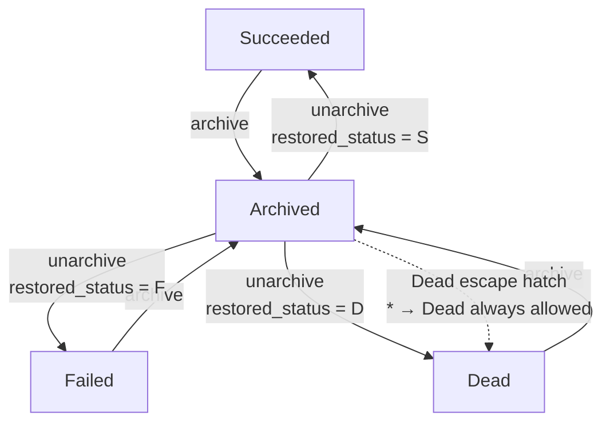
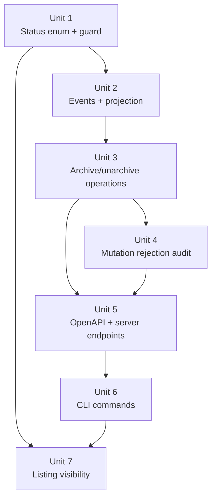

# feat: Add terminal `archived` status to workflow runs

## Overview

Adds a new terminal `archived` status to the run lifecycle so users can explicitly mark finished runs "reviewed, no further action needed." Archived runs are hidden from default listings, read-only, and reversible via `unarchive`. The feature surfaces as two new top-level CLI commands (`fabro archive`, `fabro unarchive`), two new server endpoints, and a new `InternalRunStatus` enum variant carried through the event log, projection, and OpenAPI spec.

## Problem Frame

Terminal runs (`succeeded`, `failed`, `dead`) currently share the same shelf: they all appear with `-a`, clutter listings, and carry no signal about user triage. Users want an explicit action that (a) captures "I've reviewed this" intent, (b) drops the run out of default listings, and (c) leaves all data readable for reference. See origin: `docs/brainstorms/2026-04-19-run-archived-status-requirements.md`.

## Requirements Trace

Requirements carry forward from the origin requirements document unchanged. Summaries inline for verification convenience:

**Status & Transitions**
- R1. Add `archived` as a new terminal variant of `RunStatus` → Unit 1
- R2. Archiving permitted only from terminal statuses → Unit 1, Unit 3
- R5. All three source terminal statuses archive identically → Unit 1, Unit 3

**Events & Projection**
- R3. Archiving is reversible; unarchive restores the exact prior terminal status → Unit 2, Unit 3
- R4. Prior terminal status retained durably (event payload or projection) → Unit 2
- R9. Archive/unarchive appear on the event stream with actor → Unit 2

**CLI Commands**
- R6. `fabro archive <id> [...]` with per-id failure semantics → Unit 6
- R7. `fabro unarchive <id> [...]` with same semantics → Unit 6

**API Surface**
- R8. HTTP API exposes archive/unarchive and bulk via CLI fan-out → Unit 5

**Visibility & Filtering**
- R10. `fabro ps` / `runs list` hide archived by default; opt-in flag → Unit 7
- R11. JSON listing API exposes equivalent archived-visibility control → Unit 5 (spec + handler), Unit 7 (filter plumbing)
- R16. Explicit `status=archived` filter (where it exists) implies opt-in → forward-looking rule; no status filter exists today, deferred

**Read-Only Enforcement**
- R12. Direct run-detail reads by ID still succeed regardless of archived state → Unit 4 (no gate added to read paths)
- R13. Archived runs are read-only (read surfaces continue to work) → Unit 4
- R14. Any mutation must reject with actionable "unarchive first" error → Unit 4

**Storage**
- R15. No storage / retention / cleanup behavior change → implicit (no storage code is touched by this plan)

## Scope Boundaries

Carried forward from origin. Two plan-level notes:

- The web UI at `apps/fabro-web` gets a minimal update: the hand-maintained `RunStatus` union in `app/data/runs.ts` and the `runStatusDisplay` record learn `archived` so the status renders with a label and color. No board-view or list UI *behavior* changes beyond that — filtering, default-hide, and archive/unarchive buttons are deferred to a follow-up UI pass.
- The full `InternalRunStatus` / public `RunStatus` enum unification remains deferred as a separate brainstorm. This plan only adds `archived` to both enums where the compile-time exhaustive matches force it; no other structural cleanup is attempted here.

## Context & Research

### Relevant Code and Patterns

- **Status enum and guard:** `lib/crates/fabro-types/src/status.rs` — `RunStatus` enum, `is_terminal()`, `can_transition_to()`. The one in-tree caller of `is_terminal()` *inside* the status module is the guard itself at `status.rs:36`.
- **Internal event type:** `lib/crates/fabro-workflow/src/event.rs` — `Event::RunRemoving` (`event.rs:89-92`) is the closest shape precedent for new status-transition variants. `Event::RunCancelRequested` (`event.rs:93-96`) is the precedent for carrying `Option<ActorRef>` on an event.
- **Public event wire type:** `lib/crates/fabro-types/src/run_event/mod.rs` — `EventBody::RunRemoving` at line 97-98; `ActorRef` at lines 37-44.
- **Event props:** `lib/crates/fabro-types/src/run_event/run.rs` — `RunStatusTransitionProps { reason: Option<StatusReason> }` at lines 52-56 is the shared shape; `RunRewound` has its own `previous_status: Option<String>` field as a (stringly-typed, don't-repeat) precedent for carrying prior state on an event.
- **Projection:** `lib/crates/fabro-store/src/run_state.rs:82-154` — event-body apply loop. Per-run monotonic `event_seq: AtomicU32` in `lib/crates/fabro-store/src/slate/run_store.rs:35`.
- **Event-strategy checklist:** `docs-internal/events-strategy.md` — 7-step procedure for adding a new event variant (internal `Event`, `trace()`, `event_name()`, `EventBody`, `event_body_from_event()`, `stored_event_fields()`, consumers).
- **Server routes:** `lib/crates/fabro-server/src/server.rs` — `build_router_with_options()` at `server.rs:1080-1155`. `start_run`, `cancel_run`, `pause_run`, `unpause_run` mutation handlers around `server.rs:3963-6150` — each status-gates today but returns a generic 409 on archived; they must switch to an archived-specific actionable error. `append_run_event` at `server.rs:4813-4852` is an event-producing endpoint with no status gate today — it must reject on archived.
- **Operations layer:** `lib/crates/fabro-workflow/src/operations/resume.rs:17-22` checks `status == Succeeded`; `operations/rewind.rs` has no status check; `operations/fork.rs` has no status check.
- **CLI list:** `lib/crates/fabro-cli/src/commands/runs/list.rs` + `lib/crates/fabro-cli/src/server_runs.rs:146-171` (`filter_server_runs(running_only)` via `run.status().is_active()`). `fabro ps` and any future `fabro runs list` share this one code path — the `#[command(flatten)]` on `RunsCommands` at `args.rs:986-987` collapses them.
- **Server-side list filter:** `lib/crates/fabro-workflow/src/run_lookup.rs:261-298` — `filter_runs` with `StatusFilter::{RunningOnly, All}`.
- **Bulk-by-ID CLI template:** `lib/crates/fabro-cli/src/commands/runs/rm.rs:26-101` — per-ID error collection, mixed JSON/human output, final `bail!` if any failed. Positional `Vec<String>` for IDs in `args.rs:286-288`. This is the template to mirror for archive/unarchive CLI.
- **Top-level CLI shape:** `lib/crates/fabro-cli/src/args.rs:937-945` — `RunsCommands` enum with `Ps`, `Rm`, `Inspect` — flattened to top-level by `#[command(flatten)]` at `args.rs:986-987`. New `Archive`/`Unarchive` variants go here.
- **OpenAPI spec:** `docs/api-reference/fabro-api.yaml` — `InternalRunStatus` at lines 2864-2875, `listRuns` operation at lines 121-136 (only pagination params today), `RunControlAction` not used for archive.
- **Progenitor regen:** `lib/crates/fabro-api/build.rs:136-172` runs on `cargo build -p fabro-api`.
- **TS client regen:** `lib/packages/fabro-api-client/package.json` — `bun run generate` with `@openapitools/openapi-generator-cli`.
- **Conformance test:** `cargo nextest run -p fabro-server` catches spec/router drift.

### Callers of `is_terminal()` — semantic treatment for `Archived`

| Caller | Location | Treat `Archived` as |
|---|---|---|
| `can_transition_to` (self-caller) | `lib/crates/fabro-types/src/status.rs:36` | **Special-case** — see Unit 1 |
| `wait.rs` poll loop | `lib/crates/fabro-cli/src/commands/run/wait.rs:59, 125-131, 288` | Terminal (stop polling); add `Archived` arm to the post-loop match |
| `logs.rs` follow exit | `lib/crates/fabro-cli/src/commands/run/logs.rs:233` | Terminal |
| `attach.rs` replay gate + exit code | `lib/crates/fabro-cli/src/commands/run/attach.rs:344-349, 450` | Terminal (replay, not live); `state_exit_code` already prefers the conclusion's `StageStatus`, so archived runs with a conclusion inherit the prior-status exit code naturally |
| `run_lookup.rs` end_time | `lib/crates/fabro-workflow/src/run_lookup.rs:238` | Terminal (populate `end_time`) |
| Supervisor / shutdown / worker-exit | `lib/crates/fabro-server/src/server.rs:2138, 3170, 3465` | Terminal (don't second-guess); the always-allow `* → Dead` escape hatch remains intact for anomalous cleanup |
| `attach_event_is_terminal` | `lib/crates/fabro-server/src/server.rs:1651` | **Leave unchanged** — this matches on `EventBody` not `RunStatus`; archive doesn't end an attach stream |

No billing / usage / reporting site reads `is_terminal()` — those roll up from the `conclusion` record, not from status.

### Institutional Learnings

No `docs/solutions/` entries exist in this repo; the institutional-knowledge base is empty. Substitute docs to follow:
- `docs-internal/events-strategy.md` (the 7-step event checklist)
- `docs-internal/testing-strategy.md` (layering: `cmd/*` for single-command CLI tests, `scenario/*` for cross-command lifecycle)
- `AGENTS.md` §"API workflow" (OpenAPI source-of-truth and regen sequence) and §"Rust import style" (types by name, functions via parent module)

### External References

None. All patterns are grounded in the repo.

## Key Technical Decisions

| Decision | Rationale |
|---|---|
| **Add `archived` to both `InternalRunStatus` and public `RunStatus`** | Forced by the compile-time exhaustive match at `server.rs:3317-3327` (`workflow_status_to_public`) and at `server.rs:2573-2582` (`board_column`). Omitting from the public enum would either (a) break compilation or (b) require downgrading to non-exhaustive matching and losing the compile-time safety net. The public variant carries the same semantic as the internal one. Web UI code still in scope for a tiny follow-on (see Unit 7). |
| **Carry `prior_status` on `RunProjection` and `restored_status` on `RunUnarchived` event payload** | Projection gains a single `prior_status: Option<RunStatus>` field. The `RunArchived` apply arm captures `self.status` into `prior_status` before setting status to `Archived`. The unarchive *operation* reads `prior_status` directly from the projection (no event-log scan), emits `RunUnarchived { actor, restored_status = projection.prior_status }`, and the unarchive apply arm reads its own event payload to set status and clear `prior_status`. Events stay self-describing; projection stays pure append-and-apply; no backward scan anywhere. |
| **`RunArchived` event carries `actor: Option<ActorRef>`, mirroring `RunCancelRequested`** | Existing actor-carrying precedent. `ActorRef::user(subject.login)` is the same pattern control-requested events use today. |
| **Split `is_terminal()` into two concepts: `is_terminal()` (reached terminal outcome) and `is_immutable()` (not transitionable)** | The guard at `status.rs:36` is the only caller that needs "immutable"; every other in-repo caller wants "reached terminal." Splitting gives each caller the semantic it actually wants with no special-casing at the call sites. `can_transition_to` then uses `is_immutable()`, and `Archived` participates in both. |
| **Per-ID endpoints (`POST /runs/{id}/archive`, `POST /runs/{id}/unarchive`), CLI fan-out for bulk** | Matches existing `/cancel`, `/pause`, `/unpause` route family. CLI owns the per-id result aggregation (mirroring `rm.rs`). No new response shape in the API surface. |
| **Extend `-a/--all` to include archived** (user decision) | Simplest flag story. `-a` becomes "show everything including archived"; default `ps` still shows only active runs; archived are hidden unless `-a`. |
| **`listRuns` API gains an `include_archived` query param** | The API surface needs a way to opt in that mirrors the CLI extension. Default is `false` (hide). |
| **No-op with success for repeat archive/unarchive in both directions** (user decision) | Archive on already-archived → success, no event. Unarchive on a non-archived terminal → success, no event. Both directions symmetric so bulk retries and mixed-id batches are safe. No event emitted on idempotent calls. |
| **Archive allowed only from terminal** | Origin R2. CLI rejects cleanly; no `--force` flag. |
| **Unarchive emits `RunUnarchived` with `restored_status`; projection sets status to that value and clears `prior_status`** | Event-sourcing clean: replay reconstructs the prior status from the event payload, projection stays a simple apply-in-order. |
| **Inherit authorization from existing `/cancel`, `/pause`, `/unpause` handlers** | New `POST /runs/{id}/archive` and `POST /runs/{id}/unarchive` handlers use the `AuthenticatedService` extractor pattern the existing mutation handlers already use. Actor on the event comes from the request subject via `actor_from_subject` (server.rs:5865-5867). No new authz surface introduced. |
| **Preserve the `* → Dead` escape hatch** | Origin R14 note. Supervisor/orphan handling may still mark an archived run `Dead`; that "effectively discards" the archive. |

## Open Questions

### Resolved During Planning

- **Event payload shape for `RunArchived`/`RunUnarchived`** → `RunArchived { actor }`, `RunUnarchived { actor, restored_status }` as new `EventBody` variants (not piggybacking on `RunStatusTransitionProps`, since `restored_status` is specific to unarchive).
- **`StatusReason` for archive events** → use `reason: None`. No new `StatusReason::Archived` variant; archive is a user-initiated state change, not a status reason.
- **`prior_status` ownership** → lives on `RunProjection` as a new `prior_status: Option<RunStatus>` field; populated by `RunArchived` apply, read by the unarchive *operation* at emit time, cleared by `RunUnarchived` apply.
- **Unit 5 handler authz** → inherits the `AuthenticatedService` extractor pattern used by `/cancel`, `/pause`, `/unpause`. Tenant/ownership scope inherits the same boundary.
- **`-a/--all` flag shape** → extend `-a` to include archived (user decision).
- **API shape** → per-ID endpoints + CLI fan-out.
- **Idempotency of repeat calls** → no-op with success.
- **UI-centric `RunStatus` enum treatment** → not modified in v1.
- **`can_transition_to` refactor direction** → split `is_terminal()` into `is_terminal()` + `is_immutable()`.

### Deferred to Implementation

- **Whether `fork` from an archived run is allowed** — not explicitly named in origin R14; `fork` creates a new run, so the archived-source has no lifecycle collision. Default to allowing; Unit 4 should explicitly confirm `fork.rs` does not mutate the parent run (only reads it) before shipping.
- **Whether `DELETE /runs/{id}` works on an archived run** — server-side has no status gate today; CLI-side only blocks `is_active()`. Archived runs are not active, so `fabro rm <archived_id>` succeeds naturally. Leave as-is unless a test flags it.
- **Whether `POST /runs/{id}/blobs` should reject on archived** — low-risk (content-addressed, append-only). Leave unguarded unless the mutation audit finds a user-facing path through it.
- **`StatusFilter` enum shape on the server side** — currently `RunningOnly | All`; whether to add a third variant or extend `All` is a small decision the implementer makes while touching `run_lookup.rs`.
- **Color choice for archived in `status_cell()`** — gray (`Color::Ansi256(8)`, matching `Dead`) is the obvious pick; leave final call to the implementer.
- **Unification of `InternalRunStatus` and the public `RunStatus` enums (explicitly deferred as a follow-up).** The repo carries two overlapping status enums: the event-sourced engine view (`InternalRunStatus` in OpenAPI / `RunStatus` in `fabro-types`) and the scheduler view (public OpenAPI `RunStatus` / a separate Rust `RunStatus` referenced around `lib/crates/fabro-server/src/server.rs:1233, 2813, 3322-3324, 3980, 4058, 4075, 4106, 4345-4387, 5912-5924`). They map via an explicit translation at `server.rs:3322-3324` (`Succeeded → Completed`, `Failed + reason=Cancelled → Cancelled`). The web UI at `apps/fabro-web/app/data/runs.ts:131-139` redefines the engine enum shape inline rather than consuming the public one — a strong signal the engine view is what actually matters to consumers. Unification would fold the pre-execution `Runnable` and `Cancelled` variants into the engine enum (via a new engine variant and/or a reason-driven display mapping), migrate every `managed_run.status` mutation in `server.rs` (~20 sites), and remove the public OpenAPI `RunStatus` in favor of the unified enum. This is a real, cross-cutting refactor — scoped separately. **Action:** once the archive feature ships, start a dedicated `/ce:brainstorm` for the unification design; do not bundle it into archive.

## High-Level Technical Design

> *This illustrates the intended approach and is directional guidance for review, not implementation specification. The implementing agent should treat it as context, not code to reproduce.*

Lifecycle transitions introduced by this feature:



Event flow for a single archive+unarchive cycle (per-run monotonic `event_seq`; projection state shown after each event):

```text
seq=N   RunCompleted { reason: ... }        → status = Succeeded,  prior_status = None
seq=N+1 RunArchived { actor: user(login) }   → status = Archived,   prior_status = Some(Succeeded)
seq=N+2 RunUnarchived {                       → status = Succeeded,  prior_status = None
          actor: user(login),
          restored_status: Succeeded,
        }
```

Status enum split:

```text
is_terminal()   → { Succeeded, Failed, Dead, Archived }      // "reached terminal outcome"
is_immutable()  → { Succeeded, Failed, Dead }                // "can_transition_to blocks outbound (except to Dead)"
                                                             // Archived is deliberately NOT immutable — can transition to restored_status on unarchive
```

## Implementation Units

### Unit dependency graph



---

- [ ] **Unit 1: Status enum + transition guard split**

**Goal:** Add `Archived` to `RunStatus` and split the overloaded `is_terminal()` into `is_terminal()` (reached terminal outcome) + `is_immutable()` (not transitionable). Update `can_transition_to` to allow `Succeeded|Failed|Dead ↔ Archived` while preserving the `* → Dead` escape hatch.

**Requirements:** R1, R2, R5.

**Dependencies:** None — foundation.

**Files:**
- Modify: `lib/crates/fabro-types/src/status.rs`
- Modify: `lib/crates/fabro-workflow/src/run_status.rs` (re-exports, verify they cover the new APIs)
- Modify: each `is_terminal()` caller per the audit table above — `lib/crates/fabro-cli/src/commands/run/wait.rs`, `logs.rs`, `attach.rs`; `lib/crates/fabro-workflow/src/run_lookup.rs`; `lib/crates/fabro-server/src/server.rs`
- Test: `lib/crates/fabro-types/src/status.rs` (unit tests inline or in a sibling test module)

**Approach:**
- Add `RunStatus::Archived` after `Dead`, with snake_case serde and `Display`/`FromStr` arms. Follow the existing import-style convention (types by name).
- `is_terminal()` = `matches!(self, Succeeded | Failed | Dead | Archived)`.
- Introduce `is_immutable()` = `matches!(self, Succeeded | Failed | Dead)`.
- `can_transition_to()`:
  - Keep the `to == Dead` short-circuit that returns `true` unconditionally.
  - Gate on `is_immutable()` (not `is_terminal()`) for the "already-terminal outbound block."
  - Add transitions: `(Succeeded | Failed | Dead) → Archived` and `Archived → (Succeeded | Failed | Dead)`.
- Audit every `is_terminal()` caller: all of them want "reached terminal outcome," so they remain calling `is_terminal()` and get `Archived` for free. The only caller that needs to switch to `is_immutable()` is `can_transition_to` itself.
- `wait.rs:125-131` has an exhaustive match with `unreachable!()` on non-terminal; add an `Archived` arm that prints an archived status line (or bails cleanly — archiving mid-wait is prevented upstream by R2).
- `attach.rs:450` `state_exit_code` already reads from `conclusion` first; verify the archived-fallback path still returns a sensible code (expected: inherits the pre-archive terminal via the conclusion record).

**Patterns to follow:** Existing enum/trait shape in the same file.

**Test scenarios:**
- Happy path: `RunStatus::from_str("archived")` round-trips through `Display`.
- Happy path: `Succeeded.can_transition_to(Archived)` is true; `Archived.can_transition_to(Succeeded)` is true; round-trip works for Failed and Dead too.
- Happy path: `Running.can_transition_to(Archived)` is false (only terminal → archived).
- Happy path: `Archived.can_transition_to(Dead)` is true (escape hatch preserved).
- Edge case: `Archived.can_transition_to(Archived)` is false — the idempotent no-op is handled at the operation layer (Unit 3), not the guard.
- Edge case: `is_terminal()` returns true for Archived; `is_immutable()` returns false for Archived.
- Edge case: `InvalidTransition` error carries both `from` and `to` for a rejected archive transition.

**Verification:**
- `cargo nextest run -p fabro-types` passes.
- `cargo nextest run --workspace` still passes (all `is_terminal()` callers still compile and pass under the new semantics).
- `cargo +nightly-2026-04-14 clippy --workspace --all-targets -- -D warnings` is clean.

---

- [ ] **Unit 2: Event variants + projection apply arms**

**Goal:** Add `RunArchived` and `RunUnarchived` as event variants end-to-end — internal `Event`, wire `EventBody`, props, envelope wiring, projection arms — following the 7-step checklist in `docs-internal/events-strategy.md`.

**Requirements:** R3, R4, R9.

**Dependencies:** Unit 1.

**Files:**
- Modify: `lib/crates/fabro-workflow/src/event.rs` (internal `Event` variant, `trace()`, `event_name()`, `event_body_from_event()`, `stored_event_fields()`)
- Create / modify: `lib/crates/fabro-types/src/run_event/run.rs` — new `RunArchivedProps { actor }` and `RunUnarchivedProps { actor, restored_status }` structs
- Modify: `lib/crates/fabro-types/src/run_event/mod.rs` — `EventBody::RunArchived`/`RunUnarchived` variants with `#[serde(rename = "run.archived" / "run.unarchived")]`, and `event_name()` arms
- Modify: `lib/crates/fabro-store/src/run_state.rs` — add `prior_status: Option<RunStatus>` field to `RunProjection`; `RunArchived` apply captures `self.status.as_ref().map(|r| r.status)` into `prior_status` then sets `self.status = run_status_record(RunStatus::Archived, None, ts)`; `RunUnarchived` apply sets `self.status = run_status_record(props.restored_status, None, ts)` and clears `self.prior_status = None`
- Test: `lib/crates/fabro-store/src/run_state.rs` inline test module (projection apply)
- Test: `lib/crates/fabro-workflow/src/event.rs` inline test module (event name + body round-trip)

**Approach:**
- Read `docs-internal/events-strategy.md` first; follow the 7 steps exactly.
- `RunArchivedProps` carries `actor: Option<ActorRef>`. `RunUnarchivedProps` carries `actor: Option<ActorRef>` and `restored_status: RunStatus` (typed — do not follow the `RunRewound.previous_status: Option<String>` precedent; stringly-typed is a known anti-pattern here).
- Wire event names `"run.archived"` and `"run.unarchived"` (lowercase dot notation per events-strategy.md).
- Projection: on `RunArchived`, capture `self.status.as_ref().map(|r| r.status)` into the new `prior_status` field, then set `self.status` to `Archived` with `reason: None`. On `RunUnarchived`, set `self.status` to `props.restored_status` with `reason: None` and `updated_at: ts`, and clear `self.prior_status = None`.
- `pending_control` is not modified by either arm — archive is reachable only from terminal, and terminal runs have no pending control by the existing `RunCompleted`/`RunFailed` apply semantics (see `run_state.rs:142-154`). No defensive clearing needed.
- Do NOT add these to `attach_event_is_terminal()` at `server.rs:1651` — archive is never a fresh-attach stream endpoint.

**Patterns to follow:**
- `Event::RunCancelRequested` at `lib/crates/fabro-workflow/src/event.rs:93-96` for the actor-carrying event shape.
- `Event::RunRemoving` at `lib/crates/fabro-workflow/src/event.rs:89-92` for the status-transition shape.
- `EventBody::RunFailed` / `RunCompleted` for per-event typed props structs (not shared).
- Projection apply arms at `lib/crates/fabro-store/src/run_state.rs:122-154`.

**Test scenarios:**
- Happy path: serializing `EventBody::RunArchived { actor: Some(user("alice")) }` produces JSON with `"event": "run.archived"` and `"properties": { "actor": ... }`.
- Happy path: projection replayed over `[RunCreated, RunCompleted, RunArchived]` ends with `status = Archived`.
- Happy path: projection replayed over `[RunCreated, RunCompleted, RunArchived, RunUnarchived { restored_status: Succeeded }]` ends with `status = Succeeded`.
- Integration: projection replayed over `[... RunCompleted, RunArchived, RunUnarchived(Failed)]` (hypothetical: restored_status differs from the true prior) still applies `restored_status` — enforces that the event payload is authoritative.
- Edge case: `event_name()` for both new variants returns the exact dotted strings.
- Edge case: `Event::trace()` arms exist for both (required by events-strategy step 2).

**Verification:**
- `cargo nextest run -p fabro-workflow -p fabro-store -p fabro-types` passes.
- No existing snapshot test regressed; any that explicitly list event variants have the two new ones appended.

---

- [ ] **Unit 3: Archive / unarchive workflow operations**

**Goal:** New workflow-layer functions that validate preconditions, capture prior status, and emit events for archive and unarchive. Centralize the "only-from-terminal" rule and the idempotency behavior (no-op with success) here so both the CLI and server handlers share the logic.

**Requirements:** R3, R4, R6 (server side of), R7 (server side of).

**Dependencies:** Units 1, 2.

**Files:**
- Create: `lib/crates/fabro-workflow/src/operations/archive.rs`
- Modify: `lib/crates/fabro-workflow/src/operations/mod.rs` — re-export
- Test: `lib/crates/fabro-workflow/src/operations/archive.rs` inline tests
- Test: `lib/crates/fabro-workflow/tests/it/` — scenario coverage

**Approach:**
- Two async functions: `archive(run_id, actor, ...)` and `unarchive(run_id, actor, ...)`.
- Both load the current projection. Error handling:
  - `archive` on an active (non-terminal, non-archived) status → `Error::Precondition` with an actionable message ("must be terminal").
  - `archive` on already-archived → return `Ok(idempotent)` without emitting an event.
  - `unarchive` on a non-archived terminal status → return `Ok(idempotent)` without emitting an event (symmetric with archive idempotency).
  - `unarchive` on an active status → `Error::Precondition` ("run is not archived").
  - `unarchive` on archived → read `projection.prior_status` (populated by the `RunArchived` apply arm — no backward event scan), emit `RunUnarchived { actor, restored_status: prior_status }`. If `prior_status` is unexpectedly `None` (should not happen for an archived run), fail loudly with an invariant-violated error.
- Emit events through `Emitter::emit()` (never direct-write). The emitter handles `RunEvent` construction exactly once per events-strategy.

**Patterns to follow:**
- `operations/resume.rs:17-22` for the shape of a status-checking operation that emits events.
- `server.rs:5850-5867` for how control-requested events capture `actor` via `actor_from_subject`.

**Test scenarios:**
- Happy path: `archive(succeeded_run)` emits `RunArchived` and projection shows `Archived`.
- Happy path: `unarchive(archived_run)` emits `RunUnarchived { restored_status: Succeeded }` and projection shows `Succeeded`.
- Happy path: `archive(failed_run)` then `unarchive` → projection returns to `Failed`.
- Happy path: `archive(dead_run)` then `unarchive` → projection returns to `Dead`.
- Edge case: `archive(already_archived_run)` returns Ok with no event emitted (idempotent); sequence count unchanged.
- Edge case: `unarchive(already_succeeded_run)` (not archived, but terminal) returns Ok with no event emitted (idempotent).
- Edge case: `unarchive(running_run)` (active) returns a precondition error ("run is not archived").
- Error path: `archive(running_run)` returns a precondition error mentioning "must be terminal".
- Integration: `archive` then `unarchive` then `archive` again → three events in the log (since the middle unarchive reopened the run), projection shows `Archived` at end.

**Verification:**
- `cargo nextest run -p fabro-workflow` passes.
- An integration test demonstrates the full archive/unarchive cycle through the event store, not just the logic layer.

---

- [ ] **Unit 4: Mutation rejection for archived runs (R14 audit)**

**Goal:** Teach every run-mutation entry point to reject operations on archived runs with an actionable "unarchive first" error, preserving the `* → Dead` escape hatch.

**Requirements:** R12, R13, R14.

**Dependencies:** Units 1, 2, 3.

**Files:**
- Modify: `lib/crates/fabro-workflow/src/operations/resume.rs` — add `Archived` rejection
- Modify: `lib/crates/fabro-workflow/src/operations/rewind.rs` — add status check that rejects archived (no status check today)
- Modify: `lib/crates/fabro-server/src/server.rs` — `start_run`, `cancel_run`, `pause_run`, `unpause_run` handlers (~lines 3963-6150) switch from generic 409 to archived-specific actionable message when the current status is `Archived`
- Modify: `lib/crates/fabro-server/src/server.rs` — `append_run_event` handler (~line 4813) add an archived guard (currently ungated, bypasses `can_transition_to`)
- Modify: `lib/crates/fabro-server/src/server.rs` — `submit_answer` handler (~line 4769) defensively rejects archived
- Test: `lib/crates/fabro-server/tests/it/` — conformance and negative-path tests
- Test: `lib/crates/fabro-workflow/tests/it/` — resume/rewind rejection tests

**Approach:**
- Define a single canonical error message string such as: ``run <id> is archived; run `fabro unarchive <id>` to restore it and try again``. Reuse across handlers.
- In each handler, check `status == Archived` before the existing status-class check so the archived-specific message wins.
- Do NOT reject in `attach_event_is_terminal()` (`server.rs:1651`) — that matches on `EventBody`, not status, and archive is never a fresh-attach endpoint.
- Leave `DELETE /runs/{id}` unguarded — archived runs being delete-able preserves the orthogonality of archive-and-delete (origin Scope Boundaries).
- Leave `POST /runs/{id}/blobs` unguarded for v1 — low-risk append-only path; revisit if the test suite surfaces a problem.
- Do NOT add any status check to supervisor paths (`server.rs:2138, 3170, 3465`) — those already skip terminal runs and archived is terminal under the new `is_terminal()` semantics.
- `append_run_event` (`server.rs:4813-4852`) gets an archived guard as listed in Files. In the same touch, confirm that the endpoint already rejects client-supplied lifecycle-transition `EventBody` variants (or add that rejection) — clients must not be able to inject `RunArchived`/`RunUnarchived`/`RunCompleted`/`RunFailed` directly and skip the operations-layer authorization + precondition checks. This is a pre-existing concern the plan inherits by touching this handler.
- `fork` reads from the source run but must not mutate it; confirm by grepping `operations/fork.rs` for writes targeting the source `run_id` before Unit 4 closes. If fork mutates the source (e.g. to record a child link), add the archived guard.

**Patterns to follow:**
- `resume.rs:17-22` for the status-gate shape.
- `server.rs` 409 response pattern in `cancel_run` et al. for the handler-level rejection.

**Test scenarios:**
- Happy path: none — this unit is purely negative-path.
- Error path: `resume(archived_run)` → precondition error with "unarchive first" phrasing.
- Error path: `rewind(archived_run)` → precondition error.
- Error path: `POST /runs/{id}/cancel` with archived status → 409 with archived-specific body.
- Error path: `POST /runs/{id}/pause` with archived status → 409 with archived-specific body.
- Error path: `POST /runs/{id}/unpause` with archived status → 409 with archived-specific body.
- Error path: `POST /runs/{id}/start` with archived status (e.g. resume-via-start) → 409 with archived-specific body.
- Error path: `POST /runs/{id}/events` (append_run_event) with archived status → 409 or 400 (pick consistent code with the rest of the archived-rejection family).
- Integration: `POST /runs/{id}/unarchive` followed by a resume succeeds (rejection unblocks cleanly on unarchive).

**Verification:**
- `cargo nextest run -p fabro-server -p fabro-workflow` passes.
- A scenario test demonstrates: archive → each mutation returns the actionable error → unarchive → same mutation now works.

---

- [ ] **Unit 5: OpenAPI spec + server endpoints**

**Goal:** Add archive/unarchive endpoints and `include_archived` listing param to the OpenAPI spec, add `archived` to `InternalRunStatus`, then implement server handlers and verify progenitor/TS client regeneration.

**Requirements:** R8, R10, R11, R16 (partial — server side of visibility).

**Dependencies:** Units 3, 4.

**Files:**
- Modify: `docs/api-reference/fabro-api.yaml` — add `archived` to `InternalRunStatus` enum (lines 2864-2875) **and** to public `RunStatus` enum (lines 2097-2108); add `POST /api/v1/runs/{id}/archive` and `POST /api/v1/runs/{id}/unarchive` operations; add `include_archived: boolean` query parameter to `listRuns` (lines 121-136).
- Modify: `lib/crates/fabro-server/src/server.rs` — `build_router_with_options()` gets two new routes; new handler functions `archive_run`, `unarchive_run` that use the same `AuthenticatedService` extractor as `/cancel`/`/pause`/`/unpause` and call `operations::archive::archive` / `unarchive`; add `Archived` arms to the exhaustive matches in `workflow_status_to_public` (~line 3317) and `board_column` (~line 2573); extend `list_runs` handler (~line 2744) to accept `include_archived` and apply the filter at the handler layer (it queries `state.store.list_runs` directly — it does NOT go through `run_lookup::filter_runs`).
- Test: `lib/crates/fabro-server/tests/` — conformance test automatically picks up the new routes; add handler-level happy-path + error-path tests including authz parity with `/cancel`.

**Approach:**
- Edit the OpenAPI spec first; `cargo build -p fabro-api` regenerates the Rust types.
- Response shape for archive/unarchive: reuse the existing `RunStatusResponse` shape (or whatever `/cancel` returns today) — archive/unarchive end in a clean status transition, so status-after-operation is the natural response.
- Handler error mapping: `Error::Precondition` → 409 with JSON body carrying the message; idempotent success on already-archived/already-not-archived → 200 with current status.
- `listRuns` default `include_archived = false`. The filter applies in the `list_runs` handler directly — this surface calls `state.store.list_runs(&ListRunsQuery::default())` and does not pass through `run_lookup::filter_runs` (which is only called from the prune path). Either filter the returned slice at the handler, or extend `ListRunsQuery` with an `include_archived: bool`, and push the predicate into `slate::catalog::list_run_ids`.
- Add `Archived` arms to two exhaustive matches on engine `WorkflowRunStatus` in `server.rs`: (1) `workflow_status_to_public` at ~line 3317-3327 maps to the new public `RunStatus::Archived` variant; (2) `board_column` at ~line 2573-2582 maps to `None` (archived runs don't appear in a board column) or `Some("archived")` — picker's call.
- Authz: `archive_run`/`unarchive_run` handlers use `AuthenticatedService` extractor and `actor_from_subject(subject)` to populate the event's `actor`, mirroring `cancel_run` (`server.rs:5883-6005`). No new scope/tenant logic.
- `include_archived=true` is strictly additive within the already-authorized result set (does not alter tenant/ownership scope).
- After the spec edit, run `cd lib/packages/fabro-api-client && bun run generate` to regenerate TS client. Commit generated files.

**Patterns to follow:**
- `POST /runs/{id}/cancel` route declaration and handler as the precedent for the archive/unarchive endpoints.
- `prune_runs` request/response shape at `/system/prune/runs` as a precedent for a filtered listing response (though we don't copy the filter body shape — we just add a query param).

**Test scenarios:**
- Happy path: `POST /runs/{id}/archive` on a succeeded run returns 200 and subsequent `GET /runs/{id}` shows `status: archived`.
- Happy path: `POST /runs/{id}/unarchive` on an archived run returns 200 and `GET /runs/{id}` shows the prior terminal status.
- Happy path: `GET /runs` default hides archived; `GET /runs?include_archived=true` includes them.
- Edge case: `POST /runs/{id}/archive` on already-archived run returns 200 (idempotent).
- Edge case: `POST /runs/{id}/unarchive` on a non-archived terminal run returns 200 (idempotent — symmetric with archive).
- Edge case: `POST /runs/{id}/unarchive` on an active run returns 409 with actionable "run is not archived" message.
- Error path: `POST /runs/{id}/archive` on an active (running) run returns 409.
- Error path: `POST /runs/{unknown_id}/archive` returns 404.
- Conformance: the server's spec/router conformance test (`cargo nextest run -p fabro-server`) passes after the spec edit.
- Integration: the full lifecycle `create → run → complete → archive → list (hidden) → list --include-archived (shown) → unarchive → resume (rejected? — no, resume only works on Succeeded; see Unit 4 test)`.

**Verification:**
- `cargo build -p fabro-api` regenerates without progenitor errors.
- `cd lib/packages/fabro-api-client && bun run generate && bun run typecheck` passes.
- `cargo nextest run -p fabro-server` (the conformance test is the authoritative spec/router consistency check).
- `curl -X POST .../runs/{id}/archive` returns the expected shape against a running server.

---

- [ ] **Unit 6: CLI commands — `fabro archive` and `fabro unarchive`**

**Goal:** Two new top-level CLI commands via `RunsCommands` with bulk-by-ID positional args and per-ID failure aggregation that mirrors `fabro rm`. Colors and status display learn `Archived`.

**Requirements:** R6, R7.

**Dependencies:** Unit 5.

**Files:**
- Modify: `lib/crates/fabro-cli/src/args.rs` — add `Archive(RunsArchiveArgs)` and `Unarchive(RunsUnarchiveArgs)` variants to `RunsCommands` (around line 937-945); add the corresponding arg structs mirroring `RunsRemoveArgs` (~line 281-293); add `.name()` arms (~line 947-955) returning `"archive"` and `"unarchive"`
- Create: `lib/crates/fabro-cli/src/commands/runs/archive.rs`
- Create: `lib/crates/fabro-cli/src/commands/runs/unarchive.rs`
- Modify: `lib/crates/fabro-cli/src/commands/runs/mod.rs` — dispatch arms for the two new subcommands
- Test: `lib/crates/fabro-cli/tests/it/cmd/archive.rs` (new)
- Test: `lib/crates/fabro-cli/tests/it/cmd/unarchive.rs` (new)
- Test: `lib/crates/fabro-cli/tests/it/scenario/archive.rs` (new) — full lifecycle scenario

**Approach:**
- CLI layer has no server-side logic — just the progenitor-generated `server.api().archive_run(id).send().await` calls (method names depend on OpenAPI regen).
- Copy `rm.rs:26-101` as the template: loop over `args.runs`, call the per-ID endpoint, collect `(run_id, Result)` pairs, print per-ID success/failure, emit structured JSON output when the CLI format is JSON, and `bail!("some runs could not be <archived|unarchived>")` at the end if any failed.
- Help text: `"Mark a terminal run as archived (reviewed, no further action needed). Archived runs are hidden from default listings."`. For unarchive: `"Restore an archived run to its prior terminal status."`.
- No `--force` flag. No `--confirm`. Bulk is safe because archive is reversible.
- Telemetry names (`"archive"`, `"unarchive"`) added to `RunsCommands::name()`.

**Patterns to follow:**
- `lib/crates/fabro-cli/src/commands/runs/rm.rs` for bulk-by-ID shape, per-ID output, JSON formatting, final-error semantics.
- `lib/crates/fabro-cli/tests/it/cmd/rm.rs` for test shape (help snapshot, success/fail cases).

**Test scenarios:**
- Happy path: `fabro archive <succeeded_id>` prints success line; follow-up `fabro ps` no longer shows the run; `fabro ps -a` shows it with status `archived` (gray).
- Happy path: `fabro unarchive <archived_id>` prints success line; follow-up `fabro ps -a` shows it with the prior terminal status.
- Happy path: `fabro archive <id_a> <id_b> <id_c>` archives all three; per-ID success lines.
- Edge case: `fabro archive <terminal_id> <already_archived_id>` — both "succeed" (second is a no-op).
- Edge case: `fabro unarchive <archived_id> <succeeded_id>` — first succeeds, second fails with "not archived"; final exit is non-zero; JSON mode has `errors: [{ identifier, error }]` populated.
- Edge case: `fabro unarchive <already_succeeded_id>` — succeeds idempotently (no-op, no event).
- Error path: `fabro archive <running_id>` — fails with "must be terminal"; exit non-zero.
- Error path: `fabro unarchive <running_id>` — fails with "run is not archived" (active runs can't be unarchived since they aren't terminal); exit non-zero.
- Error path: `fabro archive <unknown_id>` — 404 rendered as a clear error.
- Error path: `fabro archive` with no IDs — clap rejects (required positional).
- Help snapshot: `fabro archive --help` snapshot test.
- Help snapshot: `fabro unarchive --help` snapshot test.
- Integration (scenario): full lifecycle across multiple commands — see `tests/it/scenario/archive.rs`.

**Verification:**
- `cargo nextest run -p fabro-cli` passes (including new snapshots after `cargo insta accept --snapshot <new>`).
- Manual smoke: `fabro archive <id>` / `fabro ps` / `fabro ps -a` / `fabro unarchive <id>` against a local server.

---

- [ ] **Unit 7: Listing visibility — `-a` extension, display, server-side filter plumbing**

**Goal:** Extend `-a/--all` to include archived, teach `filter_server_runs` and the server-side `filter_runs` about archived, update the empty-list hint, and ensure the `listRuns` API opt-in works end-to-end.

**Requirements:** R10, R11, R16.

**Dependencies:** Units 1, 6.

**Files:**
- Modify: `lib/crates/fabro-cli/src/server_runs.rs:146-171` — `filter_server_runs` predicate drops archived unless `show_archived` is set; plumb the new flag through from `list_command`
- Modify: `lib/crates/fabro-cli/src/commands/runs/list.rs` — read `args.all` as the "show archived" signal (since `-a` is the chosen extension); update the empty-list hint at lines 68-78 to reflect the new meaning of `-a`; add an `Archived` arm to `status_cell()` at lines 146-159 (gray, `Color::Ansi256(8)`)
- Modify: `apps/fabro-web/app/data/runs.ts:131-150` — add `"archived"` to the inline `RunStatus` string-literal union and add a `runStatusDisplay["archived"]` entry with an appropriate label/dot/text triple (gray family). The web UI type is hand-maintained and parallel to the generated TS client; without this update, archived runs render with no label
- Test: `lib/crates/fabro-cli/tests/it/cmd/ps.rs` updates — existing tests verify new flag semantics
- Test: `lib/crates/fabro-server/tests/it/` — listing tests cover both `include_archived` values on the API side (the actual API handler change lives in Unit 5)
- Test: `apps/fabro-web/` — if there's a `runs.ts` test, ensure `isRunStatus("archived")` returns true

**Approach:**
- Default `fabro ps` (no `-a`): only active runs (unchanged from today).
- `fabro ps -a`: active + terminal + archived (the one visible behavior change for existing scripted users — document in the help text).
- Empty-list hint rewording: today's text is `"No running processes found. Use -a to show all runs."` — no change needed if we keep `-a` as "show all including archived."
- Server-side `filter_runs` is called from multiple surfaces (list, prune). Archive-exclusion rule only applies to `listRuns`; `prune` works on terminal runs and archived are terminal, so pruning an archived run is fine under existing semantics — but validate during implementation that prune doesn't surprise users.
- The `include_archived` query param on `listRuns` is already added in Unit 5; this unit just wires it through the filter layer on both sides.

**Patterns to follow:**
- `RunFilterArgs.orphans` composition at `lib/crates/fabro-cli/src/args.rs:258-261` as a precedent for a list-time boolean filter (even though we're extending `-a` rather than adding a new flag).

**Test scenarios:**
- Happy path: `fabro ps` (default) hides a newly archived run.
- Happy path: `fabro ps -a` shows active + terminal + archived runs.
- Happy path: `GET /api/v1/runs` (default) hides archived.
- Happy path: `GET /api/v1/runs?include_archived=true` shows archived.
- Edge case: `fabro ps -a` on a server with only archived runs shows them (not the "No running processes found" hint).
- Edge case: `fabro ps` on a server with only archived runs shows the empty-list hint pointing to `-a`.
- Edge case: `status_cell()` renders `archived` in gray.
- Integration: run the full lifecycle — create → run → complete → `ps` shows it → `archive` → `ps` hides it → `ps -a` shows it → `unarchive` → `ps` still hides it (now succeeded, still terminal, still hidden without `-a`).

**Verification:**
- `cargo nextest run -p fabro-cli -p fabro-server -p fabro-workflow` passes.
- Snapshot tests for `fabro ps` output under each mode accepted via `cargo insta accept --snapshot <...>`.
- Manual smoke against a local server with a small run population covering all three status buckets (active, terminal-non-archived, archived).

## System-Wide Impact

- **Interaction graph:** adds two new server routes; extends one (`listRuns`). Six existing mutation handlers get an archived-specific 409 branch. Two operations (`resume`, `rewind`) get an archived precondition. One existing event family (status-transition) gains two variants; the projection gets two apply arms. CLI gets two new top-level commands; one list filter extends.
- **Error propagation:** archived-rejection errors surface as `Error::Precondition` in the workflow layer, 409 in HTTP, and non-zero exit codes with actionable per-ID messages at the CLI. The canonical error text is shared across all surfaces.
- **State lifecycle risks:** unarchive reads `projection.prior_status` (set by the `RunArchived` apply arm), so there is no event-log scan at unarchive time. Projection stays pure append-and-apply. The risk is reduced to a single invariant: `prior_status` must be `Some` whenever `status == Archived`. Enforced by the archive apply arm being the only code that sets status to Archived and the unarchive apply arm being the only code that clears `prior_status`.
- **API surface parity:** both `InternalRunStatus` and public `RunStatus` gain `archived` (forced by exhaustive matches at `server.rs:2573-2582, 3317-3327`). `RunStatusResponse` callers get a new enum value. The hand-maintained web UI `RunStatus` type in `app/data/runs.ts` is updated in lockstep so archived runs render correctly.
- **Integration coverage:** scenario test in `lib/crates/fabro-cli/tests/it/scenario/archive.rs` covers the full cross-command lifecycle. `cargo nextest run -p fabro-server` conformance test guards OpenAPI/router drift.
- **Unchanged invariants:** the `* → Dead` transition escape hatch. The `attach_event_is_terminal()` semantics (matches on event body, not status). The supervisor/orphan-recovery paths (already skip terminal runs; archived now qualifies). The `DELETE /runs/{id}` behavior (archived runs remain deletable). The event-sourcing purity of the projection (archive/unarchive are both append-only events).

## Risks & Dependencies

| Risk | Mitigation |
|------|------------|
| `projection.prior_status` gets out of sync with `status == Archived` due to a future apply arm or code path that sets status=Archived without also setting prior_status | Only the `RunArchived` apply arm sets status to Archived. Add a debug-assert in the unarchive operation: `debug_assert!(prior_status.is_some())` and return an invariant-violated error if somehow None. A property test on projection replay can catch drift. |
| OpenAPI regen introduces breaking changes for existing in-repo TS client callers | Both enums gain `archived`. The generated TS client enums pick it up automatically; the hand-maintained `apps/fabro-web/app/data/runs.ts` union is updated in Unit 7. A grep for `switch`/`match` over `RunStatus` in `apps/fabro-web/` during Unit 7 confirms no other consumer regresses. |
| A caller invokes `append_run_event` with a client-supplied `RunArchived`/`RunUnarchived`/`RunCompleted` body to bypass the operations-layer authz+precondition | Unit 4 adds an event-variant allowlist check to `append_run_event` so lifecycle-transition variants are rejected at the endpoint (see Unit 4 Approach). |
| `is_terminal()` semantics change silently breaks a caller we missed in the audit | Every production caller was enumerated in the research section; the change treats archived as terminal, which is safer than the reverse. `cargo nextest run --workspace` is the gate — if a caller needed the old "immutable" meaning, it was already calling `can_transition_to`, which now uses `is_immutable()`. |
| Scripted users of `-a` get archived runs in their output after the flag extension | Intentional per user decision; document in release notes and the `-a` help text. |
| Concurrent archive + status transition race on the same run | Per-run `event_seq` is atomic; the event that wins (`Succeeded/Failed` vs `Archived`) is whichever commits first. The later one fails `can_transition_to` and returns a precondition error. Handled naturally by the existing guard. |
| Label/tag/comment writes on archived runs in a future feature | No such endpoints exist today; the plan adds no specific rejection for them. The Deferred to Implementation item records that future annotation surfaces must include an archive check. |

## Documentation / Operational Notes

- Update `docs/core-concepts/runs.md` (if it exists) or the appropriate user-facing CLI docs to describe the archived lifecycle.
- Add a changelog entry for the new commands and the `-a` extension (user-visible).
- No migration is required — existing runs keep their prior statuses; the new status appears only on runs the user explicitly archives.
- No monitoring changes — archive/unarchive events flow through the existing event pipeline and telemetry.

## Sources & References

- **Origin document:** [docs/brainstorms/2026-04-19-run-archived-status-requirements.md](../brainstorms/2026-04-19-run-archived-status-requirements.md)
- **Events strategy:** [docs-internal/events-strategy.md](../../docs-internal/events-strategy.md)
- **Testing strategy:** [docs-internal/testing-strategy.md](../../docs-internal/testing-strategy.md)
- **API workflow convention:** `AGENTS.md` §"API workflow"
- **Bulk-by-ID CLI template:** `lib/crates/fabro-cli/src/commands/runs/rm.rs`
- **Actor-carrying event precedent:** `lib/crates/fabro-workflow/src/event.rs:93-96` (`RunCancelRequested`)
- **Status-transition event precedent:** `lib/crates/fabro-workflow/src/event.rs:89-92` (`RunRemoving`)
- **Projection apply:** `lib/crates/fabro-store/src/run_state.rs:82-154`
