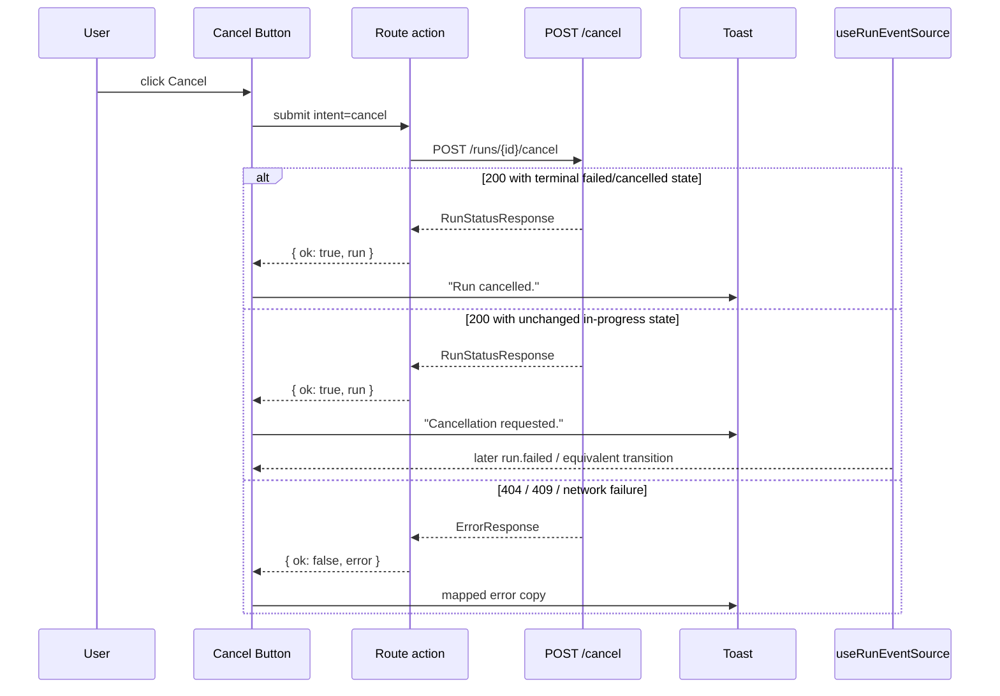
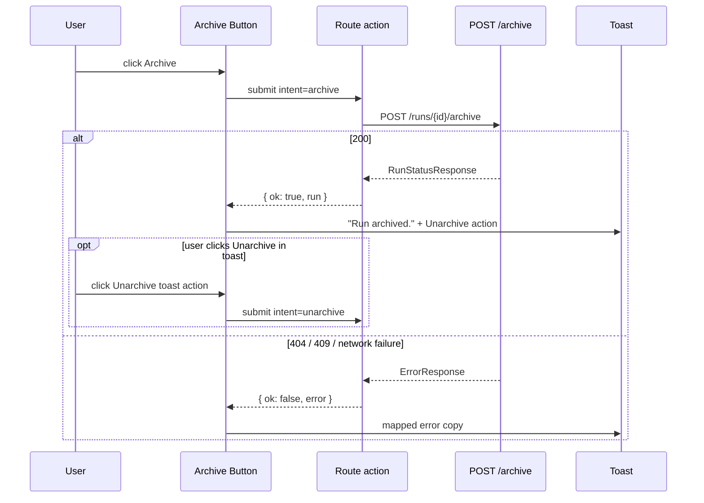
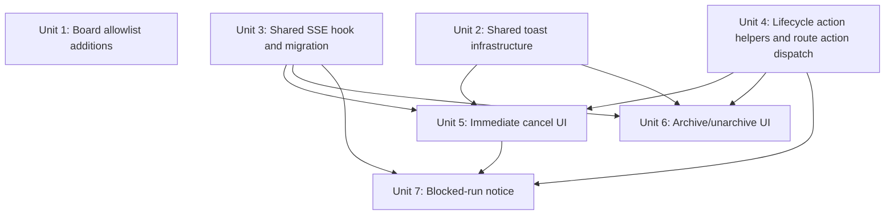

# feat: Expose CLI lifecycle actions (cancel, archive, unarchive) in the web UI

## Overview

Today the Fabro web UI at `apps/fabro-web` is essentially read-only for run management: only Preview mutates state. This plan adds three lifecycle actions to the run detail page (`/runs/{id}`): **cancel**, **archive**, and **unarchive**.

The plan also closes three supporting gaps the requirements and review surfaced:

- a shared action-capable toast system
- a run-detail SSE subscription so action visibility updates live
- two missing event strings in the board revalidation allowlist

As of **April 20, 2026**, product explicitly chose to remove the deferred cancel timer and undo window from the earlier requirements doc. In this plan, cancel fires immediately.

Pause/unpause and delete remain out of scope (see origin: `docs/brainstorms/2026-04-19-web-ui-lifecycle-actions-requirements.md`).

## Problem Frame

Two user pains from the origin document drive this work:

1. **Daily friction for CLI users** who live in the web UI but must context-switch to a terminal to cancel, archive, or unarchive runs.
2. **Exclusion of non-CLI teammates** (PMs, reviewers, stakeholders) who can observe runs but cannot participate in managing them.

The server endpoints already exist. The remaining work is UI surface, route wiring, SSE reconciliation, and user-facing error handling.

## Requirements Trace

All IDs reference the origin document, but this plan is the source of truth for implementation. The origin document's deferred-cancel requirements were superseded on **April 20, 2026** when product chose immediate cancel with no undo window.

- **R1** Expose cancel, archive, and unarchive on the run detail page.
- **R2** Do not expose pause, unpause, or delete in this pass.
- **R3** Do not expose checkpoint operations (resume, rewind, fork) or HITL question answering in this pass.
- **R4** Do not expose these actions on board kanban cards or as bulk selection in this pass.
- **R5** State-aware visibility:
  cancel visible for `submitted|runnable|starting|running|paused` as the primary affordance; archive for terminal non-archived runs; unarchive for archived runs.
- **R6** Blocked runs hide the primary cancel button and instead show an inline notice with question text plus CLI guidance. Cancel remains reachable through a de-emphasized secondary affordance inside that notice.
- **R7** The detail page subscribes to the run's SSE stream so affordances update live without a manual refresh.
- **R8** Cancel fires immediately. There is no client-side pending timer, no undo window, and no pre-fire `GET /runs/{id}` recheck in this plan.
- **R9** Archive and unarchive fire immediately and surface an inverse-action toast ("Run archived. Unarchive").
- **R10** While a lifecycle action request is in flight, only the submitting control disables/spins. There is no cross-action disable window because there is no pending cancel timer.
- **R11** There is no optimistic local archived/unarchived flip. All three actions reconcile through the action response, normal route revalidation, and SSE for later lifecycle transitions.
- **R12** On 404/409/network failures, show a user-facing mapped error toast and revalidate so the page reconciles to actual server state. Because there is no optimistic local state, there is no rollback layer.
- **R13** Multi-tab behavior has no per-client timers. SSE still reconciles non-terminal state transitions across tabs. **Known limitation:** if tab A is showing an already-terminal run and tab B archives/unarchives it, tab A may stay stale because the per-run `/attach` stream has already closed on `RunCompleted`/`RunFailed`. Users recover on navigation/refresh or on a failed action attempt surfaced through the 409/error toast path.
- **R14** Accessibility:
  toasts use `role="status"` and `aria-live="polite"`, do not steal focus, action buttons are keyboard-operable and touch-friendly, and the blocked-run secondary cancel affordance expands to a 48x48 CSS px touch target on coarse pointers. Countdown-specific pause/resume behavior is no longer part of scope.

## Scope Boundaries

- Actions exposed: cancel, archive, unarchive. Nothing else.
- Surface: run detail page (`/runs/{id}`) only. Not the board, not bulk.
- Not exposed: pause, unpause, delete, force-delete, resume/rewind/fork, HITL answering.
- No OpenAPI changes.
- No new server event types.
- No changes to authorization (single-tenant trusted deployment assumption).
- No phone-size responsive layout work; tablet and up only.
- No keyboard shortcuts for individual actions.

## Context & Research

### Relevant Code and Patterns

- **Board SSE + revalidation allowlist:** `apps/fabro-web/app/routes/runs.tsx` (`BOARD_STATUS_EVENTS` at lines 63-79). `run.archived` and `run.unarchived` are missing. Test pattern in `apps/fabro-web/app/routes/runs.test.tsx`.
- **Existing per-run SSE subscriptions:** `apps/fabro-web/app/routes/run-files.tsx` and `apps/fabro-web/app/components/stage-sidebar.tsx`. Both parse `msg.data` JSON and gate on `payload.event`; they do **not** use `EventSource` message type names.
- **Run detail page header and Preview button:** `apps/fabro-web/app/routes/run-detail.tsx`. The route already uses React Router `useFetcher` plus a route `action` for Preview, so lifecycle actions can follow the same pattern instead of introducing a second mutation model.
- **Run detail loader shape:** the loader receives raw API `summary.status` and maps it onto `run.lifecycleStatus` in loader data. UI visibility logic in this plan keys off `run.lifecycleStatus`; loader-only branching is described explicitly as checking `summary.status` before mapping.
- **Existing toast primitive:** `apps/fabro-web/app/routes/run-files/states.tsx` has a simple read-only live-region toast. It is a useful visual/a11y baseline but is not reusable for stacked toasts with action buttons.
- **UI primitives:** `apps/fabro-web/app/components/ui.tsx` exports `PRIMARY_BUTTON_CLASS` and `SECONDARY_BUTTON_CLASS`. No generic `<Button>` or app-level toast system exists today.
- **API helpers:** `apps/fabro-web/app/api.ts` exports both `apiJson` and `apiFetch`. `apiJson` discards the response body on non-2xx. That is incompatible with lifecycle actions because these flows need the server error envelope for 404/409 handling. Lifecycle mutation helpers in this plan therefore use `apiFetch` and parse the body manually.
- **Status taxonomy:** `apps/fabro-web/app/data/runs.ts` exports `RunStatus`, `runStatusDisplay`, and `mapRunSummaryToRunItem`. Use those status strings rather than open-coding new ones.
- **Blocked question data:** `GET /api/v1/runs/{id}/questions` returns a `PaginatedApiQuestionList` in `docs/api-reference/fabro-api.yaml`. This plan intentionally shows the **first** pending question's `text` when the run is blocked; the blocked notice is informational only and does not attempt multi-question navigation or answering.
- **Server cancel semantics:** for `submitted`/`runnable`, cancel may synchronously return a terminal failed/cancelled state; for `starting`/`running`/`blocked`/`paused`, the response may keep the same lifecycle status and the eventual transition lands later via SSE.
- **Per-run `/attach` stream limitations:** the stream closes on terminal run events and has a few other silent-termination paths. This plan accepts the existing already-terminal stale-tab limitation for archive/unarchive instead of changing the server subscription contract.

### Institutional Learnings

None. `docs/solutions/` is not seeded in this repo. Capture learnings from this work with `/ce:compound` after implementation.

### External References

Not needed. Local patterns cover React Router actions, SSE subscriptions, and route-level data loading.

## Key Technical Decisions

- **Immediate cancel, no undo.** Product explicitly removed the deferred timer on April 20, 2026. Cancel now behaves like a normal immediate mutation with passive feedback.
- **One mutation pattern for all three lifecycle actions.** Cancel, archive, and unarchive all use React Router `useFetcher` plus the `run-detail.tsx` route `action`, extending the existing Preview route-action pattern with an `intent` dispatch instead of mixing `fetcher` and direct click-handler fetches.
- **Lifecycle mutation helpers use `apiFetch`, not `apiJson`.** These flows need access to the error response body for 404/409 mapping. `run-actions.ts` owns that parsing and returns or throws typed shapes the route action can consume.
- **Archive/unarchive are not optimistic.** The UI shows normal in-flight disabled state during submission, then relies on action completion + route revalidation to reflect the archived state. This is simpler and matches current app patterns.
- **Shared app-shell toast provider is still the right shape.** With the cancel undo window removed, the earlier focus-order and route-lifetime problems disappear. The provider only needs to support passive toasts and inverse-action toasts.
- **The new shared SSE hook is for code reuse, not socket deduplication.** `useRunEventSource` standardizes payload parsing, allowlist gating, debounce behavior, and cleanup across call sites. It still opens one `EventSource` per caller; the plan no longer claims otherwise.
- **Blocked-run question text is loaded by the run-detail route, not by a component-local fetch.** When the loader sees raw API `summary.status === "blocked"` before mapping that value to `run.lifecycleStatus`, it fetches the first pending question and returns `blockedQuestionText` alongside the run summary. `blocked-run-notice.tsx` stays presentational.
- **Blocked-run secondary cancel is an inline text affordance, not an overflow menu.** This satisfies the product intent of a de-emphasized escape hatch while avoiding unnecessary menu infrastructure.
- **Post-terminal archive/unarchive reconciliation stays response-driven.** The plan does not reconnect `/attach` after terminal closure. Success responses and normal route revalidation handle the local tab; the known already-terminal stale-tab limitation is explicitly accepted.

## Open Questions

### Resolved During Planning

- **Cancel interaction model:** immediate-fire, no undo, per April 20, 2026 product decision.
- **Mutation transport:** all lifecycle actions use `useFetcher` plus route `action` dispatch in `run-detail.tsx`.
- **Error-body parsing:** use `apiFetch` inside `run-actions.ts`; do not use `apiJson` for lifecycle mutations.
- **Blocked question source:** fetch the first pending question in the run-detail loader when raw API `summary.status` is `blocked` before it is mapped to `run.lifecycleStatus`.
- **Blocked cancel affordance shape:** inline muted text link inside the blocked notice rather than a menu.

### Deferred to Implementation

- Exact toast z-index and portal strategy if stacking interacts with the legacy toast in `run-files/states.tsx`.
- Exact user-facing copy for each mapped 4xx/409 condition. Minimum set:
  cancel-409, archive-409, unarchive-409, 404, and generic network failure.
- Exact visual treatment of the archive/unarchive inverse-action toast when the user clicks the toast action immediately after the first mutation settles.
- Whether unarchive success uses a symmetric inverse-action toast (`Archive`) or a short passive "Run restored." toast.

## High-Level Technical Design

> This section is directional guidance for implementation and review, not code to copy verbatim.

### Module layout (new + modified, repo-relative)

```text
apps/fabro-web/app/
├── components/
│   ├── toast.tsx                    NEW  Toast, ToastProvider, useToast, ToastRoot
│   └── blocked-run-notice.tsx       NEW  Presentational blocked notice
├── lib/
│   ├── sse.ts                       NEW  useRunEventSource(runId, { allowlist, debounceMs, onEvent? })
│   └── run-actions.ts               NEW  cancel/archive/unarchive request helpers, status predicates, error mapping
├── layouts/
│   └── app-shell.tsx                MOD  Mount ToastProvider once
└── routes/
    ├── run-detail.tsx               MOD  Loader adds blockedQuestionText; action dispatches lifecycle intents; UI renders actions and toast integration
    ├── run-detail.test.tsx          NEW  or extend if created during implementation
    ├── runs.tsx                     MOD  Extend BOARD_STATUS_EVENTS
    └── runs.test.tsx                MOD  Add allowlist cases
```

### Immediate cancel flow



### Archive / unarchive inverse-action flow



## Implementation Units



---

- [x] **Unit 1: Extend `BOARD_STATUS_EVENTS` with `run.archived` and `run.unarchived`**

**Goal:** Ensure the board revalidates when a run is archived or unarchived from any source.

**Requirements:** R7, R13.

**Dependencies:** None.

**Files:**
- Modify: `apps/fabro-web/app/routes/runs.tsx`
- Modify: `apps/fabro-web/app/routes/runs.test.tsx`

**Approach:**
- Add `run.archived` and `run.unarchived` to `BOARD_STATUS_EVENTS`.
- Leave debounce/revalidator wiring unchanged.

**Patterns to follow:**
- Existing allowlist structure in `apps/fabro-web/app/routes/runs.tsx`
- Existing allowlist tests in `apps/fabro-web/app/routes/runs.test.tsx`

**Test scenarios:**
- `shouldRefreshBoardForEvent("run.archived")` returns `true`.
- `shouldRefreshBoardForEvent("run.unarchived")` returns `true`.
- `shouldRefreshBoardForEvent("run.created")` remains `false`.

**Verification:**
- `runs.test.tsx` passes.
- Manual: archive a terminal run from outside the board and confirm `/runs` updates without a manual refresh.

---

- [x] **Unit 2: Shared toast infrastructure (`ToastProvider`, `useToast`)**

**Goal:** Introduce a stackable app-level toast system for passive toasts, error toasts, and inverse-action toasts.

**Requirements:** R9, R12, R14.

**Dependencies:** None.

**Files:**
- Create: `apps/fabro-web/app/components/toast.tsx`
- Create: `apps/fabro-web/app/components/toast.test.tsx`
- Modify: `apps/fabro-web/app/layouts/app-shell.tsx`

**Approach:**
- Export `ToastProvider`, `useToast()`, and a provider-owned root container.
- `useToast()` exposes `push`, `dismiss`, and `clear`.
- Supported toast shapes:
  passive info toast, error toast, and action toast with a single button.
- Root renders a stacked bottom-right container with `role="status"` and `aria-live="polite"`.
- Do not steal focus on mount.
- Error toasts are sticky until dismissed.
- Non-error toasts may auto-dismiss with a short TTL.
- Action buttons meet the minimum touch target via padding or explicit size classes.

**Patterns to follow:**
- Existing `Toast` live-region semantics in `apps/fabro-web/app/routes/run-files/states.tsx`

**Test scenarios:**
- `push({ message })` renders a toast with the message.
- `push({ action: { label, onClick } })` renders an actionable button and fires `onClick`.
- Error toasts do not auto-dismiss.
- Multiple toasts stack in insertion order.
- `dismiss()` removes a toast and leaves the rest reflowed.
- The provider mounted in `app-shell.tsx` is accessible from descendant route components.

**Verification:**
- `toast.test.tsx` passes.
- `bun run typecheck` passes.

---

- [x] **Unit 3: Shared SSE hook (`useRunEventSource`) and migration of existing call sites**

**Goal:** Standardize run-scoped SSE parsing and revalidation behavior across the app.

**Requirements:** R7, R13.

**Dependencies:** None runtime; Units 5 and 6 consume this.

**Files:**
- Create: `apps/fabro-web/app/lib/sse.ts`
- Create: `apps/fabro-web/app/lib/sse.test.ts`
- Modify: `apps/fabro-web/app/routes/run-detail.tsx`
- Modify: `apps/fabro-web/app/routes/run-files.tsx`
- Modify: `apps/fabro-web/app/components/stage-sidebar.tsx`

**Approach:**
- Export `useRunEventSource(runId, { allowlist, debounceMs = 300, onEvent? })`.
- Internally:
  open `/api/v1/runs/${runId}/attach?since_seq=1`, parse `msg.data`, read `payload.event`, and gate both `revalidator.revalidate()` and `onEvent(payload)` on the allowlist.
- Cleanup closes the `EventSource` and pending debounce timer.
- The plan intentionally describes this as code reuse and behavior standardization, not socket deduplication.
- `run-detail.tsx` should subscribe to the lifecycle events that can change button visibility for the current run.
- `run-files.tsx` and `stage-sidebar.tsx` keep their current event sets and debounce timing.
- `run-detail.tsx` is the subscriber that makes the blocked notice in Unit 7 disappear when the run leaves `blocked`.

**Patterns to follow:**
- Existing SSE shapes in `apps/fabro-web/app/routes/run-files.tsx`
- Existing SSE shapes in `apps/fabro-web/app/components/stage-sidebar.tsx`

**Test scenarios:**
- Allowlisted `payload.event` triggers debounced revalidation.
- Non-allowlisted events are ignored.
- `onEvent` receives the parsed payload for allowlisted events.
- Unmount closes the source and clears any timer.
- The migrated `run-files.tsx` still refreshes for `checkpoint.completed`.
- The migrated `stage-sidebar.tsx` still refreshes for stage events.

**Verification:**
- `sse.test.ts` passes.
- Existing `run-files` and `stage-sidebar` tests continue to pass.

---

- [x] **Unit 4: Lifecycle action helpers and route action dispatch**

**Goal:** Centralize request handling, error parsing, and status predicates for cancel/archive/unarchive.

**Requirements:** R5, R8, R9, R11, R12.

**Dependencies:** None.

**Files:**
- Create: `apps/fabro-web/app/lib/run-actions.ts`
- Create: `apps/fabro-web/app/lib/run-actions.test.ts`
- Modify: `apps/fabro-web/app/routes/run-detail.tsx`

**Approach:**
- `run-actions.ts` owns:
  `cancelRun(id, request)`, `archiveRun(id, request)`, `unarchiveRun(id, request)`,
  `mapError(error, action)`,
  and `canCancel`, `canArchive`, `canUnarchive`.
- These helpers use `apiFetch`, not `apiJson`, so the error body is still available on 404/409.
- Introduce a small typed error shape such as:
  `{ status: number; errors: ErrorResponseEntry[] }`.
- If the error body is absent or non-JSON (for example, a proxy HTML error page), parse fallback should return `{ status, errors: [] }` so `mapError` can fall back to generic copy instead of throwing.
- Extend the route `action` in `run-detail.tsx` to dispatch on `intent=preview|cancel|archive|unarchive`.
- Because Preview is no longer the implicit default path, add a hidden `intent=preview` input to the existing Preview form so the dispatch routes it explicitly.
- Return a typed action result payload for lifecycle submissions so the component can toast on settle.

**Patterns to follow:**
- Existing `useFetcher` + route `action` pattern already used for Preview in `run-detail.tsx`

**Test scenarios:**
- `cancelRun`, `archiveRun`, and `unarchiveRun` parse 200 responses correctly.
- 404 and 409 responses preserve the parsed error envelope.
- Non-JSON error bodies fall back to `{ status, errors: [] }` rather than throwing during parsing.
- `mapError` returns user-facing copy for cancel/archive/unarchive conflict states.
- Status predicates use lifecycle status strings from `data/runs.ts`, not a new local taxonomy.
- The route `action` dispatches correctly for each lifecycle `intent`.
- Preview still submits through the same route action via `intent=preview`; cover that regression in `run-detail.test.tsx`.

**Verification:**
- `run-actions.test.ts` passes.
- `bun run typecheck` passes.

---

- [x] **Unit 5: Immediate cancel UI**

**Goal:** Add the cancel button to the run detail header using the same route-action/fetcher pattern as the other lifecycle actions.

**Requirements:** R5, R8, R10, R11, R12.

**Dependencies:** Units 2, 3, and 4.

**Files:**
- Modify: `apps/fabro-web/app/routes/run-detail.tsx`
- Modify/Create: `apps/fabro-web/app/routes/run-detail.test.tsx`

**Approach:**
- Render cancel when `canCancel(run.lifecycleStatus)` is true and the run is not blocked.
- Use `cancelFetcher.Form` with `intent=cancel`.
- Disable only the cancel control while its submission is in flight.
- On successful settle:
  if the returned run is already terminal failed/cancelled, show a passive "Run cancelled." toast;
  otherwise show "Cancellation requested." and rely on SSE + normal revalidation for the final flip.
- On 404/409/network failure, show `mapError(error, "cancel")` in an error toast.

**Patterns to follow:**
- Preview button layout and fetcher pattern in `apps/fabro-web/app/routes/run-detail.tsx`
- `SECONDARY_BUTTON_CLASS` from `apps/fabro-web/app/components/ui.tsx`

**Test scenarios:**
- Cancel renders for `submitted`, `runnable`, `starting`, `running`, and `paused`.
- Cancel is hidden for `blocked`, `succeeded`, `failed`, `dead`, and `archived`.
- Submitting cancel sends `intent=cancel` through the route action.
- While the cancel submission is pending, only that button disables.
- A terminal success response shows "Run cancelled."
- An async success response shows "Cancellation requested."
- 404/409 responses show the mapped error toast.

**Verification:**
- `run-detail.test.tsx` passes with cancel cases.
- Manual: cancel a long-running run from `/runs/{id}` and confirm the toast and later lifecycle update behavior.

---

- [x] **Unit 6: Archive / unarchive UI**

**Goal:** Add archive and unarchive controls plus the inverse-action toast flow.

**Requirements:** R5, R9, R10, R11, R12.

**Dependencies:** Units 2, 3, and 4.

**Files:**
- Modify: `apps/fabro-web/app/routes/run-detail.tsx`
- Modify: `apps/fabro-web/app/routes/run-detail.test.tsx`

**Approach:**
- Render archive when `canArchive(run.lifecycleStatus)` is true.
- Render unarchive when `canUnarchive(run.lifecycleStatus)` is true.
- Use dedicated fetchers or one intent-aware fetcher for both actions.
- No optimistic local state; rely on standard submission state and route revalidation.
- On archive success, push an action toast with `Unarchive`.
- The toast action should capture the route-scoped fetcher submission at push time, e.g. `onClick: () => unarchiveFetcher.submit(...)`, rather than trying to host a route `<Form>` inside the app-shell toast tree.
- On unarchive success, show the success-toast variant chosen in Deferred to Implementation below.
- On 404/409/network failure, show the mapped error toast.

**Patterns to follow:**
- Same route-action/fetcher pattern as Unit 5

**Test scenarios:**
- Archive renders only for terminal non-archived runs.
- Unarchive renders only for archived runs.
- Submitting archive/unarchive dispatches the correct `intent`.
- Buttons disable while their own submission is pending.
- Archive success shows "Run archived." with an Unarchive action.
- Clicking the toast's Unarchive action submits the unarchive flow.
- 404/409 failures show mapped error toasts.

**Verification:**
- `run-detail.test.tsx` passes with archive/unarchive cases.
- Manual: archive a terminal run from the detail page, then restore it from the toast action.

---

- [x] **Unit 7: Blocked-run notice + secondary cancel affordance**

**Goal:** Show non-CLI users why the run is blocked without presenting cancel as the main action.

**Requirements:** R6, R14.

**Dependencies:** Units 3, 4, and 5.

**Files:**
- Create: `apps/fabro-web/app/components/blocked-run-notice.tsx`
- Create: `apps/fabro-web/app/components/blocked-run-notice.test.tsx`
- Modify: `apps/fabro-web/app/routes/run-detail.tsx`
- Modify: `apps/fabro-web/app/routes/run-detail.test.tsx`

**Approach:**
- In the run-detail loader:
  when raw API `summary.status === "blocked"` before it is mapped to `run.lifecycleStatus`, fetch the first pending question from `/api/v1/runs/{id}/questions?page[limit]=1&page[offset]=0` and return `blockedQuestionText`.
- `blocked-run-notice.tsx` is presentational: it renders the question text when available, otherwise fallback copy, plus the muted "Cancel run anyway." secondary control.
- The secondary control reuses the same cancel submission path as Unit 5.
- The control uses the coarse-pointer hit-area expansion pattern from R14.
- Loader-branch tests for `blockedQuestionText` live in `run-detail.test.tsx`; `blocked-run-notice.test.tsx` stays focused on presentational behavior.

**Patterns to follow:**
- Visual banner treatment inspired by `InlineErrorBanner` in `apps/fabro-web/app/routes/run-files/states.tsx`

**Test scenarios:**
- Blocked runs render the question text when the loader returns it.
- Blocked runs render fallback copy when no question is available.
- Blocked runs do not show the primary cancel button.
- Clicking "Cancel run anyway." submits the same cancel path as Unit 5.
- The notice disappears when the lifecycle status is no longer blocked after revalidation/SSE.

**Verification:**
- `blocked-run-notice.test.tsx` passes.
- Manual: open a blocked run, verify the question text and secondary cancel affordance.

## System-Wide Impact

- **Interaction model:** lifecycle actions now share one route-action/fetcher model instead of mixing fetcher submissions and direct handler fetches.
- **Error propagation:** lifecycle mutation helpers preserve and parse server error bodies via `apiFetch`.
- **State reconciliation:** immediate action responses, normal route revalidation, and live SSE updates remain the only state sources. There is no local optimistic layer and no client-side pending cancel timer.
- **Known limitation retained:** archive/unarchive on already-terminal runs can leave another open tab stale until refresh because `/attach` has already closed. This plan documents the limitation rather than changing the server contract.

## Risks & Dependencies

| Risk | Mitigation |
|------|------------|
| Toast provider overlaps the legacy fixed-position toast in `run-files/states.tsx`. | Start with simple stacking and adjust z-index or migrate the older toast later if visual overlap proves real. |
| The shared SSE refactor is over-read as socket deduplication work. | The plan states explicitly that Unit 3 is code reuse and behavior standardization only. |
| Error mapping drifts from server copy. | Keep the mapped strings in one place in `run-actions.ts`; only use server detail text as a fallback for unexpected cases. |
| Blocked runs may have multiple pending questions. | The plan intentionally shows only the first question because this surface is informational, not an answering workflow. |
| `scripts/refresh-fabro-spa.sh` is forgotten before commit. | Call it out in implementation and PR notes whenever `apps/fabro-web` changes ship. |

## Documentation / Operational Notes

- **PR description** should call out:
  scope = cancel/archive/unarchive only;
  immediate cancel with no undo;
  new `ToastProvider`;
  new run-detail SSE subscription;
  `scripts/refresh-fabro-spa.sh` was run.
- **Accessibility audit before merge:**
  1. Tab through the detail-page action row and confirm cancel/archive/unarchive are keyboard-operable.
  2. Trigger cancel and confirm the passive toast appears without stealing focus.
  3. Trigger archive and confirm the inverse-action toast button is reachable by keyboard and touch-friendly.
  4. Open a blocked run and confirm the secondary "Cancel run anyway." affordance meets the coarse-pointer hit-area requirement.

## Sources & References

- **Origin document:** [docs/brainstorms/2026-04-19-web-ui-lifecycle-actions-requirements.md](docs/brainstorms/2026-04-19-web-ui-lifecycle-actions-requirements.md)
- Key repo files:
  `apps/fabro-web/app/routes/run-detail.tsx`,
  `apps/fabro-web/app/routes/runs.tsx`,
  `apps/fabro-web/app/routes/run-files.tsx`,
  `apps/fabro-web/app/components/stage-sidebar.tsx`,
  `apps/fabro-web/app/routes/run-files/states.tsx`,
  `apps/fabro-web/app/api.ts`,
  `apps/fabro-web/app/components/ui.tsx`,
  `apps/fabro-web/app/layouts/app-shell.tsx`
- API spec:
  `docs/api-reference/fabro-api.yaml`
- Related plan:
  `docs/plans/2026-04-19-001-feat-archived-run-status-plan.md`
