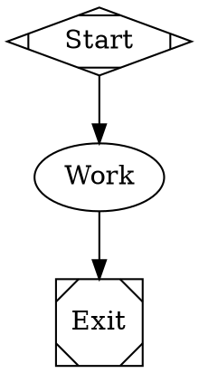

[OpenRouter](https://openrouter.ai/) is an aggregator that fronts hundreds of models behind one OpenAI-compatible API. Fabro ships a disabled `openrouter` provider entry with a curated model catalog, so you can opt in from `settings.toml` without changing Fabro code.

## Prerequisites

- An [OpenRouter account](https://openrouter.ai/) with credit
- An API key from [openrouter.ai/keys](https://openrouter.ai/keys)

## Enable the provider

Add the provider override to `~/.fabro/settings.toml`:

```toml title="settings.toml"
_version = 1

[llm.providers.openrouter]
enabled = true
```

## Configure credentials

For server-backed runs, store the key in the Fabro server vault:

```bash
fabro provider login openrouter
# or
fabro secret set OPENROUTER_API_KEY sk-or-v1-...
```

Standalone local SDK/CLI runs can use an env-backed credential source explicitly:

```bash
export OPENROUTER_API_KEY=sk-or-v1-...
```

## Included models

The built-in catalog curates frontier and open-weights models under vendor-namespaced IDs:

| Fabro model ID | Notes |
| --- | --- |
| `anthropic/claude-opus-4-7` | Claude via OpenRouter, Anthropic-style cache billing |
| `anthropic/claude-sonnet-4-6` | Provider default |
| `anthropic/claude-haiku-4-5` | Provider small default |
| `openai/gpt-5.4`, `openai/gpt-5.5` | |
| `google/gemini-3.1-pro-preview`, `google/gemini-3.5-flash` | |
| `deepseek/deepseek-v4-pro`, `deepseek/deepseek-v4-flash` | |
| `moonshotai/kimi-k2.6`, `qwen/qwen3-coder`, `qwen/qwen3.6-flash` | |
| `z-ai/glm-4.6`, `minimax/minimax-m2.7`, `xiaomi/mimo-v2.5-pro` | |
| `nvidia/nemotron-3-super-120b-a12b`, `mistralai/devstral-2512` | |

Any other OpenRouter model can be added as a settings model entry with `provider = "openrouter"` and the OpenRouter slug as `api_id`:

```toml title="settings.toml"
[llm.models."meta-llama/llama-4-maverick"]
provider = "openrouter"
display_name = "Llama 4 Maverick"
family = "llama-4"

[llm.models."meta-llama/llama-4-maverick".limits]
context_window = 1000000

[llm.models."meta-llama/llama-4-maverick".features]
tools = true
vision = false
reasoning = false
```

## Use OpenRouter models

```bash
fabro model list --provider openrouter
fabro model test --model anthropic/claude-sonnet-4-6
fabro run workflow.fabro --model deepseek/deepseek-v4-flash
```

In workflow stylesheets:



## Cost telemetry

Every OpenRouter response includes an inline `usage.cost` with authoritative USD billing. Fabro surfaces it as `cost_usd` with `cost_source = "authoritative"` on completion responses. Other providers populate the same fields from catalog price estimates with `cost_source = "estimated"`.

The catalog prices on OpenRouter model rows are best-effort estimates used only before the authoritative figure arrives (for example, mid-stream rollups).

## Provider routing

OpenRouter's [provider routing preferences](https://openrouter.ai/docs/guides/routing/provider-selection) pass through verbatim via `provider_options.openrouter` on API/SDK requests — the keys merge into the top level of the request body:

```json
{
  "model": "anthropic/claude-sonnet-4-6",
  "provider_options": {
    "openrouter": {
      "provider": { "sort": "throughput", "data_collection": "deny" },
      "models": ["anthropic/claude-sonnet-4.6", "deepseek/deepseek-v4-pro"]
    }
  }
}
```

## Attribution headers

Fabro does not send OpenRouter's optional attribution headers (`HTTP-Referer`, `X-Title`) by default, so self-hosted installations stay anonymous on OpenRouter's public app leaderboard. To opt in:

```toml title="settings.toml"
[llm.providers.openrouter.extra_headers]
"HTTP-Referer" = { literal = "https://your-site.example" }
"X-Title" = { literal = "Your App" }
```

## Troubleshooting

**"No API key configured"** — For server-backed runs, set the key with `fabro provider login openrouter` or `fabro secret set OPENROUTER_API_KEY ...`. For standalone local usage, export `OPENROUTER_API_KEY` in the invoking shell.

**402 / insufficient credits** — OpenRouter requires prepaid credit; check your balance at [openrouter.ai/credits](https://openrouter.ai/credits).

**Unknown model** — Confirm the model's `api_id` matches an OpenRouter slug exactly (including the vendor prefix), then run `fabro model test --model <fabro-model-id>`.

## Further reading

<Columns cols={2}>
  <Card title="Models" icon="microchip" href="/core-concepts/models">
    How Fabro routes model IDs, providers, and fallbacks.
  </Card>
  <Card title="Settings Configuration" icon="gear" href="/reference/user-configuration">
    Full reference for `[llm.providers.<id>]` and `[llm.models.<id>]`.
  </Card>
</Columns>
