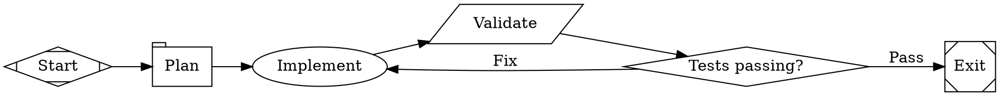
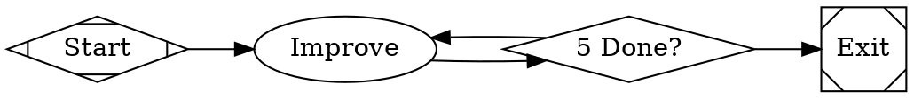

This tutorial builds an implement-test-fix loop — the agent writes code, runs tests, and if they fail, fixes the code and tries again. No human intervention needed.

## The workflow

<Frame>
  
</Frame>



```bash
fabro run files-internal/demo/05-branch-loop.fabro
```

## Command nodes

The `validate` node has `shape=parallelogram`, making it a **command node**. It runs a shell script and captures the output:

```dot
validate [label="Validate", shape=parallelogram, script="python3 -m pytest test_fizzbuzz.py -v 2>&1 || true"]
```

The `|| true` ensures the command always exits successfully — this way the node itself doesn't fail even when tests fail. The test output is captured as `command.output` in the [run context](/execution/context) for downstream nodes to use.

## Conditional branching

The `gate` node has `shape=diamond`, making it a **conditional node**. It evaluates outgoing edge conditions against the current run context:

```dot
gate [shape=diamond, label="Tests passing?"]

gate -> exit      [label="Pass", condition="outcome=success"]
gate -> implement [label="Fix"]
```

- If the previous stage (`validate`) succeeded → take the "Pass" edge to `exit`
- Otherwise → take the unconditional "Fix" edge back to `implement`

The `condition="outcome=success"` checks the status of the most recently completed stage. An edge without a `condition` acts as the default fallback.

### Condition expressions

Conditions support more than just equality checks:

```dot
// Numeric comparisons
gate -> fast [condition="context.score > 80"]

// Substring matching
gate -> alert [condition="context.log contains error"]

// Boolean logic
gate -> deploy [condition="outcome=success && context.tests_passed=true"]

// Negation
gate -> retry [condition="!outcome=success"]
```

See [Transitions](/workflows/transitions) for the full condition grammar.

## The fix loop

When tests fail, execution loops back to `implement`. The agent receives context about what happened — the test output and failure details — so it can fix the issues:

```
start → plan → implement → validate → gate → [Fix] → implement → validate → gate → [Pass] → exit
```

Each time `implement` runs, it sees the previous test output in its preamble, guiding the fix.

## Preventing infinite loops

This workflow has no explicit loop limit, but in production you should add one. Use `max_visits` to cap how many times a node can execute:

```dot
implement [label="Implement", max_visits=3, prompt="..."]
```

After 3 visits, Fabro terminates the run rather than looping forever. You can also set a graph-level limit:

```dot
graph [max_node_visits="20"]
```

## Fixed-count loops

Sometimes you want a node to execute exactly N times before moving on — for example, running an improvement pass 5 times. Use `internal.node_visit_count` in an edge condition:



The engine tracks how many times each node has been visited. When `gate` has been visited 5 times, the condition matches and execution advances to `exit`. The unconditional edge back to `improve` serves as the default fallback for earlier visits.


## Node type summary

This workflow uses four node types:

| Node | Shape | What it does |
|---|---|---|
| `plan` | `tab` | Single LLM call, no tools |
| `implement` | `box` (default) | Agent with tool access |
| `validate` | `parallelogram` | Runs a shell script |
| `gate` | `diamond` | Routes based on conditions |

## What you've learned

- **Command nodes** (`shape=parallelogram`) run shell scripts and capture output
- **Conditional nodes** (`shape=diamond`) route execution based on edge conditions
- **Loops** are just edges that point backward — the agent receives prior context on each visit
- **`max_visits`** prevents infinite loops
- **`internal.node_visit_count`** in edge conditions enables fixed-count loops
- Unconditional edges act as default fallbacks

## Next

<Card title="Parallel Review" icon="arrow-right" href="/tutorials/parallel-review">
  Fan out to concurrent branches and merge the results.
</Card>
