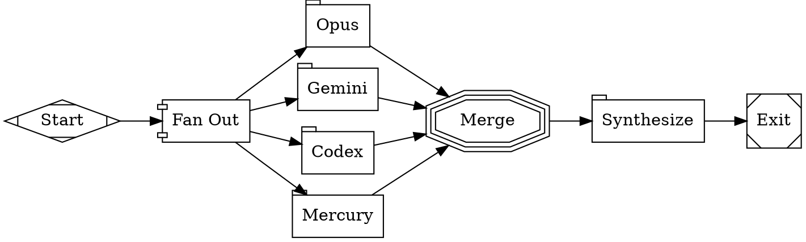

This tutorial combines parallel execution with multi-model routing to get independent opinions from four different LLM providers, then synthesizes the results. This is the ensemble pattern — useful when you want diverse perspectives, consensus-based decisions, or protection against any single model's blind spots.

## The workflow

<Frame>
  
</Frame>



```bash
fabro run files-internal/demo/11-ensemble.dot
```

<Note>
This workflow requires API keys for all four providers (`ANTHROPIC_API_KEY`, `GEMINI_API_KEY`, `OPENAI_API_KEY`, `INCEPTION_API_KEY`). If a provider key is missing, that branch will fail — but `error_policy="continue"` ensures the other branches still complete.
</Note>

## How it works

The workflow has three phases:

### 1. Fan-out to four providers

The `fork` node spawns four parallel branches, each assigned to a different provider via the stylesheet:

```
#opus    { model: claude-opus-4-6;      }
#gemini  { model: gemini-3.1-pro-preview;}
#codex   { model: gpt-5.3-codex;       }
#mercury { model: mercury-2;             provider: inception; }
```

Each branch receives the same prompt but runs on a completely different model. The branches execute concurrently and have no knowledge of each other's responses.

### 2. Merge results

The `merge` node collects all four responses. With `error_policy="continue"`, it waits for every branch — even if some fail. A missing API key or provider outage doesn't cancel the entire workflow.

### 3. Synthesize

The `synth` node receives all four perspectives in its preamble and produces a unified recommendation. It uses `reasoning_effort: high` because comparing and synthesizing multiple viewpoints is a harder task than generating any single one.

## Combining patterns

This workflow combines two patterns from earlier tutorials:

- **Parallel execution** from [Parallel Review](/tutorials/parallel-review) — fan-out/fan-in with join and error policies
- **Model routing** from [Multi-Model Routing](/tutorials/multi-model) — stylesheet selectors assigning different providers to each node

The key difference from the parallel review tutorial is that here each branch uses a _different provider_, not just a different prompt. This gives you genuinely independent perspectives — each model has different training data, different reasoning patterns, and different blind spots.

## When to use ensembles

The ensemble pattern is most valuable when:

- **Correctness matters more than speed** — e.g., security audits, architectural decisions, spec reviews
- **You want to detect model-specific blind spots** — if three models agree and one disagrees, the disagreement is worth investigating
- **You need confidence in a judgment call** — consensus across models is stronger than any single model's opinion

The tradeoff is cost and latency — you're making 4x the LLM calls. Use single-model workflows for routine tasks and ensembles for high-stakes decisions.

## What you've learned

- **Ensemble workflows** fan out the same task to multiple providers
- **`error_policy="continue"`** keeps the workflow running even when some branches fail
- **ID selectors** (`#opus`, `#gemini`) assign each branch to a specific model
- A **synthesis node** compares perspectives and produces a unified result
- Combine parallel execution and model routing for diverse, independent analysis

## Next

<Card title="Sub-Workflows" icon="arrow-right" href="/tutorials/sub-workflow">
  Delegate to reusable child workflows with the supervisor pattern.
</Card>
