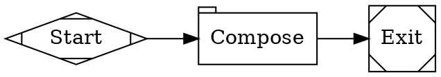
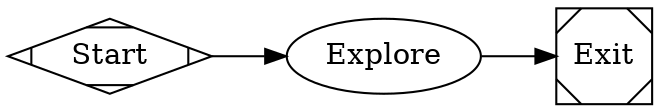
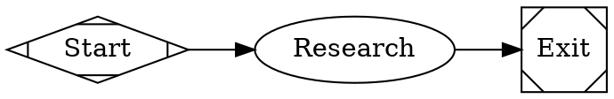

This tutorial walks through three minimal workflows that introduce the building blocks of Fabro: a one-shot prompt, an agent with tool access, and a sub-agent delegation pattern.

## Prerequisites

Complete the [Quick Start](/getting-started/quick-start) so you have a working `fabro` binary and at least one LLM API key configured.

## 1. One-shot prompt

The simplest possible workflow has one node that sends a prompt to an LLM and exits.

<Frame>
  
</Frame>



Run it:

```bash
fabro run files-internal/demo/01-hello.fabro
```

### What's happening

- `shape=tab` makes this a **prompt node** — a single LLM call with no tool access. Good for generation, summarization, and classification.
- `reasoning_effort="low"` tells the model to think less. This is a simple task that doesn't need deep reasoning.
- `graph [goal="..."]` describes the workflow's purpose. Fabro uses it in preambles and retrospectives.

Every workflow needs exactly one `start` node (`shape=Mdiamond`) and one `exit` node (`shape=Msquare`).

## 2. Agent with tools

An **agent node** (the default `box` shape) runs an LLM in a loop with access to tools — bash, file reading, file editing, grep, and glob. The agent calls tools autonomously until it decides the task is complete.

<Frame>
  
</Frame>



```bash
fabro run files-internal/demo/02-tool-use.fabro
```

### What's happening

- No `shape` attribute means the default `box` — an **agent node**.
- The agent has access to [built-in tools](/agents/tools): `shell`, `read_file`, `write_file`, `edit_file`, `grep`, `glob`, `web_search`, and `web_fetch`.
- The agent decides which tools to call and when to stop. Fabro handles the tool loop automatically.

### Prompt vs. agent nodes

| | Prompt node (`tab`) | Agent node (`box`) |
|---|---|---|
| LLM calls | Single call | Multi-turn loop |
| Tool access | None | Full toolset |
| Use case | Analysis, generation | Tasks requiring file I/O and commands |

## 3. Sub-agents

An agent can spawn **sub-agents** to delegate work. Sub-agents run in their own session and return results to the parent.

<Frame>
  
</Frame>



```bash
fabro run files-internal/demo/03-subagent.fabro
```

### What's happening

- The parent agent uses `spawn_agent` to create a child session, then `wait` to collect the result.
- Sub-agents have their own tool access and conversation history — they don't see the parent's context.
- This pattern is useful for parallelizing research, isolating risky operations, or keeping the parent's context window lean.

See [Sub-agents](/agents/subagents) for the full tool reference.

## What you've learned

- **Prompt nodes** (`shape=tab`) make a single LLM call — no tools
- **Agent nodes** (default `box`) run a multi-turn tool loop
- **Sub-agents** let an agent delegate to independent child sessions
- Every workflow needs a `start` node, an `exit` node, and a `goal`

## Next

<Card title="Plan & Implement" icon="arrow-right" href="/tutorials/plan-implement">
  Add human gates and revision loops to a multi-step workflow.
</Card>
