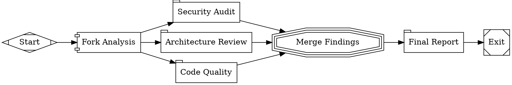

This tutorial runs three code review perspectives in parallel — security, architecture, and quality — then merges the results into a single report.

## The workflow

<Frame>
  
</Frame>



```bash
fabro run files-internal/demo/06-parallel.fabro
```

## Fan-out with the fork node

The `fork` node has `shape=component`, making it a **parallel fan-out node**. Every outgoing edge becomes a concurrent branch:

```dot
fork [label="Fork Analysis", shape=component, join_policy="wait_all", error_policy="continue"]

fork -> security
fork -> architecture
fork -> quality
```

All three branches start at the same time. Each gets an isolated copy of the run context, so branches can't interfere with each other.

### Join policies

The `join_policy` controls when execution can proceed past the merge:

| Policy | Behavior |
|---|---|
| `wait_all` | Wait for every branch to finish (default) |
| `first_success` | Proceed as soon as one branch succeeds |
| `k_of_n(N)` | Proceed after N branches succeed |
| `quorum(0.5)` | Proceed after a fraction of branches succeed |

### Error policies

The `error_policy` controls what happens when a branch fails:

| Policy | Behavior |
|---|---|
| `continue` | Run all branches even if some fail (default) |
| `fail_fast` | Cancel remaining branches as soon as one fails |
| `ignore` | Treat all branch failures as successes |

This workflow uses `error_policy="continue"` so that a failure in one review perspective doesn't cancel the others.

## Fan-in with the merge node

The `merge` node has `shape=tripleoctagon`, making it a **merge (fan-in) node**. It collects results from all branches into a single context:

```dot
merge [label="Merge Findings", shape=tripleoctagon]

security     -> merge
architecture -> merge
quality      -> merge
```

The merged branch results are available to downstream nodes. The `report` node receives all three perspectives in its preamble and synthesizes them.

## Concurrency control

By default, Fabro runs up to 4 parallel branches simultaneously. Control this with `max_parallel`:

```dot
fork [shape=component, max_parallel=2]
```

This is useful when branches are resource-intensive (e.g., each running a full agent session with tool calls) and you want to limit concurrency.

## What you've learned

- **Fan-out nodes** (`shape=component`) spawn concurrent branches
- **Merge nodes** (`shape=tripleoctagon`) collect branch results
- **Join policies** control when execution can proceed past the merge
- **Error policies** control how branch failures are handled
- Each branch gets an isolated copy of the context

## Next

<Card title="Multi-Model Routing" icon="arrow-right" href="/tutorials/multi-model">
  Assign different models to different workflow nodes using stylesheets.
</Card>
