This tutorial builds a plan-approve-implement workflow where a human reviews the plan before the agent writes code. If the plan isn't right, the human sends it back for revision — creating a loop.

## The workflow

```dot title="plan-implement.fabro"
digraph PlanImplement {
    graph [goal="Plan, approve, implement, and simplify a change"]
    rankdir=LR

    start [shape=Mdiamond, label="Start"]
    exit  [shape=Msquare, label="Exit"]

    plan      [label="Plan", prompt="Analyze the goal and codebase. Write a clear, step-by-step implementation plan to a Markdown file called plan.md. Include what files will change and why.", reasoning_effort="high"]
    approve   [shape=hexagon, label="Approve Plan"]
    implement [label="Implement", prompt="Read plan.md and implement every step. Make all the code changes described in the plan."]
    simplify  [label="Simplify", prompt="@files-internal/prompts/simplify.md"]

    start -> plan -> approve
    approve -> implement [label="[A] Approve"]
    approve -> plan      [label="[R] Revise"]
    implement -> simplify -> exit
}
```

<Frame>
  
</Frame>



```bash
fabro run files-internal/demo/10-plan-implement.fabro
```

## Human gates

The `approve` node has `shape=hexagon`, which makes it a **human gate** — the workflow pauses and waits for a person to choose a path.

```dot
approve [shape=hexagon, label="Approve Plan"]

approve -> implement [label="[A] Approve"]
approve -> plan      [label="[R] Revise"]
```

The outgoing edge labels define the options. In the CLI, you'll see:

```
? Approve Plan
  [1] A - [A] Approve
  [2] R - [R] Revise
Select:
```

The `[A]` and `[R]` prefixes are keyboard accelerators — type the letter to select.

## The revision loop

If you choose **Revise**, execution goes back to the `plan` node. The agent runs again with context about what happened — it knows its previous plan was rejected and can improve it. This cycle repeats until you approve.

```
start → plan → approve → [Revise] → plan → approve → [Approve] → implement → simplify → exit
```

Loops are natural in Fabro — just point an edge back to an earlier node. For safety, you can set `max_visits` on a node to prevent infinite loops:

```dot
plan [label="Plan", max_visits=5, ...]
```

## Reasoning effort

The `plan` node sets `reasoning_effort="high"`. This tells the model to think harder — useful for planning tasks that require careful analysis. The default is `high`, but you can set it to `low` or `medium` for simpler tasks to save cost and time.

## Prompt file references

The `simplify` node uses `@files-internal/prompts/simplify.md` instead of an inline prompt string:

```dot
simplify [label="Simplify", prompt="@files-internal/prompts/simplify.md"]
```

The `@` prefix tells Fabro to load the prompt from a Markdown file, resolved relative to the DOT file's location. This keeps DOT files concise and lets you version prompts as standalone files. See [Prompts](/agents/prompts) for details.

## Context flow between nodes

Each node receives a **preamble** summarizing what happened in prior stages. When the `implement` node runs, it knows that a plan was written and approved. The preamble includes:

- The workflow goal
- A summary of completed stages with their outcomes
- Files touched by prior stages
- Run context values

The agent reads `plan.md` (as instructed by its prompt), but the preamble gives it additional context about the overall workflow state. See [Context](/execution/context) for the full reference.

## What you've learned

- **Human gates** (`shape=hexagon`) pause for human input with edge labels as options
- **Revision loops** are just edges that point back to earlier nodes
- **Prompt file references** (`@path/to/file.md`) keep DOT files clean
- **`reasoning_effort`** controls how hard the model thinks
- Nodes receive preambles summarizing prior stages

## Next

<Card title="Branch & Loop" icon="arrow-right" href="/tutorials/branch-loop">
  Add conditional branching and automated test validation loops.
</Card>
