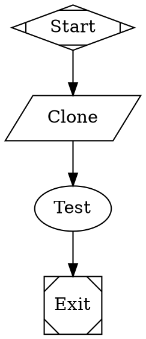

Fabro supports `$variable` placeholders that let you parameterize workflows without editing the DOT file.

## Run config variables

Define variables in the `[vars]` section of a run config TOML file:

```toml title="run.toml"
version = 1
goal = "Run tests for $repo_name"
graph = "check.fabro"

[vars]
repo_name = "fabro"
repo_url = "https://github.com/fabro-sh/fabro"
language = "rust"
```

These variables are expanded into the DOT source **before** the graph is parsed. You can use `$variable` anywhere in the DOT file — goals, prompts, labels, scripts, or any other attribute:



When launched with `fabro run run.toml`, Fabro replaces `$repo_name`, `$repo_url`, and `$language` with their values before parsing the graph.

### Undefined variables

If a `$variable` in the DOT file has no matching entry in `[vars]`, Fabro raises an error. This catches typos early — a misspelled `$langauge` fails immediately rather than passing a literal `$langauge` to the LLM.

### Escaping `$`

To include a literal `$` in the output, write `$$`:

```dot
test [prompt="The env var is $$HOME"]
```

This produces `The env var is $HOME` without treating `$HOME` as a variable reference. A bare `$` not followed by an identifier character (e.g. `costs $5`) does not need escaping.

## The `$goal` variable

Inside agent and prompt node prompts, Fabro automatically expands `$goal` to the workflow's `goal` attribute. This happens at runtime, after graph parsing:

```dot title="example.fabro"
digraph Example {
    graph [goal="Implement the login feature"]

    plan [label="Plan", prompt="Create a plan for: $goal"]
}
```



The plan node's prompt becomes `"Create a plan for: Implement the login feature"`.

## Variable merging

When using server-level run defaults alongside a run config TOML, variables are merged. Task config vars override default vars when keys collide:

| Source | Priority |
|---|---|
| Run config TOML `[vars]` | Highest — wins on collision |
| Server defaults `[vars]` | Lowest — provides fallback values |
