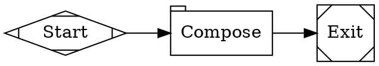
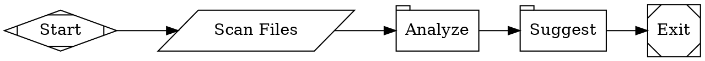
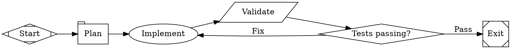
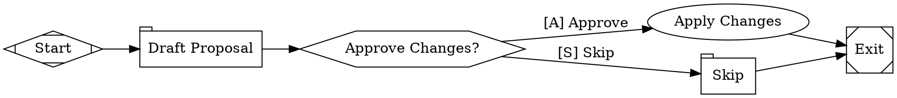
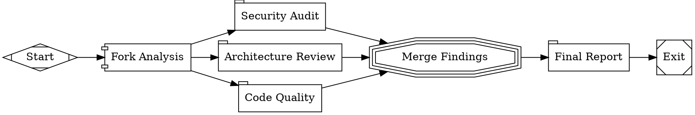
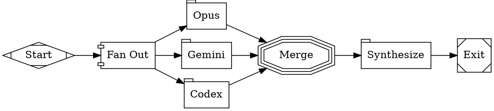

# Example Workflows

Use these as starting points. Choose the simplest topology that fits the requirements.

## 1. Linear Pipeline (simplest)

One-shot prompt, no tools:



## 2. Command-Then-Analyze Pipeline

Shell command feeds into LLM analysis:



## 3. Implement-Test-Fix Loop

Agent writes code, command validates, conditional routes back on failure:



## 4. Human Approval Gate

Draft, get human approval, then apply:



## 5. Plan-Approve-Implement with Revision Loop

```dot
digraph PlanImplement {
    graph [goal="Plan, approve, implement, and simplify a change"]
    rankdir=LR

    start [shape=Mdiamond, label="Start"]
    exit  [shape=Msquare, label="Exit"]

    plan      [label="Plan", prompt="Analyze the goal and codebase. Write a clear, step-by-step implementation plan to plan.md. Include what files will change and why.", reasoning_effort="high"]
    approve   [shape=hexagon, label="Approve Plan"]
    implement [label="Implement", prompt="Read plan.md and implement every step. Make all the code changes described in the plan."]
    simplify  [label="Simplify", prompt="Review the changes just made. Simplify and clean up the code without changing behavior."]

    start -> plan -> approve
    approve -> implement [label="[A] Approve"]
    approve -> plan      [label="[R] Revise"]
    implement -> simplify -> exit
}
```



## 6. Parallel Fan-Out Review

Multiple independent analyses merged into a synthesis:



## 7. Multi-Model with Stylesheet

Different models for different roles:

```dot
digraph MultiModel {
    graph [
        goal="Build and review a utility function using multiple models",
        model_stylesheet="
            * { model: claude-haiku-4-5;reasoning_effort: low; }
            .coding { model: claude-sonnet-4-6;reasoning_effort: high; }
            #review { model: claude-sonnet-4-6;reasoning_effort: high; }
        "
    ]
    rankdir=LR

    start [shape=Mdiamond, label="Start"]
    exit  [shape=Msquare, label="Exit"]

    spec      [label="Write Spec", prompt="Write a brief spec for a TypeScript string utility module with 3 functions: slugify, truncate, and capitalize. Output the spec only.", shape=tab]
    implement [label="Implement", prompt="Implement the TypeScript string utility module from the spec. Write it to string-utils.ts.", class="coding"]
    test      [label="Write Tests", prompt="Write tests for the string utility module using Bun's test runner. Write to string-utils.test.ts.", class="coding"]
    review    [label="Code Review", prompt="Review the implementation and tests. Check for edge cases, type safety, and correctness. Provide a brief verdict.", shape=tab]

    start -> spec -> implement -> test -> review -> exit
}
```



## 8. Multi-Provider Ensemble

Independent opinions from multiple providers, then synthesize:



## 9. Production Implement-and-Simplify with Verification

Full pipeline with toolchain checks, lint loops, and verification gates:

```dot
digraph ImplementAndSimplify {
    graph [
        goal="Implement and simplify",
        model_stylesheet="
            * { backend: api; model: claude-opus-4-6;}
        "
    ]
    rankdir=LR

    start [shape=Mdiamond, label="Start"]
    exit  [shape=Msquare, label="Exit"]

    toolchain         [label="Toolchain", shape=parallelogram, script="command -v cargo >/dev/null || { curl --proto '=https' --tlsv1.2 -sSf https://sh.rustup.rs | sh -s -- -y && sudo ln -sf $HOME/.cargo/bin/* /usr/local/bin/; }; cargo --version 2>&1", max_retries=0]
    preflight_compile [label="Preflight Compile", shape=parallelogram, script="cargo check 2>&1", max_retries=0]
    preflight_lint    [label="Preflight Lint", shape=parallelogram, script="cargo clippy -- -D warnings 2>&1", max_retries=0]
    fix_lints         [label="Fix Lints", prompt="The preflight lint step failed. Read the build output from context and fix all clippy lint warnings.", max_visits=3]
    implement         [label="Implement", prompt="Read the plan file referenced in the goal and implement every step. Make all the code changes described in the plan."]
    simplify          [label="Simplify", prompt="Review the changes just made. Simplify and clean up the code without changing behavior."]
    verify            [label="Verify", shape=parallelogram, script="cargo clippy -- -D warnings 2>&1 && cargo test 2>&1", goal_gate=true, retry_target="fixup"]
    fixup             [label="Fixup", prompt="The verify step failed. Read the build output from context and fix all clippy lint warnings and test failures.", max_visits=3]

    start -> toolchain
    toolchain -> preflight_compile [condition="outcome=success"]
    toolchain -> exit
    preflight_compile -> preflight_lint [condition="outcome=success"]
    preflight_compile -> exit
    preflight_lint -> implement [condition="outcome=success"]
    preflight_lint -> fix_lints
    fix_lints -> preflight_lint
    implement -> simplify -> verify
    verify -> exit  [condition="outcome=success"]
    verify -> fixup
    fixup -> verify
}
```



Paired TOML:

```toml
version = 1
graph = "workflow.dot"

[sandbox]
provider = "local"

[sandbox.local]
worktree_mode = "always"
```
